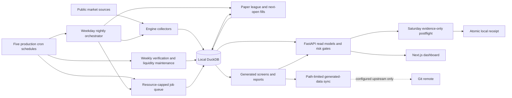

# Architecture reference

One box, one DuckDB file, five deterministic production cron schedules, and one evidence-only
Saturday postflight. The engine collects real market data, screens it, runs a paper-trading league
of pre-registered strategies against a conservative fill simulator, mines supporting datasets, and
backtests itself — all locally. There is **no broker connection and no real money** (that is M5,
deferred, personal-hardware-only by design).
Generated public data may leave through Git only when the current branch has a configured
upstream. The `source_control` object in `GET /meta` is authoritative for the current tracking
state; `local-only` means local commits are not an off-machine backup.

Specs: [`design/trading-engine-design.md`](design/trading-engine-design.md) (§12 wins on
conflict) and [`design/trading-execution-design.md`](design/trading-execution-design.md).
Documentation index: [`README.md`](README.md). Operations:
[`how-it-works.md`](how-it-works.md). Build history + every decision:
[`BUILDLOG.md`](../BUILDLOG.md). This is the architecture map, not the law—when it disagrees
with the specs or BUILDLOG, they win.

## The honesty rules (why the design looks like this)

1. **Never invent a price** — a failed fetch is recorded as missing, never filled in.
2. **Point-in-time, append-only** — anything stamped `as_of`/`run_date`/`fetch_as_of`
   (screens, fundamentals, earnings, universe snapshots, corporate actions, macro signals,
   experiment results) is never updated, only appended. Backtests can therefore only see
   what was knowable at the time.
3. **Pre-registration** — every executed strategy or experiment freezes its hypothesis,
   expectation, control, and kill criterion *before* evidence accrues
   (`sim/strategies/configs.py`, `farm/experiments/*.yaml`, or a versioned charter under
   `docs/charters/`). A charter permits a bounded research run; it does not activate a paper
   book. No peeking or threshold tuning after the fact.
4. **Conservative fills** — orders fill at the *next* session's open with size-dependent
   slippage and a liquidity cap; never same-bar, never at prices we didn't store.
5. **Prove by running** — nothing is "done" from code inspection; every feature ships with
   an end-to-end proof on a DB copy, logged in BUILDLOG.

## Shared studies and dashboard boundaries

The reusable study core (`farm/study/`) normalizes an immutable ticker-by-session price panel.
Duplicate ticker/session inputs are rejected both within each bounded chunk and across chunks,
so input order cannot silently choose a price. Vectorized coordinate checks keep the panel's
bounded ingestion path; valid-input simulation and report formats are unchanged.
Independent price checks require positive entries and nonnegative exits. A terminal zero remains
a complete long loss (or short gain) when computing the paired trade return. Its secondary price
ratio is undefined and excluded from that field's ratio distribution; trade coverage remains
complete, so distribution sample counts and trade coverage answer different questions.

The dashboard admits API responses at page boundaries, then passes them to presentation-only
components. `/meta` is shared within one render, not cached across requests. The persistent
status row scrolls within the viewport and remains keyboard accessible, including on mobile.
Frozen forward reports are validated and projected without rewriting their payloads or rules.

## Components

```
engine/               data layer + nightly driver
  collect.py            yfinance EOD -> prices (~4.1k liquid names, 19.8M rows, history to 1962)
  universe.py           nasdaqtraded.txt -> universe + append-only daily snapshot (~12.2k names)
  market_date.py        resolves the breadth-qualified date allowed to advance nightly state
  screen.py             Minervini trend-template screen -> screen_results + data/screens/<date>.md
  actions.py            corporate actions: splits/dividends fetch + the reconciler (see below)
  signals.py            macro/flow/sentiment collector -> macro_signals
  intraday.py           1m/7d + 5m/60d archive for ~1.1k names (raw archive, not a signal source)
  fundamentals.py       weekly point-in-time fundamentals   earnings.py  daily earnings dates
  queue_runner.py       THE job queue (§12.7): resource-capped drain (parallel only for jobs
                        declared safe), resumable jobs, stale-job reclaim, bounded budget
  forward_review.py     frozen sector-momentum-vs-SPY paper monitor
  xs_forward_review.py  frozen prospective 12-1-momentum-vs-EW paper monitor
  tradingview_history_archive.py  TradingView historical archive (P14; research facts only)
  run_daily.sh          the nightly driver (see pipeline below)
sim/                  the paper league
  strategies/           one file per strategy + configs.py (the frozen pre-registrations)
  league.py             creates books, steps one session/day: orders -> fills -> dividends -> MTM
  fills.py              next-open fill model, slippage by median dollar volume, liquidity cap
  portfolio.py          cash/position accounting; state = pure function of (fills, dividends)
  calendar.py           NYSE session calendar helpers
server/               FastAPI backend (localhost:8000) — read endpoints + discretionary tickets
  host_command.py     bounded subprocess capture for read-only host probes
  driver_log.py       cron-log parsing plus advisory-lock and runtime observation
  driver_monitor.py   expected-slot and aggregate scheduled-driver projections
  scheduler_host.py  read-only crontab, service, and timezone host probes
  scheduler_monitor.py exact schedule and launch-readiness audit
  friday_postflight.py schedule-aware validation of the auxiliary Friday audit receipt
  meta_snapshot.py    fail-soft loader for the optional engine health snapshot
  market_data_sources.py Market-data source hardening (P13) registry; tradingview_source.py exact-transcript client
  market_health.py    market freshness + independent-price evidence projection
  liquidity_monitor.py scheduled liquidity-evidence reconciliation
  exposure_monitor.py stale active-position/order projection with exposure-scoped quote history
  meta_projection.py  composes the read-only `/meta` payload and isolates optional failures
  miner_monitor.py    bounded scheduled-miner job + metadata reconciliation
  nightly_monitor.py  nightly driver/database state and final evidence projection
  nightly_reports.py  bounded screen and league artifact reconciliation
  queue_monitor.py    queue counts and actionable-versus-historical failures
  sweep_monitor.py    recurring-sweep queue and published-ranking evidence
  walkforward_recovery.py bounded scheduled-driver recovery from exact queue cohorts
  walkforward_artifacts.py stable published-result validation facade
  walkforward_artifact_identity.py registration and evidence-cohort identity validation
  walkforward_artifact_geometry.py planned, retained, and data-floor-dropped fold validation
  walkforward_artifact_folds.py terminal-fold statistics and summary validation
  walkforward_cohort.py published cohort scanning, reconciliation, and projection
  walkforward_evidence.py live registrations + walk-forward evidence projection
  sector_forward_status.py fail-closed Sector prospective-evidence projection
  xs_forward_status.py fail-closed cross-sectional momentum evidence projection
  e1_forward_status.py fail-closed E1 out-of-sample experiment projection
  forward_contracts.py shared paper-only projection primitives
  file_utils.py       bounded nonblocking regular-file reads for operational artifacts
  status_validation.py strict timestamp/count parsing shared by evidence monitors
  market_read_models.py bounded recent market-date resolution with exact fallback, plus screens/candidates
  league_read_models.py streaming operational standings and stable league/equity facade
  league_equity_read_models.py bounded single-book and bulk equity-series projections
  paper_read_models.py discretionary ticket sizing context
  position_read_models.py active holdings and market marks
  order_read_models.py bounded active-book order history
  journal_read_models.py discretionary journal + bounded league events
  json_utils.py        strict JSON decoding for operational evidence and stored metadata
  read_model_utils.py shared row materialization and display-text bounds
  research_readiness.py non-promotional aggregate research-admission projection
  stock_readiness.py  point-in-time stock-selection coverage gate
  fundamentals_readiness.py point-in-time fundamentals coverage gate
  intraday_readiness.py live 1m/5m coverage gate with date-range-cached NYSE schedules
  readiness_common.py shared date/count normalization for readiness projections
  risk.py             ticket context, ordered gate orchestration, and admission decision
  risk_ticket_gates.py pure stop, anchor, notional, sizing, playbook, and reward/risk gates
  risk_book.py        bulk discretionary valuation, stops, and pending/open risk
  risk_history.py     streaming FIFO round trips and bounded circuit-breaker state
  risk_market.py      SPY-regime and point-in-time earnings evidence
  sizing.py           fixed-fractional position sizing primitive
  ticket_contract.py  closed request shape and discretionary-ticket normalization
  tickets.py          atomic discretionary ticket/order/review mutation facade
  ticket_store.py     SQL persistence inside caller-owned ticket transactions
ui/                   Next.js dashboard (localhost:3000), /api/* proxied to :8000
  app/page.js           dashboard request fan-out and fail-visible response admission
  app/components/Dashboard*.js independent league/evidence/readiness/screen render sections
  app/components/Header*.js persistent shell plus operational/research status sections
  app/components/Ticket*.js validated mutation owner plus presentation-only field/result sections
  app/positions/page.js position/order request fan-out, response admission, and filter derivation
  app/components/Positions*.js independent open-position and bounded-order render sections
  app/journal/page.js journal fetch, response admission, and top-level failure boundary
  app/components/Journal*.js circuit-breaker, ticket, round-trip, and league-event render sections
  app/league/page.js league/equity request fan-out, cross-response admission, failure boundary
  app/components/League*.js operational context/notices and standings/curve render sections
  app/candidates/[ticker]/page.js candidate/context request fan-out and response admission
  app/lib/candidate-route.js bounded route decoding and encoded in-app candidate-link construction
  app/components/Candidate*.js summary, template-check, and ticket-panel render sections
  app/lib/*-contracts.js pure endpoint-domain response validators
  app/lib/meta-*-contracts.js composed /meta core, job, automation, evidence, exposure, and forward validators
  app/lib/research-contracts.js aggregate research-readiness and derived-status validator
  app/lib/research-coverage-contracts.js input-schema, dated, and intraday coverage validators
  app/lib/operations-contracts.js stable positions/orders/journal contract facade
  app/lib/positions-contracts.js position valuation, filter, and row-coherence validator
  app/lib/orders-contracts.js bounded order/status and unique-row validator
  app/lib/journal-contracts.js ticket, gate, fill, round-trip, and league-event validator
farm/                 research workloads through the queue
  experiment.py         pre-registered experiments (SHA-256 config immutability, locked holdout)
  experiment_runner.py  E1 forward runner — one append-only row per settled out-of-sample Monday
  backtest/             historical replays of the league books (vectorized screen, real day-step)
  execution_drag.py     measures next-open-vs-signal-close cost from our own fills
store/market.duckdb   everything above in one DuckDB (single-writer!)
data/                 committed outputs: screens, league.md, reports, _meta.json health snapshot
logs/                 cron.log + per-run logs (gitignored)
```

### Runtime data flow and authority boundaries



Only the paper league and explicitly gated discretionary API mutations change portfolio state.
The dashboard, readiness endpoints, forward monitors, and Saturday postflight observe or publish
evidence; none can promote a strategy, connect a broker, or authorize live capital. DuckDB,
runtime logs, and the postflight receipt remain local and gitignored.

**Key tables:** `prices` (a *cache of Yahoo's split-adjusted view* — see reconciler),
`universe` / `universe_snapshot`, `screen_results`, `jobs`, league state in `portfolios` +
`sim_orders/sim_fills/sim_positions/sim_equity/sim_dividends`, discretionary flow in
`disc_tickets` + `audit_log` + `review_markers`, mining in `fundamentals` /
`fundamentals_fetch_log` / `earnings_calendar` / `earnings_fetch_log` / `intraday_prices`,
actions in `corporate_actions` /
`split_adjustments` / `actions_fetch_log`, research in `experiment_results`, signals in
`macro_signals`.

## The nightly pipeline (cron, 22:30 UTC weekdays)

`run_daily.sh`, under `set -euo pipefail`, with an `flock` overlap guard and bounded
DB-lock retries. Stage order and failure semantics matter:

| # | Stage | On failure |
|---|---|---|
| 1 | universe refresh | WARN, continue (transient Nasdaq hiccup must not kill the night) |
| 2 | collect (incremental EOD, calendar-gated) | **fatal** |
| 3 | resolve breadth-qualified market date | **fatal** |
| 4 | screen that exact date (`--skip-if-done`) | **fatal** |
| 5 | actions fetch (incremental: active-held ∪ active-pending ∪ core ETFs ∪ screen-top-50) | WARN, continue |
| 6 | actions **reconcile** | **fatal — deliberately.** If we can't verify the price scale, trading on it is worse than skipping a night |
| 7 | league step on that exact date (one transaction per day — no half-done sessions) | **fatal** |
| 8 | frozen sector-momentum forward review | WARN, continue; stale output is replaced with `INVALID` |
| 9 | frozen `xs_momentum_12_1` forward review | WARN, continue; stale output is replaced with `INVALID` |
| 10 | E1 forward experiment row | WARN, continue |
| 11 | sync (commit + push `data/`) | WARN, continue |
| 12 | independent price verification | WARN, continue |
| 13 | farm subshell: enqueue intraday (100) → signals (105) → earnings (110) → fundamentals (Fridays, 120) → drain the queue | pinned exit 0 — farm failures never fail the nightly |

The universe stage treats Nasdaq's `ETF=Y` field as authoritative, excludes test issues and
NextShares, and otherwise admits common-equity-like listings. Security-name checks recognize both
singular and plural rights and warrants. Preferred classes are excluded only when `preferred` or
`preference` introduces a class noun such as share, stock, security, series, or unit; this avoids
misclassifying common shares such as Preferred Bank or preferred-income funds. A name containing
`unit` is excluded only when Nasdaq also gives it a dedicated `.U` or terminal-`U` symbol, so
ordinary operating-partnership units such as ET, MPLX, and PAA remain eligible. Existing rows that
no longer pass are deactivated, never deleted, during the next normal universe refresh; historical
snapshots are append-only. The parser does not retroactively rewrite a completed day's snapshot.

A failure breadcrumb names the failing stage (`logs/.last_stage`). Queue jobs are resumable;
a killed drain leaves a stale `running` job that the next drain reclaims automatically.
The primary EOD collector and the network-backed intraday, signals, action-backfill, earnings,
and Friday-fundamentals miners do not retain a DuckDB connection during HTTP waits. The EOD
collector resolves its universe under a short read lease, writes each completed Yahoo batch
under a short writer lease, and materializes final health metadata under a final read lease.
Its max-history path commits each batch's price rows, `backfill_done` flags, and job progress
together. Queued network miners each run as one supervised, sequential child and likewise lease
the writer only for bounded checkpoints, so API/UI readers get access between writes. Intraday
appends each completed download batch through the existing idempotent insert. Signals opens a
read-only lease only for internal breadth and a writer per source insert. The breadth reader drops
its temporary universe relation in a `finally` block, so a failed breadth calculation cannot leak
connection-local state into another source or retry. Earnings and
fundamentals checkpoint every 25 names, while actions checkpoint every 50 names and commits data
rows and append-only fetch outcomes together.
Action and earnings recovery skip valid `ok` and `empty` pulls; fundamentals skips only committed
snapshots because an unusable response is a data gap. A `failed` attempt remains visible and
eligible for retry. Every explicit production transaction goes through
`engine.lib.db.transaction`: ordinary failures and process-level interruptions both trigger
rollback, a rollback failure is attached without replacing the original exception, and a
caller-owned connection remains reusable after successful cleanup. A structural test rejects raw
`BEGIN TRANSACTION`, `COMMIT`, or `ROLLBACK` statements anywhere else in production Python.
The same source audit scans `engine`, `sim`, `farm`, `server`, and `tools`, rejecting direct
`Path.write_text`/`write_bytes` publication outside the atomic resource helper. Its sole exception
is backup assembly inside a private, verified staging directory that is itself atomically
published only after the complete bundle is durable.
eligible for retry in all three miners.
By default, earnings coverage is the union of equities seen in the recent fundamentals window
and passers from the latest screen, filtered through the authoritative `universe` row to retain
only active, non-ETF names. If fundamentals has not run yet, the fallback is active, liquid,
non-ETF names. An explicit operator-supplied ticker list is intentionally unrestricted and keeps
its requested order and Yahoo-symbol mapping.

The nightly date is stricter than “the newest row in `prices`.” A date qualifies only when
real bars cover at least 90% of the active liquid universe and at least 1,000 names (the
absolute floor is capped at the universe size for a newly initialized small store). A real bar
has positive volume and is not a flat OHLC dead quote. Partial later batches and phantom rows
remain archived for audit, but cannot advance the screen or league: the driver resolves one ISO
date after collection and passes it explicitly to both commands. The resolver fails closed when
the active liquid universe is absent, no date qualifies, or any newer real-bar date remains below
the breadth threshold. The last condition deliberately includes inactive, non-liquid, and orphaned
rows because frozen downstream components still inspect the store-wide maximum date. Such a tail
stops the nightly before corporate-action reconciliation or league processing, leaving the rows
available for diagnosis without exposing downstream state to them.
The dashboard's `GET /screen/latest` projection is independently capped at that same operational
date. Both latest and dated screen routes return at most 100 passing names per page while retaining
the complete screened, passing, and new-today totals. Stable RS-rank/ticker ordering, page offsets,
page-local new counts, total pages, and previous/next flags keep every passer reachable without an
unbounded dashboard response; the API validates the final assembled page and the UI independently
validates those relationships and exposes navigation. Both boundaries require the exact public
envelope and row fields, unique ordered tickers, safe counts, and a positive page limit.
`GET /screen/{run_date}` remains an explicit archival lookup for diagnosis.
Every returned screen row must also match its requested run date and have a positive finite close,
an exact RS rank from 1 through 99, an exact template score from 0 through 8, finite distance
metrics, real booleans, and the known `all` or `ex-leveraged` universe policy. Candidate history
is bounded to the newest 250 stored bars and requires an exact envelope and bar shape, strictly
increasing real dates no later than `as_of`, positive finite OHLC values with coherent high/low
geometry, and finite nonnegative volume. A latest quote, when present, must be a complete date/value
pair with a positive finite close that exactly matches the corresponding returned bar; an attached
screen row uses the same screen contract. The assembled candidate is validated again before return.
Invalid stored or internal values fail the affected read without rewriting or silently dropping the
source row.

The same gate checks paper-ledger continuity. All active portfolios must share one latest
equity checkpoint, and a newer qualified date must be exactly the next scheduled NYSE session.
It is safe to repeat the same date (`--skip-if-done`), but the nightly will not jump over a
missing session or guess how to reconstruct its historical screen and corporate-action state.
Such a gap stops before screening and requires explicit, audited recovery.
The screener atomically publishes its dated Markdown recovery anchor before committing
`screen_results`; once rows exist, that anchor supplies the regime and exclusion context needed
to rebuild the remaining CSV, EOD, latest-summary, and metadata companions. A legacy or corrupt
state with committed rows but no dated anchor fails closed and preserves the append-only rows;
only an explicit `--rerun` can authorize recomputation.

## The corporate-actions reconciler (the subtle one)

Yahoo restates raw OHLC at fetch time, but incremental collection only re-fetches ~5 days —
so the first split in any stored name would leave a permanent scale break in history.
The reconciler (nightly, fatal) adjudicates every known split against what the **stored
series actually shows**: it locates the break by scanning close ratios (never assumes the
ex-date), restates exactly once (watermarked in `split_adjustments`, audited in
`audit_log`), adjusts held positions (qty×ratio, cost÷ratio), and **never guesses** —
ambiguous or contradictory readings are skipped with a TODO for a human. Dividends are
credited to the books as cash (`sim_dividends`), which is what makes `total_return` real
(the BIL hurdle in dual_momentum was inert until this existed). An independent tripwire
flags any held name with a >40% one-session move and no corporate-actions row.

## The league

The live store currently has **25 active paper portfolios**, including the three profitability
evidence loop (P15)
comparator books activated on 2026-09-29. All are long-only with persisted initial capital and execution profiles. 18 are historically
replayable rules. Three are intentionally excluded from historical walk-forward:
`discretionary` needs human tickets, `pead_ear` lacks historical point-in-time earnings
dates, and `macro_composite` lacks a historical point-in-time macro reconstruction. They
remain valid forward-paper books; they are not silently scored as zero-return backtests.

The replayable cohort includes SPY and equal-weight controls, dual and sector momentum,
the Minervini template family, mean-reversion overlays, turtle and stopped momentum,
low-volatility, 52-week-high, and `xs_momentum_12_1`. Every automated book's frozen config
carries an expectation and a **kill criterion**; the weekly review judges process, not
outcome. Current standings: `data/reports/league.md`, whose table contains exactly the active
portfolios marked in that nightly. `data/reports/league.csv` deliberately remains the
complete `sim_equity` history, including retired portfolios, so retirement does not erase audit
evidence. Historical replays:
`data/reports/backtests/`. Five AI-overlay books and two frozen twins were retired
2026-08-18 (`active = FALSE`, equity history kept); their immutable source and reports
live in `archive/agentic-2026-08/`.

The vectorized historical screener treats its named DuckDB tables as call-scoped scratch state:
all `_hs_*` tables and the optional leverage-exclusion table are dropped in a `finally` block, so
an interrupted screen cannot pollute a caller-owned replay connection. This cleanup does not alter
the point-in-time formulas, membership policy, ranks, or rows written by a successful screen.

The live League page is an operational scoreboard, not a research ranking. It orders raw total
return since each current book's own inception, so windows differ. An active book whose latest
equity checkpoint trails the operational date remains visible but is labelled stale and unranked;
its SPY context ends on that book's own equity date. Its `vs SPY` column is same-window
market context, not every strategy's registered control. The API labels these semantics as
`ranking_basis`, `comparison_basis`, and `evidence_role = operational_only`; neither rank nor a
positive contextual spread is evidence of profitability or a promotion signal. Comparative
claims belong in the coherent walk-forward and frozen forward reports below.
The API computes those standings over the complete active cohort with equity history, then returns
at most the first 100 ranked rows with exact `matching_count` and `truncated` metadata. The bulk
equity endpoint uses that same ranked selection and repeats the portfolio-level limit/count state;
it never substitutes an alphabetical subset. This bounds the operational response without changing
rank calculations or hiding that the displayed table is partial.

**Weekly walk-forward re-validation** (`farm/walkforward/`, job kind `walkforward`) is the
input to that review: every historically replayable active book is re-run over rolling
train→validate folds
(24 months train, 12 months validate, stepped 12 months, 10 folds, anchored on the latest
session), one independent replay per fold through the same league day-step. Each newly
generated artifact stores a versioned comparison declaration: screen-driven single-name
books use `ew_benchmark`; ETF/allocation books use `spy_benchmark`. Reports include a
mechanical exploratory PASS / WATCH / REVIEW flag only when candidate and control share
that declaration and the complete source/data/capital/execution cohort. An old artifact
without the declaration remains visible as absolute historical context but receives no
fresh relative verdict. Reports land in `data/reports/walkforward/`. The workload is NOT
part of the weekday nightly: run `engine/run_weekly_walkforward.sh` (Sunday cron).
The `weekly_walkforward` object in `GET /meta` reports whether that scheduled driver completed
(including a later complete queue cohort recovering an enqueue failure). Separately, the
`walkforward_evidence` object validates every active book's result against its canonical live
config hash, then requires one complete source, anchor, train/validate/step, fill-model, universe,
initial-capital, execution-profile, data-snapshot, and comparison-protocol cohort. It reports
`current`, `stale-source`, `incomplete`, `mixed-cohort`, or `invalid`, with compact signature
fields for diagnosis; the UI treats only `current` and a validated `updating` transition as
healthy. A successful driver run, the latest published historical cohort, and current evidence
are deliberately not treated as the same fact.
The evidence decision always uses the complete artifact scan. Its six public diagnostic
categories each expose an exact count, at most 100 sorted values, and separate list- and
value-truncation flags; each returned value is capped at 256 Unicode code points. Thus an
oversized set of missing results, invalid files, config or registration mismatches, duplicate
config IDs, or invalid registrations cannot make `GET /meta` unbounded, while omitted details
cannot make the underlying status appear healthier.
Completeness is measured against the registered ten-fold plan, not merely against an artifact's
self-reported retained count. Retained protocol/result folds plus `dropped_folds` must account for
each index 1–10 exactly once. Every drop must carry `status: dropped`, a non-empty reason, and valid
train/split/validate geometry. Retained folds may honestly terminate as `ok`, `inert`, or `skipped`;
this integrity check requires disclosed evidence, not a profitable outcome.
The validator also reconstructs all ten calendar windows from the declared anchor and
train/validate/step lengths. It independently derives each book's `data_floor` from the live
required-ticker history and requires the artifact to match. A fold is dropped exactly when its
validation window opens at or before that floor; otherwise only its training start may be clamped
up to the floor. Missing required history, self-consistent but shifted dates, an undisclosed
floor-driven drop, or any other geometry that the producer could not have emitted is invalid.
The declared window lengths must also equal the frozen live protocol—24 months train, 12 months
validate, and 12 months step—so a uniformly altered cohort cannot redefine the experiment and
still report `current`. The anchor is intentionally cohort-specific: the Sunday job anchors to the
latest stored session at run time, and later weekday collection does not by itself invalidate that
weekly result.
Every published `summary` must also equal a fresh aggregation of its retained fold records. The
validator recomputes fold counts, validate fills, win rate, mean/median/best/worst return, train and
validate CAGR, decay, Sharpe, drawdown, and latest return with the producer's own summarizer. A
plausible-looking edited headline metric or an extra unrecognized summary field therefore cannot
enter a `current` cohort independently of the underlying fold evidence.
For every successful fold, the compact evidence must also be arithmetically self-consistent:
calendar boundaries and first/split/last sessions must agree; train and validation equity must
join at the split; return and CAGR must recompute from finite equity, base, and elapsed-year
values; session and fill counts must reconcile; clamp disclosure must match the data floor; and
the ordered monthly validation series must start in the split month and close at final equity.
Stored volatility, Sharpe, monthly loss, and drawdown values are domain-checked, but the compact
artifact does not contain the daily path needed to recompute them independently. `inert` and
`skipped` remain valid non-results only with an explicit reason and are excluded from summaries.
Producer-owned assumptions are bound to live code, not accepted merely because every artifact
repeats them: `fill_model` must equal the simulator's current version, `universe_policy` must equal
the producer's resolved policy, and `data_quality_class` must equal the strategy classifier. A
uniformly mislabeled cohort or malformed live policy is invalid rather than a new coherent cohort.
For any scheduled or manually started exact queue cohort, the `weekly_walkforward` projection
reports the newest cohort as `updating` with per-state `refresh_*` job counts. A failed driver is
reported as `recovered` only after every expected book completes; an older successful run or
recovery cannot hide newer work in progress. Failed-run responses retain `recovery_*` aliases for
compatibility.
Parallel-safe rows are finalized together after the slowest child in that batch exits, because
the parent cannot reacquire DuckDB's writer while sibling readers remain open. An individual
artifact can therefore publish atomically before its row leaves `running`; the cohort counts are
deliberately conservative, and the exact service/PID state is the tie-breaker while updating.
During that validated replacement, `walkforward_evidence` reports `updating` and retains the
intermediate file state as `artifact_status`; malformed artifacts or invalid registrations still
report `invalid` immediately rather than being hidden by the active recovery.
The artifact's `data_snapshot` is a compact table-level identity, not a byte-for-byte archive of
the replay inputs. Pinning an anchor fixes the fold dates but does not stop Yahoo from revising its
split-adjusted historical cache. Before a provenance-only refresh, preserve the old result JSON
and run `tools/audit_walkforward_migration.py` against the replacements; any diagnostic or
economic path outside the declared provenance/runtime allowlist must be reviewed and documented.
The audit and live `walkforward_evidence` validator recompute each snapshot SHA-256 from the same
canonical `tables` serialization used by the producer; a digest that merely has the right shape
cannot authorize snapshot drift or be reported as current evidence. Both readers also reject
duplicate JSON object keys instead of silently accepting the last value. Server-side evidence and
stored-metadata readers share that strict policy and reject non-standard or non-finite JSON numbers
such as `NaN`, `Infinity`, and float overflow, plus structures deeper than the shared 100-level
safety limit. Operational JSON file reads are capped at 1 MiB. The migration auditor additionally
retains both cohort directory chains without following symlinks, admits only regular `.json`
leaves, and rejects a directory, inventory, file identity, or file-content change observed during
the complete comparison. Unregistered legacy result files
are identified and
ignored before strict evidence validation; that does not admit them into the active cohort.
For a material migration, retain immutable `before/` and `after/` cohorts under
`data/reports/walkforward/migrations/`; the canonical result directory is a moving latest view and
cannot reproduce an old comparison after the next scheduled refresh.
Exact rerun reproducibility additionally requires retaining the input database or exported replay
tables from the original run.

## The discretionary path (the UI's reason to exist)

`ui/` (Next, :3000) → `/api` proxy → FastAPI (:8000, localhost-only) → the 11 risk controls
in the execution design §4: `data_quarantine`, `stop_present`, `entry_anchored`, `notional_cap`,
`sizing_1pct`, `playbook_named`, `rr_at_least_2`, `max_open_risk_4r`, `earnings_window`,
`regime_gate`, and `circuit_breaker`. The 4R heat control includes pending tickets. A passing
ticket becomes a **pending** `sim_orders`
row in the discretionary book — it fills at the next session's open through the same fill
model as every other book. The server never fills or steps anything. While a queue job
holds the single DuckDB writer lock, the UI degrades honestly (503 / "database busy").
The same 503 boundary covers a write request that overlaps the API's own read-only DuckDB
connections; transient connection-mode contention must not escape as an internal-server error.
Ticket submission accepts only `buy` or `sell` and finite positive quantities/prices. A sell
reserves against both the held quantity and already-pending exits, so concurrent close intents
cannot create a short. Ticket/order/audit creation, cancellation, and circuit-breaker review
markers each commit atomically. The returned signal date is the exact date stored on the order;
a request made after the next session opens is rolled forward to prevent a past-open fill.
Text input is bounded before any database work: ticker 32, playbook 128, emotion 32, override
reason 512, and notes 4,096 characters. The form mirrors the journal-field limits, while the API
remains authoritative for every client; OpenAPI advertises the same maxima on the request schema.
Read-route identifiers are validated before a database connection opens: candidate tickers use
the same 32-character ceiling, ticker and portfolio identifiers must be nonblank; portfolio
identifiers must contain 1–128 characters; and both must be canonical trimmed, printable single
lines. Public numeric identifiers must be positive integers no greater than
`9,007,199,254,740,991`, so every value remains exact in JavaScript and other interoperable JSON
consumers. This applies to queue/miner/sweep job IDs, paper order and ticket IDs, fill-event IDs,
Friday-postflight receipts, and stale-exposure order details. Ticket cancellation enforces that
same range before opening DuckDB and again at the transaction boundary; an unsafe stored linked
order ID fails without a write. New ticket/order allocation at an exhausted boundary returns a
controlled 503 and rolls back the portfolio, order, ticket, and audit transaction.
Public count metadata uses the corresponding nonnegative range from zero through
`9,007,199,254,740,991`. Database aggregates and cross-projection counts are validated before
pagination arithmetic or serialization; booleans, floats, negatives, and larger integers fail the
affected projection instead of being coerced or rounded by a JSON consumer. An omitted `portfolio`
query still requests all active positions, but an explicitly empty value is invalid rather than
being treated as unfiltered.
Database-backed portfolio identifiers crossing the league, equity, positions, orders, journal,
or stale-exposure boundaries must additionally be trimmed printable single lines under that same
128-character ceiling. Invalid legacy keys fail the affected projection; they are never truncated,
silently omitted, or allowed to collide as JSON object keys.
The same fail-closed rule applies to database-backed ticker keys crossing screen, candidate,
position, order, journal, stale-exposure, and active-quarantine projections under the existing
32-character ceiling; malformed ticker identities are never clipped or rewritten.
If the discretionary portfolio has been retired, submission fails closed instead of appending a
new intent to—or silently reactivating—the archival book.
The ticket form's 1%-risk hint uses `GET /tickets/context`, a read-only projection of the same
discretionary equity and risk constants used by the server gates. It uses configured `$39,000`
initial capital only when that endpoint explicitly reports that the book is not yet created. If
the book is inactive, the candidate lacks a real quote on the context's breadth-qualified market
date, or the read fails or is malformed, no quantity is suggested; a manual
quantity remains subject to the server's authoritative notional, 1%-risk, experiment-size, and
4R portfolio-heat gates. A failed or contradictory context response is also shown as a visible
warning on the Candidate page rather than only suppressing the suggestion.
The producer requires an exact calendar date when one is present, a real boolean active flag,
positive finite equity and risk limits, `risk_pct <= 1`, and
`experiment_max_pct <= risk_pct`. Invalid configuration or stored state fails the projection;
an inactive book or nonpositive/non-finite active equity remains an explicit unavailable sizing
state rather than being serialized as usable capital. Malformed dates or active flags still fail
the projection. The producer and browser also require the exact eight-field ticket-context
envelope, preventing an unreviewed backend field from silently becoming sizing input.

## The agent paper path (shadow admission)

The agent path is layered by authority. Agent paper decisions (P5) records proposals without
execution; the daily opportunity agent (P8) may place only validated local-simulator orders through
its locked tool; multi-cadence agent tools (P9) adds shadow cadences; forward agent evaluation
(P11) joins decisions to append-only outcomes; the agent research product (P12) exposes the
bounded research product; and P15 adds
candidate-wide scoring plus inactive comparator books. Full versioned requirements and evidence
boundaries remain in the corresponding [`plans/`](plans/README.md).

All proposal context is retained for replay, model/provider identity is observable, and a failed or
unknown identity cannot silently fall through to another provider. Human review and any temporary
paper authority are separate state transitions. The detailed grant, consumption, revocation, and
recovery design is in
[`design/paper-authority-state-machine.md`](design/paper-authority-state-machine.md). The later
personal-host execution proposal is in
[`design/stage2-broker-paper.md`](design/stage2-broker-paper.md). Neither path creates broker or
real-capital authority on this host.

## Dashboard and API boundaries

The Positions & Orders page is a current-state projection: both lists join `portfolios` and
include active books only. An explicit position lookup for an unknown or retired portfolio
returns 404 instead of presenting archival shares as current exposure. Retired position and
order rows remain untouched in DuckDB for historical reconstruction and audit. `GET /positions`
returns at most the first 500 matching active-book holdings in deterministic portfolio/ticker
order, plus `matching_count` and `truncated` metadata; valuation and discretionary-stop lookups are
restricted to those returned tickers. The page visibly discloses truncation rather than presenting
the partial table as complete exposure. Each active holding requires a positive finite quantity and
average cost. Its optional close and discretionary stop must be positive and finite, and every
derived market-value, P&L, percentage, stop-distance, and R-multiple value must remain finite.
Zero-quantity simulator tombstones stay excluded as closed positions; negative, null, or non-finite
quantities fail the projection rather than disappearing from it. Stored rows are not repaired or
rewritten by this read boundary. `GET /orders` is likewise a bounded operational view: with
or without a status filter it returns the newest 500 matching
active-book orders, plus
`matching_count` and `truncated` metadata. Its optional `status` filter
accepts only `pending`, `filled`, `rejected`, or `cancelled`; an unsupported value is a validation
error rather than a misleading empty result, even if a malformed successful response echoes that
unsupported filter with an empty collection. The page displays truncation instead of implying that
the visible rows are the complete order archive. Each returned order also caps its display-only
playbook at 128 characters and rejection reason at 4,096 characters, with a per-row
`detail_truncated` marker; stored values remain unchanged. Order rows require a positive safe ID,
canonical portfolio/ticker identity, `buy` or `sell` side, positive finite quantity, a real signal
date, and a known status. Rejected or cancelled orders require a nonblank reason; other statuses
must not carry one. Optional ticket IDs must be positive and JSON-safe, and attached stop/target
values must be positive and finite. Duplicate public order IDs fail the projection.
Malformed successful responses for positions,
orders, or the active-portfolio filter fail visibly instead of becoming an empty table. The league's
bulk and compatibility per-book equity endpoints, Journal league-event feed, and discretionary
risk state use the same active-only boundary. The Journal renders the newest 100 discretionary
tickets, newest 100 completed discretionary round-trips, and newest 100 active-book fills, with
independent total/truncation metadata for each view. These are bounded UI projections; the circuit
breaker still evaluates the complete discretionary fill history. Journal ticket playbook, emotion,
and notes are independently capped at their 128-, 32-, and 4,096-character submission ceilings and
carry the same per-row disclosure without rewriting the append-only ticket. Both pages reject malformed successful
API payloads visibly rather than presenting incomplete data as an empty result.
The positions and orders producers validate their exact final envelope and row fields before
returning data, and the browser independently enforces the same schemas. Position row fields vary
only with the declared quote and discretionary-risk state; stale valuation/risk fields and
unreviewed additions fail closed instead of being rendered or silently ignored.
Each visible ticket also returns at most its newest 100 linked fills, with an exact per-ticket count
and truncation flag. Partial fills are not modeled, so production normally has one fill per order;
the nested ceiling is a defensive read boundary for malformed or legacy ledger rows and does not
limit the complete fill stream used by circuit-breaker analysis.
Ticket rows require known side/status values, positive finite quantity, finite optional numeric
references, a canonical naïve DuckDB timestamp (whole seconds or six microsecond digits), and
status-coherent order linkage. Tickets are newest-first by that timestamp and then ID; the browser
compares the canonical timestamp text directly so JavaScript's millisecond conversion cannot erase
the producer's microsecond ordering. Nested and league-event fills
require known sides, real dates, positive finite quantity and fill price; nested fills must also
match their parent ticket's ticker and side. Projected round trips require a canonical ticker,
positive finite quantity and entry/exit prices, a real exit date, and finite realized R. Violations
fail the journal projection without altering the append-only ledger.
The Dashboard, League, and Candidate pages apply the same fail-visible boundary to their required
response shapes. The league, single-book equity, and bulk-equity producers require their exact
reviewed envelope and row fields before returning data; the League page independently applies the
same exact-field rule to standings and bulk-equity responses. Screen, position, order, ticket,
round-trip, fill, and League-event rows are also validated before rendering, so one malformed
nested value cannot crash React or silently become an em dash. The browser independently requires
the producer's fixed 100-row League and screen limits and fixed 500-row equity-series, position,
and order limits; a smaller self-consistent limit cannot masquerade as the complete public
contract. It also verifies newest-first order IDs and the producer's deterministic League, screen,
and position ordering. Textual tie-breakers compare Unicode code points like Python and DuckDB,
not JavaScript UTF-16 code units, including identifiers outside the basic multilingual plane. The
shared browser/server-rendered transport incrementally reads at most 1 MiB of response bytes,
rejects a larger declared or
streamed body before parsing, and therefore bounds malformed as well as successful responses.
Structured API validation errors
are normalized to readable text before reaching React, so a rejected query renders an error notice
rather than crashing the page. Displayed transport errors are normalized to one printable line and
capped at 4,096 Unicode characters; structured validation output admits at most its first 16 issues
and states when additional issues were omitted. The browser labels a 503 as a temporary database
lock only when it matches one of the two exact public busy envelopes; an unreadable health response
or unrelated 503 remains an error instead of being misreported as nightly lock contention. Shared
request handling also preserves the JSON content type when callers add headers.
Ticket submission, cancellation, and review-completion clients also validate their successful
response contracts before reporting success or refreshing current state. The server validates the
same ID, decision/status, signal-date, gate, reason, cancellation, and timezone-aware review-marker
invariants and exact reviewed response/gate fields inside each write transaction after constructing
its response but before commit. Successful submission payloads expose at most 32 gates and 32
nonblank reasons; gate names are capped at 128 characters, gate details at 4,096, and reasons at
4,241. These text ceilings count Unicode code points consistently in Python and the browser, so
non-BMP text does not consume two browser-side characters. The browser independently requires the
same exact success shapes and bounds. A
malformed internal success result therefore rolls back the portfolio/order/ticket/audit or
review-marker writes instead of committing state that the browser must reject. `POST /tickets` publishes
a closed request schema and rejects unknown keys before opening a transaction, so a misspelled
acknowledgement or override field cannot silently fall back to its default. All three paper-state
mutation routes require an explicit
`application/json` media type before opening a write connection. The browser helper already sends
JSON; form, text, multipart, and missing content types fail before mutation, preventing a
cross-origin HTML form from reaching these unauthenticated loopback handlers. This defense does
not make the service safe to expose beyond loopback.
The API additionally accepts only exact `127.0.0.1` and `localhost` Host names, with a valid
optional port, before route or database handling. The UI applies the same hostname allowlist before rendering or
proxying `/api`, closing the DNS-rebinding path to either unauthenticated loopback service. These
allowlists are part of the local deployment boundary, not a substitute for
authentication or authorization.
Current League standings are capped at the response's breadth-qualified `as_of` date; each row
declares its own `equity_as_of` and `current` state, while
return, drawdown, and rank calculations still use complete active-book history through that date.
The producer requires canonical portfolio IDs, nonblank names and optional execution-profile IDs,
exact inception/equity dates, positive finite persisted initial capital when present, finite equity,
safe position/fill counts, and a recognized regime. Total return, SPY-relative return, drawdown,
and five-session return must remain finite before ranking or serialization; a five-session window
whose starting equity is zero reports that metric as unavailable. Invalid stored values fail the
affected projection without clipping, omission, or database rewriting.
The serialized table contains at most 100
ranked books and exposes the exact eligible count and truncation state. Equity-history responses
declare the same `as_of` and portfolio-level bound, expose each selected book's complete eligible
observation count, and return only the newest 500 points per selected portfolio in chronological
display order, with explicit limits and truncation flags. Every point requires a canonical
portfolio identifier, finite equity and cash values, and a nonnegative JSON-safe position count;
malformed rows fail the projection instead of being serialized. Later-dated rows never leak into
a current curve.
The League page fetches its table and selected
equity curves in two parallel requests; it does not issue one request per portfolio. If the bulk
curve projection fails, omits a displayed portfolio, or contains a malformed or out-of-order
point, standings remain visible but every curve is explicitly labelled unavailable rather than
silently appearing to have no history. It also rejects portfolio-count metadata that disagrees
with the standings response. The page visibly discloses either kind of truncation: a table beyond
100 ranked books or a curve beyond its 500-observation window.

## Agent services (P8, P9, P11, P13, P14, P15)

Six user-systemd timers run the AI agent and research-data capture alongside cron, and the
three P15 timers (scoring, pre-open, and events) have run since activation on 2026-09-29.
Unit files live in `server/*.service` / `server/*.timer`; each service runs one bounded command,
prints one JSON result line, and has only local-simulator authority or none.

| Timer | Schedule | Runs | Authority |
|---|---|---|---|
| `trading-engine-agent-data-capture.timer` | 01:25 UTC Tue–Sat | price, corporate-action, provider-response, and independent-price observation capture | none (append-only data) |
| `trading-engine-agent-shadow.timer` | 01:30 UTC Tue–Sat | `server.agent_shadow_schedule run` (agent-only shadow decision) | none |
| `trading-engine-daily-opportunity.timer` | 02:00 UTC Tue–Sat | `server.daily_opportunity_runner` (P8 standouts, assessments, locked simulator trade tool), then `server.agent_evaluation_reporting` (P11 report) | local simulator only |
| `trading-engine-hourly-opportunity.timer` | Mon–Fri 10:15–16:15 America/New_York, hourly | `server/run_hourly_opportunity.sh hourly_market_watch_v5` (P15 shadow; P13 TradingView cross-check) | none |
| `trading-engine-four-hour-opportunity.timer` | Mon–Fri 10:30 and 13:30 America/New_York | `server/run_hourly_opportunity.sh four_hour_opportunity_review_v5` (P15 shadow; P13 TradingView cross-check) | none |
| `trading-engine-tradingview-history.timer` | Weekdays 03:40, 07:40, 11:40, 21:40, 23:40 UTC; weekends every four hours from 03:40 | `server/run_tradingview_history_archive.sh` (P14 bounded archive slice) | none (research facts only) |
| `trading-engine-p15-scoring.timer` | 02:30 UTC Tue-Sat | three-sample candidate scoring, then refreshed JSON/P15 Markdown evaluation reports | local simulator only |
| `trading-engine-p15-preopen.timer` | 09:05 America/New_York weekdays | cancel-only reassessment of pending AI/hybrid entry intents | cancel only; cannot add, resize, reprice, or fill |
| `trading-engine-p15-events.timer` | 09:35/09:50 and 10:05-15:50 at :05/:20/:35/:50 America/New_York | retained RSS, optional SEC 8-K, and intraday-mover shadow decisions | none |

The two UTC agent timers, the daily timer, and the TradingView archive timer are
`Persistent=true` (a missed run fires after the host wakes); the intraday timers are
`Persistent=false`, so a missed window is not replayed. The P15 scoring timer is persistent;
the P15 pre-open and event timers are non-persistent.

**Market-data sources (P13/P14).** The hourly wrapper preflights the optional
`~/.config/trading-engine/market-data.env` and runs the v5 observer through
`tools.market_data_source`. TradingView quotes and daily bars are active for internal research
under the owner's asserted non-display rights; exact WebSocket transcripts are retained, stale
snapshots stay ledger-only, and Alpaca remains dormant without credentials. The P14 archive advances
a frozen, explicitly survivor-biased current-liquid cohort in resumable windows through the job
queue (nightly enqueue is a fallback to the timer). Neither source writes `prices`, prices fills, or
grants execution authority. Details: [`product-agent-research-platform.md`](product-agent-research-platform.md#optional-market-data-sources),
[P13](plans/p13-market-data-source-hardening.md), [P14](plans/p14-tradingview-history-archive.md).

**P15 flow.** The 02:30 scorer snapshots up to 40 positive movers and 20 distinct trend names,
runs three retained samples per chunk, and feeds three identical-mechanics US$10,000 comparator
books only after the activation workstream (W8). The 09:05 pre-open step can only cancel AI/hybrid entries before
09:25. Intraday event windows retain RSS headlines, configured SEC 8-K filings, and thresholded
movers; their decisions are shadow-only and capped at 60 per session. Both next-bar and
next-session-open labels are append-only. The W6 projection applies the registered 60/90/120 IC
looks, book comparison, P8 readiness, pre-open/event diagnostics, and bounded trial register.

**Status.** `GET /daily-opportunities/status` (P8 runs, assessments, and simulator orders),
`GET /agent/evaluation/status` (P11 coverage plus validated P8/P15 gates and trial counts), and
`GET /paper-trial/status` (autonomous paper trial (P7) activation blockers). The P11 report is also published to
`data/reports/agent-evaluation.json`; P15 also publishes `data/reports/agent-eval/p15.md` after its
scoring run. Before activation, the lead verifies or installs all six P15 units from source, keeps
the three timers disabled and inactive, and confirms all three books are inactive.

**Logs.** Output goes to the user journal:

```bash
systemctl --user list-timers 'trading-engine-*'
journalctl --user -u trading-engine-daily-opportunity.service -n 50 --no-pager
journalctl --user -u trading-engine-p15-scoring.service \
  -u trading-engine-p15-preopen.service -u trading-engine-p15-events.service -n 50 --no-pager
```

**Disable.** Stop a service's future runs with
`systemctl --user disable --now trading-engine-<name>.timer`; re-enable with
`systemctl --user enable --now …`. The agent-only shadow additionally honours its persistent
control (`server.agent_shadow_schedule disable --reason …`, described above). Disabling a timer
never rewrites or retries a recorded decision.

## Operations

Day-to-day checks, service management, recovery, and the P15 activation record are in the
[`how-it-works.md`](how-it-works.md) operations runbook.

## Challenger lab (P16) extensions (built, inactive)

P16 extends the existing pipeline without changing its authority boundary. Evaluation v2 adds
factor-neutral IC, always-valid sequential tests, exact report recomputation, deflated-Sharpe
selection, and a canonical P5–P16 trial census (103 registrations with weighted contribution
N=139). A P16-only adapter projects that state into the existing P15 evaluation response so a P16
validation error cannot take down the P15 status surface.

The challenger lab, SEC filing reader, portfolio constructor, fill-measurement/calibration path,
historical text lab, post-cutoff replay lab, and weekly operator digest are implemented but inert.
The filing scan derives readiness from its SEC-caller inventory and remains closed while the
frozen scheduled P15 caller bypasses the host-wide dispatcher. Construction recovery waits until
the missed session's deadline and until the relevant close was fetched. Fill measurement retains
one best attempt per selected name even when bars fail, while the simulator continues to use
`baseline_v1`. Historical labs cannot promote a policy, and the Stage 2 document grants no broker,
credential, account, or capital authority.

## Resource caps (§12.7, non-negotiable)

Nice-19/ionice for all heavy work; one DuckDB writer at a time, with up to 8 isolated
read-only replay workers for explicitly `parallel_safe` jobs; load/RAM checks; disk
watchdog at 60/80 GB; and polite fetch pacing per host. The normal queue drain has a
4-hour start budget; the Saturday sweep driver raises that to 12 hours. A budget expiry
stops new jobs and leaves them pending—it never kills an in-flight job. The box has 32
cores and 62 GiB RAM. EOD, intraday, signals, actions, earnings, and fundamentals network
collectors release DuckDB between bounded writes rather than pinning it for an entire crawl.
The independent weekly price verifier materializes its selected names, asset classes, and stored
five-session windows under one read lease, then closes DuckDB before its multi-hour Nasdaq request
loop; it therefore does not block a writer for the duration of that pass.

Research JSON and Markdown outputs are published by atomic replacement, so a killed worker
cannot expose a partial file. Backtest and walk-forward index rebuilds also take a shared
advisory lock: parallel workers may compute concurrently, but each complete report snapshot
is assembled and published serially from all result files visible at that point.

## Python environment and packaging

`pyproject.toml` explicitly packages only `engine`, `farm`, `server`, and `sim` (including the
frozen experiment YAML/JSON files). Runtime requirements declare every direct third-party import;
pytest and Ruff live in the `dev` extra and are not production dependencies. `uv.lock` is the
required release lockfile, so a reviewed commit supports reproducible setup with
`uv sync --extra dev --frozen`. It is still untracked according to the current
`tools.release_manifest`; the dated worktree review records the same condition at its 2026-09-11
snapshot but is not current status. It is therefore not recoverable from `HEAD`. The release
manifest command `tools.release_manifest` is authoritative for current tracking state. It reads
release-critical and ordinary working-tree files through stable no-follow leaf and parent
descriptors, so a path swapped to a symlink, FIFO, or different regular file during inspection
fails closed without following external bytes or blocking on a special node. Git-visible symlink
target text is read relative to the same stable parent boundary without following the target; a
changing symlink is reported as an unstable working-tree path.
CI uses the same locked environment, builds a wheel, then
runs Ruff, compilation, shell syntax, tests with warnings as errors, and the UI production build.
A static packaging test rejects bare internal imports and undeclared direct dependencies before
they can become environment-dependent failures.

## External strategy accounts

Private alpha generates versioned strategy specifications and prospective requests. The engine's
[`paper account contract`](paper-account-contract.md) owns independent funding, admission and
all execution/accounting state through the existing `portfolios` and `sim_*` tables. Many
strategies may evaluate shared immutable prices concurrently; all order/account mutations use
one writer. A USD 10k, 50k or 100k tier is a separate account, never a shared balance. Unsupported
option/future execution is refused explicitly while those specifications remain research-only.
