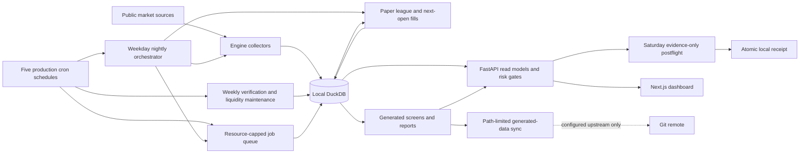

# How the trading engine works

One box, one DuckDB file, five deterministic production cron schedules, and one evidence-only
Saturday postflight. The engine collects real market data, screens it, runs a paper-trading league
of pre-registered strategies against a conservative fill simulator, mines supporting datasets, and
backtests itself — all locally. There is **no broker connection and no real money** (that is M5,
deferred, personal-hardware-only by design).
Generated public data may leave through Git only when the current branch has a configured
upstream. The `source_control` object in `GET /meta` is authoritative for the current tracking
state; `local-only` means local commits are not an off-machine backup.

Specs: [`design/trading-engine-design.md`](design/trading-engine-design.md) (§12 wins on
conflict) and [`design/trading-execution-design.md`](design/trading-execution-design.md).
Documentation index: [`README.md`](README.md). Build history + every decision:
[`BUILDLOG.md`](../BUILDLOG.md). This is the operating map, not the law—when it disagrees
with the specs or BUILDLOG, they win.

## The honesty rules (why the design looks like this)

1. **Never invent a price** — a failed fetch is recorded as missing, never filled in.
2. **Point-in-time, append-only** — anything stamped `as_of`/`run_date`/`fetch_as_of`
   (screens, fundamentals, earnings, universe snapshots, corporate actions, macro signals,
   experiment results) is never updated, only appended. Backtests can therefore only see
   what was knowable at the time.
3. **Pre-registration** — every executed strategy or experiment freezes its hypothesis,
   expectation, control, and kill criterion *before* evidence accrues
   (`sim/strategies/configs.py`, `farm/experiments/*.yaml`, or a versioned charter under
   `docs/charters/`). A charter permits a bounded research run; it does not activate a paper
   book. No peeking or threshold tuning after the fact.
4. **Conservative fills** — orders fill at the *next* session's open with size-dependent
   slippage and a liquidity cap; never same-bar, never at prices we didn't store.
5. **Prove by running** — nothing is "done" from code inspection; every feature ships with
   an end-to-end proof on a DB copy, logged in BUILDLOG.

## Components

```
engine/               data layer + nightly driver
  collect.py            yfinance EOD -> prices (~4.1k liquid names, 19.8M rows, history to 1962)
  universe.py           nasdaqtraded.txt -> universe + append-only daily snapshot (~12.2k names)
  market_date.py        resolves the breadth-qualified date allowed to advance nightly state
  screen.py             Minervini trend-template screen -> screen_results + data/screens/<date>.md
  actions.py            corporate actions: splits/dividends fetch + the reconciler (see below)
  signals.py            macro/flow/sentiment collector -> macro_signals
  intraday.py           1m/7d + 5m/60d archive for ~1.1k names (raw archive, not a signal source)
  fundamentals.py       weekly point-in-time fundamentals   earnings.py  daily earnings dates
  queue_runner.py       THE job queue (§12.7): resource-capped drain (parallel only for jobs
                        declared safe), resumable jobs, stale-job reclaim, bounded budget
  forward_review.py     frozen sector-momentum-vs-SPY paper monitor
  xs_forward_review.py  frozen prospective 12-1-momentum-vs-EW paper monitor
  run_daily.sh          the nightly driver (see pipeline below)
sim/                  the paper league
  strategies/           one file per strategy + configs.py (the frozen pre-registrations)
  league.py             creates books, steps one session/day: orders -> fills -> dividends -> MTM
  fills.py              next-open fill model, slippage by median dollar volume, liquidity cap
  portfolio.py          cash/position accounting; state = pure function of (fills, dividends)
  calendar.py           NYSE session calendar helpers
server/               FastAPI backend (localhost:8000) — read endpoints + discretionary tickets
  host_command.py     bounded subprocess capture for read-only host probes
  driver_log.py       cron-log parsing plus advisory-lock and runtime observation
  driver_monitor.py   expected-slot and aggregate scheduled-driver projections
  scheduler_host.py  read-only crontab, service, and timezone host probes
  scheduler_monitor.py exact schedule and launch-readiness audit
  friday_postflight.py schedule-aware validation of the auxiliary Friday audit receipt
  meta_snapshot.py    fail-soft loader for the optional engine health snapshot
  market_health.py    market freshness + independent-price evidence projection
  liquidity_monitor.py scheduled liquidity-evidence reconciliation
  exposure_monitor.py stale active-position/order projection with exposure-scoped quote history
  meta_projection.py  composes the read-only `/meta` payload and isolates optional failures
  miner_monitor.py    bounded scheduled-miner job + metadata reconciliation
  nightly_monitor.py  nightly driver/database state and final evidence projection
  nightly_reports.py  bounded screen and league artifact reconciliation
  queue_monitor.py    queue counts and actionable-versus-historical failures
  sweep_monitor.py    recurring-sweep queue and published-ranking evidence
  walkforward_recovery.py bounded scheduled-driver recovery from exact queue cohorts
  walkforward_artifacts.py stable published-result validation facade
  walkforward_artifact_identity.py registration and evidence-cohort identity validation
  walkforward_artifact_geometry.py planned, retained, and data-floor-dropped fold validation
  walkforward_artifact_folds.py terminal-fold statistics and summary validation
  walkforward_cohort.py published cohort scanning, reconciliation, and projection
  walkforward_evidence.py live registrations + walk-forward evidence projection
  sector_forward_status.py fail-closed Sector prospective-evidence projection
  xs_forward_status.py fail-closed cross-sectional momentum evidence projection
  e1_forward_status.py fail-closed E1 out-of-sample experiment projection
  forward_contracts.py shared paper-only projection primitives
  file_utils.py       bounded nonblocking regular-file reads for operational artifacts
  status_validation.py strict timestamp/count parsing shared by evidence monitors
  market_read_models.py bounded recent market-date resolution with exact fallback, plus screens/candidates
  league_read_models.py streaming operational standings and stable league/equity facade
  league_equity_read_models.py bounded single-book and bulk equity-series projections
  paper_read_models.py discretionary ticket sizing context
  position_read_models.py active holdings and market marks
  order_read_models.py bounded active-book order history
  journal_read_models.py discretionary journal + bounded league events
  json_utils.py        strict JSON decoding for operational evidence and stored metadata
  read_model_utils.py shared row materialization and display-text bounds
  research_readiness.py non-promotional aggregate research-admission projection
  stock_readiness.py  point-in-time stock-selection coverage gate
  fundamentals_readiness.py point-in-time fundamentals coverage gate
  intraday_readiness.py live 1m/5m coverage gate with date-range-cached NYSE schedules
  readiness_common.py shared date/count normalization for readiness projections
  risk.py             ticket context, ordered gate orchestration, and admission decision
  risk_ticket_gates.py pure stop, anchor, notional, sizing, playbook, and reward/risk gates
  risk_book.py        bulk discretionary valuation, stops, and pending/open risk
  risk_history.py     streaming FIFO round trips and bounded circuit-breaker state
  risk_market.py      SPY-regime and point-in-time earnings evidence
  sizing.py           fixed-fractional position sizing primitive
  ticket_contract.py  closed request shape and discretionary-ticket normalization
  tickets.py          atomic discretionary ticket/order/review mutation facade
  ticket_store.py     SQL persistence inside caller-owned ticket transactions
ui/                   Next.js dashboard (localhost:3000), /api/* proxied to :8000
  app/page.js           dashboard request fan-out and fail-visible response admission
  app/components/Dashboard*.js independent league/evidence/readiness/screen render sections
  app/components/Header*.js persistent shell plus operational/research status sections
  app/components/Ticket*.js validated mutation owner plus presentation-only field/result sections
  app/positions/page.js position/order request fan-out, response admission, and filter derivation
  app/components/Positions*.js independent open-position and bounded-order render sections
  app/journal/page.js journal fetch, response admission, and top-level failure boundary
  app/components/Journal*.js circuit-breaker, ticket, round-trip, and league-event render sections
  app/league/page.js league/equity request fan-out, cross-response admission, failure boundary
  app/components/League*.js operational context/notices and standings/curve render sections
  app/candidates/[ticker]/page.js candidate/context request fan-out and response admission
  app/lib/candidate-route.js bounded route decoding and encoded in-app candidate-link construction
  app/components/Candidate*.js summary, template-check, and ticket-panel render sections
  app/lib/*-contracts.js pure endpoint-domain response validators
  app/lib/meta-*-contracts.js composed /meta core, job, automation, evidence, exposure, and forward validators
  app/lib/research-contracts.js aggregate research-readiness and derived-status validator
  app/lib/research-coverage-contracts.js input-schema, dated, and intraday coverage validators
  app/lib/operations-contracts.js stable positions/orders/journal contract facade
  app/lib/positions-contracts.js position valuation, filter, and row-coherence validator
  app/lib/orders-contracts.js bounded order/status and unique-row validator
  app/lib/journal-contracts.js ticket, gate, fill, round-trip, and league-event validator
farm/                 research workloads through the queue
  experiment.py         pre-registered experiments (SHA-256 config immutability, locked holdout)
  experiment_runner.py  E1 forward runner — one append-only row per settled out-of-sample Monday
  backtest/             historical replays of the league books (vectorized screen, real day-step)
  execution_drag.py     measures next-open-vs-signal-close cost from our own fills
store/market.duckdb   everything above in one DuckDB (single-writer!)
data/                 committed outputs: screens, league.md, reports, _meta.json health snapshot
logs/                 cron.log + per-run logs (gitignored)
```

### Runtime data flow and authority boundaries



Only the paper league and explicitly gated discretionary API mutations change portfolio state.
The dashboard, readiness endpoints, forward monitors, and Saturday postflight observe or publish
evidence; none can promote a strategy, connect a broker, or authorize live capital. DuckDB,
runtime logs, and the postflight receipt remain local and gitignored.

**Key tables:** `prices` (a *cache of Yahoo's split-adjusted view* — see reconciler),
`universe` / `universe_snapshot`, `screen_results`, `jobs`, league state in `portfolios` +
`sim_orders/sim_fills/sim_positions/sim_equity/sim_dividends`, discretionary flow in
`disc_tickets` + `audit_log` + `review_markers`, mining in `fundamentals` /
`fundamentals_fetch_log` / `earnings_calendar` / `earnings_fetch_log` / `intraday_prices`,
actions in `corporate_actions` /
`split_adjustments` / `actions_fetch_log`, research in `experiment_results`, signals in
`macro_signals`.

## The nightly pipeline (cron, 22:30 UTC weekdays)

`run_daily.sh`, under `set -euo pipefail`, with an `flock` overlap guard and bounded
DB-lock retries. Stage order and failure semantics matter:

| # | Stage | On failure |
|---|---|---|
| 1 | universe refresh | WARN, continue (transient Nasdaq hiccup must not kill the night) |
| 2 | collect (incremental EOD, calendar-gated) | **fatal** |
| 3 | resolve breadth-qualified market date | **fatal** |
| 4 | screen that exact date (`--skip-if-done`) | **fatal** |
| 5 | actions fetch (incremental: active-held ∪ active-pending ∪ core ETFs ∪ screen-top-50) | WARN, continue |
| 6 | actions **reconcile** | **fatal — deliberately.** If we can't verify the price scale, trading on it is worse than skipping a night |
| 7 | league step on that exact date (one transaction per day — no half-done sessions) | **fatal** |
| 8 | frozen sector-momentum forward review | WARN, continue; stale output is replaced with `INVALID` |
| 9 | frozen `xs_momentum_12_1` forward review | WARN, continue; stale output is replaced with `INVALID` |
| 10 | E1 forward experiment row | WARN, continue |
| 11 | sync (commit + push `data/`) | WARN, continue |
| 12 | independent price verification | WARN, continue |
| 13 | farm subshell: enqueue intraday (100) → signals (105) → earnings (110) → fundamentals (Fridays, 120) → drain the queue | pinned exit 0 — farm failures never fail the nightly |

The universe stage treats Nasdaq's `ETF=Y` field as authoritative, excludes test issues and
NextShares, and otherwise admits common-equity-like listings. Security-name checks recognize both
singular and plural rights and warrants. Preferred classes are excluded only when `preferred` or
`preference` introduces a class noun such as share, stock, security, series, or unit; this avoids
misclassifying common shares such as Preferred Bank or preferred-income funds. A name containing
`unit` is excluded only when Nasdaq also gives it a dedicated `.U` or terminal-`U` symbol, so
ordinary operating-partnership units such as ET, MPLX, and PAA remain eligible. Existing rows that
no longer pass are deactivated, never deleted, during the next normal universe refresh; historical
snapshots are append-only. The parser does not retroactively rewrite a completed day's snapshot.

A failure breadcrumb names the failing stage (`logs/.last_stage`). Queue jobs are resumable;
a killed drain leaves a stale `running` job that the next drain reclaims automatically.
The primary EOD collector and the network-backed intraday, signals, action-backfill, earnings,
and Friday-fundamentals miners do not retain a DuckDB connection during HTTP waits. The EOD
collector resolves its universe under a short read lease, writes each completed Yahoo batch
under a short writer lease, and materializes final health metadata under a final read lease.
Its max-history path commits each batch's price rows, `backfill_done` flags, and job progress
together. Queued network miners each run as one supervised, sequential child and likewise lease
the writer only for bounded checkpoints, so API/UI readers get access between writes. Intraday
appends each completed download batch through the existing idempotent insert. Signals opens a
read-only lease only for internal breadth and a writer per source insert. The breadth reader drops
its temporary universe relation in a `finally` block, so a failed breadth calculation cannot leak
connection-local state into another source or retry. Earnings and
fundamentals checkpoint every 25 names, while actions checkpoint every 50 names and commits data
rows and append-only fetch outcomes together.
Action and earnings recovery skip valid `ok` and `empty` pulls; fundamentals skips only committed
snapshots because an unusable response is a data gap. A `failed` attempt remains visible and
eligible for retry. Every explicit production transaction goes through
`engine.lib.db.transaction`: ordinary failures and process-level interruptions both trigger
rollback, a rollback failure is attached without replacing the original exception, and a
caller-owned connection remains reusable after successful cleanup. A structural test rejects raw
`BEGIN TRANSACTION`, `COMMIT`, or `ROLLBACK` statements anywhere else in production Python.
The same source audit scans `engine`, `sim`, `farm`, `server`, and `tools`, rejecting direct
`Path.write_text`/`write_bytes` publication outside the atomic resource helper. Its sole exception
is backup assembly inside a private, verified staging directory that is itself atomically
published only after the complete bundle is durable.
eligible for retry in all three miners.
By default, earnings coverage is the union of equities seen in the recent fundamentals window
and passers from the latest screen, filtered through the authoritative `universe` row to retain
only active, non-ETF names. If fundamentals has not run yet, the fallback is active, liquid,
non-ETF names. An explicit operator-supplied ticker list is intentionally unrestricted and keeps
its requested order and Yahoo-symbol mapping.

The nightly date is stricter than “the newest row in `prices`.” A date qualifies only when
real bars cover at least 90% of the active liquid universe and at least 1,000 names (the
absolute floor is capped at the universe size for a newly initialized small store). A real bar
has positive volume and is not a flat OHLC dead quote. Partial later batches and phantom rows
remain archived for audit, but cannot advance the screen or league: the driver resolves one ISO
date after collection and passes it explicitly to both commands. The resolver fails closed when
the active liquid universe is absent, no date qualifies, or any newer real-bar date remains below
the breadth threshold. The last condition deliberately includes inactive, non-liquid, and orphaned
rows because frozen downstream components still inspect the store-wide maximum date. Such a tail
stops the nightly before corporate-action reconciliation or league processing, leaving the rows
available for diagnosis without exposing downstream state to them.
The dashboard's `GET /screen/latest` projection is independently capped at that same operational
date. Both latest and dated screen routes return at most 100 passing names per page while retaining
the complete screened, passing, and new-today totals. Stable RS-rank/ticker ordering, page offsets,
page-local new counts, total pages, and previous/next flags keep every passer reachable without an
unbounded dashboard response; the API validates the final assembled page and the UI independently
validates those relationships and exposes navigation. Both boundaries require the exact public
envelope and row fields, unique ordered tickers, safe counts, and a positive page limit.
`GET /screen/{run_date}` remains an explicit archival lookup for diagnosis.
Every returned screen row must also match its requested run date and have a positive finite close,
an exact RS rank from 1 through 99, an exact template score from 0 through 8, finite distance
metrics, real booleans, and the known `all` or `ex-leveraged` universe policy. Candidate history
is bounded to the newest 250 stored bars and requires an exact envelope and bar shape, strictly
increasing real dates no later than `as_of`, positive finite OHLC values with coherent high/low
geometry, and finite nonnegative volume. A latest quote, when present, must be a complete date/value
pair with a positive finite close that exactly matches the corresponding returned bar; an attached
screen row uses the same screen contract. The assembled candidate is validated again before return.
Invalid stored or internal values fail the affected read without rewriting or silently dropping the
source row.

The same gate checks paper-ledger continuity. All active portfolios must share one latest
equity checkpoint, and a newer qualified date must be exactly the next scheduled NYSE session.
It is safe to repeat the same date (`--skip-if-done`), but the nightly will not jump over a
missing session or guess how to reconstruct its historical screen and corporate-action state.
Such a gap stops before screening and requires explicit, audited recovery.
The screener atomically publishes its dated Markdown recovery anchor before committing
`screen_results`; once rows exist, that anchor supplies the regime and exclusion context needed
to rebuild the remaining CSV, EOD, latest-summary, and metadata companions. A legacy or corrupt
state with committed rows but no dated anchor fails closed and preserves the append-only rows;
only an explicit `--rerun` can authorize recomputation.

## The corporate-actions reconciler (the subtle one)

Yahoo restates raw OHLC at fetch time, but incremental collection only re-fetches ~5 days —
so the first split in any stored name would leave a permanent scale break in history.
The reconciler (nightly, fatal) adjudicates every known split against what the **stored
series actually shows**: it locates the break by scanning close ratios (never assumes the
ex-date), restates exactly once (watermarked in `split_adjustments`, audited in
`audit_log`), adjusts held positions (qty×ratio, cost÷ratio), and **never guesses** —
ambiguous or contradictory readings are skipped with a TODO for a human. Dividends are
credited to the books as cash (`sim_dividends`), which is what makes `total_return` real
(the BIL hurdle in dual_momentum was inert until this existed). An independent tripwire
flags any held name with a >40% one-session move and no corporate-actions row.

## The league

The live store currently has **21 active paper portfolios**, all long-only and each with
its own persisted initial capital and execution profile. 18 are historically
replayable rules. Three are intentionally excluded from historical walk-forward:
`discretionary` needs human tickets, `pead_ear` lacks historical point-in-time earnings
dates, and `macro_composite` lacks a historical point-in-time macro reconstruction. They
remain valid forward-paper books; they are not silently scored as zero-return backtests.

The replayable cohort includes SPY and equal-weight controls, dual and sector momentum,
the Minervini template family, mean-reversion overlays, turtle and stopped momentum,
low-volatility, 52-week-high, and `xs_momentum_12_1`. Every automated book's frozen config
carries an expectation and a **kill criterion**; the weekly review judges process, not
outcome. Current standings: `data/reports/league.md`, whose table contains exactly the active
portfolios marked in that nightly. `data/reports/league.csv` deliberately remains the
complete `sim_equity` history, including retired portfolios, so retirement does not erase audit
evidence. Historical replays:
`data/reports/backtests/`. Five AI-overlay books and two frozen twins were retired
2026-08-18 (`active = FALSE`, equity history kept); their immutable source and reports
live in `archive/agentic-2026-08/`.

The vectorized historical screener treats its named DuckDB tables as call-scoped scratch state:
all `_hs_*` tables and the optional leverage-exclusion table are dropped in a `finally` block, so
an interrupted screen cannot pollute a caller-owned replay connection. This cleanup does not alter
the point-in-time formulas, membership policy, ranks, or rows written by a successful screen.

The live League page is an operational scoreboard, not a research ranking. It orders raw total
return since each current book's own inception, so windows differ. An active book whose latest
equity checkpoint trails the operational date remains visible but is labelled stale and unranked;
its SPY context ends on that book's own equity date. Its `vs SPY` column is same-window
market context, not every strategy's registered control. The API labels these semantics as
`ranking_basis`, `comparison_basis`, and `evidence_role = operational_only`; neither rank nor a
positive contextual spread is evidence of profitability or a promotion signal. Comparative
claims belong in the coherent walk-forward and frozen forward reports below.
The API computes those standings over the complete active cohort with equity history, then returns
at most the first 100 ranked rows with exact `matching_count` and `truncated` metadata. The bulk
equity endpoint uses that same ranked selection and repeats the portfolio-level limit/count state;
it never substitutes an alphabetical subset. This bounds the operational response without changing
rank calculations or hiding that the displayed table is partial.

**Weekly walk-forward re-validation** (`farm/walkforward/`, job kind `walkforward`) is the
input to that review: every historically replayable active book is re-run over rolling
train→validate folds
(24 months train, 12 months validate, stepped 12 months, 10 folds, anchored on the latest
session), one independent replay per fold through the same league day-step. Each newly
generated artifact stores a versioned comparison declaration: screen-driven single-name
books use `ew_benchmark`; ETF/allocation books use `spy_benchmark`. Reports include a
mechanical exploratory PASS / WATCH / REVIEW flag only when candidate and control share
that declaration and the complete source/data/capital/execution cohort. An old artifact
without the declaration remains visible as absolute historical context but receives no
fresh relative verdict. Reports land in `data/reports/walkforward/`. The workload is NOT
part of the weekday nightly: run `engine/run_weekly_walkforward.sh` (Sunday cron).
The `weekly_walkforward` object in `GET /meta` reports whether that scheduled driver completed
(including a later complete queue cohort recovering an enqueue failure). Separately, the
`walkforward_evidence` object validates every active book's result against its canonical live
config hash, then requires one complete source, anchor, train/validate/step, fill-model, universe,
initial-capital, execution-profile, data-snapshot, and comparison-protocol cohort. It reports
`current`, `stale-source`, `incomplete`, `mixed-cohort`, or `invalid`, with compact signature
fields for diagnosis; the UI treats only `current` and a validated `updating` transition as
healthy. A successful driver run, the latest published historical cohort, and current evidence
are deliberately not treated as the same fact.
The evidence decision always uses the complete artifact scan. Its six public diagnostic
categories each expose an exact count, at most 100 sorted values, and separate list- and
value-truncation flags; each returned value is capped at 256 Unicode code points. Thus an
oversized set of missing results, invalid files, config or registration mismatches, duplicate
config IDs, or invalid registrations cannot make `GET /meta` unbounded, while omitted details
cannot make the underlying status appear healthier.
Completeness is measured against the registered ten-fold plan, not merely against an artifact's
self-reported retained count. Retained protocol/result folds plus `dropped_folds` must account for
each index 1–10 exactly once. Every drop must carry `status: dropped`, a non-empty reason, and valid
train/split/validate geometry. Retained folds may honestly terminate as `ok`, `inert`, or `skipped`;
this integrity check requires disclosed evidence, not a profitable outcome.
The validator also reconstructs all ten calendar windows from the declared anchor and
train/validate/step lengths. It independently derives each book's `data_floor` from the live
required-ticker history and requires the artifact to match. A fold is dropped exactly when its
validation window opens at or before that floor; otherwise only its training start may be clamped
up to the floor. Missing required history, self-consistent but shifted dates, an undisclosed
floor-driven drop, or any other geometry that the producer could not have emitted is invalid.
The declared window lengths must also equal the frozen live protocol—24 months train, 12 months
validate, and 12 months step—so a uniformly altered cohort cannot redefine the experiment and
still report `current`. The anchor is intentionally cohort-specific: the Sunday job anchors to the
latest stored session at run time, and later weekday collection does not by itself invalidate that
weekly result.
Every published `summary` must also equal a fresh aggregation of its retained fold records. The
validator recomputes fold counts, validate fills, win rate, mean/median/best/worst return, train and
validate CAGR, decay, Sharpe, drawdown, and latest return with the producer's own summarizer. A
plausible-looking edited headline metric or an extra unrecognized summary field therefore cannot
enter a `current` cohort independently of the underlying fold evidence.
For every successful fold, the compact evidence must also be arithmetically self-consistent:
calendar boundaries and first/split/last sessions must agree; train and validation equity must
join at the split; return and CAGR must recompute from finite equity, base, and elapsed-year
values; session and fill counts must reconcile; clamp disclosure must match the data floor; and
the ordered monthly validation series must start in the split month and close at final equity.
Stored volatility, Sharpe, monthly loss, and drawdown values are domain-checked, but the compact
artifact does not contain the daily path needed to recompute them independently. `inert` and
`skipped` remain valid non-results only with an explicit reason and are excluded from summaries.
Producer-owned assumptions are bound to live code, not accepted merely because every artifact
repeats them: `fill_model` must equal the simulator's current version, `universe_policy` must equal
the producer's resolved policy, and `data_quality_class` must equal the strategy classifier. A
uniformly mislabeled cohort or malformed live policy is invalid rather than a new coherent cohort.
For any scheduled or manually started exact queue cohort, the `weekly_walkforward` projection
reports the newest cohort as `updating` with per-state `refresh_*` job counts. A failed driver is
reported as `recovered` only after every expected book completes; an older successful run or
recovery cannot hide newer work in progress. Failed-run responses retain `recovery_*` aliases for
compatibility.
Parallel-safe rows are finalized together after the slowest child in that batch exits, because
the parent cannot reacquire DuckDB's writer while sibling readers remain open. An individual
artifact can therefore publish atomically before its row leaves `running`; the cohort counts are
deliberately conservative, and the exact service/PID state is the tie-breaker while updating.
During that validated replacement, `walkforward_evidence` reports `updating` and retains the
intermediate file state as `artifact_status`; malformed artifacts or invalid registrations still
report `invalid` immediately rather than being hidden by the active recovery.
The artifact's `data_snapshot` is a compact table-level identity, not a byte-for-byte archive of
the replay inputs. Pinning an anchor fixes the fold dates but does not stop Yahoo from revising its
split-adjusted historical cache. Before a provenance-only refresh, preserve the old result JSON
and run `tools/audit_walkforward_migration.py` against the replacements; any diagnostic or
economic path outside the declared provenance/runtime allowlist must be reviewed and documented.
The audit and live `walkforward_evidence` validator recompute each snapshot SHA-256 from the same
canonical `tables` serialization used by the producer; a digest that merely has the right shape
cannot authorize snapshot drift or be reported as current evidence. Both readers also reject
duplicate JSON object keys instead of silently accepting the last value. Server-side evidence and
stored-metadata readers share that strict policy and reject non-standard or non-finite JSON numbers
such as `NaN`, `Infinity`, and float overflow, plus structures deeper than the shared 100-level
safety limit. Operational JSON file reads are capped at 1 MiB. The migration auditor additionally
retains both cohort directory chains without following symlinks, admits only regular `.json`
leaves, and rejects a directory, inventory, file identity, or file-content change observed during
the complete comparison. Unregistered legacy result files
are identified and
ignored before strict evidence validation; that does not admit them into the active cohort.
For a material migration, retain immutable `before/` and `after/` cohorts under
`data/reports/walkforward/migrations/`; the canonical result directory is a moving latest view and
cannot reproduce an old comparison after the next scheduled refresh.
Exact rerun reproducibility additionally requires retaining the input database or exported replay
tables from the original run.

## The discretionary path (the UI's reason to exist)

`ui/` (Next, :3000) → `/api` proxy → FastAPI (:8000, localhost-only) → the 11 risk controls
in the execution design §4: `data_quarantine`, `stop_present`, `entry_anchored`, `notional_cap`,
`sizing_1pct`, `playbook_named`, `rr_at_least_2`, `max_open_risk_4r`, `earnings_window`,
`regime_gate`, and `circuit_breaker`. The 4R heat control includes pending tickets. A passing
ticket becomes a **pending** `sim_orders`
row in the discretionary book — it fills at the next session's open through the same fill
model as every other book. The server never fills or steps anything. While a queue job
holds the single DuckDB writer lock, the UI degrades honestly (503 / "database busy").
The same 503 boundary covers a write request that overlaps the API's own read-only DuckDB
connections; transient connection-mode contention must not escape as an internal-server error.
Ticket submission accepts only `buy` or `sell` and finite positive quantities/prices. A sell
reserves against both the held quantity and already-pending exits, so concurrent close intents
cannot create a short. Ticket/order/audit creation, cancellation, and circuit-breaker review
markers each commit atomically. The returned signal date is the exact date stored on the order;
a request made after the next session opens is rolled forward to prevent a past-open fill.
Text input is bounded before any database work: ticker 32, playbook 128, emotion 32, override
reason 512, and notes 4,096 characters. The form mirrors the journal-field limits, while the API
remains authoritative for every client; OpenAPI advertises the same maxima on the request schema.
Read-route identifiers are validated before a database connection opens: candidate tickers use
the same 32-character ceiling, ticker and portfolio identifiers must be nonblank; portfolio
identifiers must contain 1–128 characters; and both must be canonical trimmed, printable single
lines. Public numeric identifiers must be positive integers no greater than
`9,007,199,254,740,991`, so every value remains exact in JavaScript and other interoperable JSON
consumers. This applies to queue/miner/sweep job IDs, paper order and ticket IDs, fill-event IDs,
Friday-postflight receipts, and stale-exposure order details. Ticket cancellation enforces that
same range before opening DuckDB and again at the transaction boundary; an unsafe stored linked
order ID fails without a write. New ticket/order allocation at an exhausted boundary returns a
controlled 503 and rolls back the portfolio, order, ticket, and audit transaction.
Public count metadata uses the corresponding nonnegative range from zero through
`9,007,199,254,740,991`. Database aggregates and cross-projection counts are validated before
pagination arithmetic or serialization; booleans, floats, negatives, and larger integers fail the
affected projection instead of being coerced or rounded by a JSON consumer. An omitted `portfolio`
query still requests all active positions, but an explicitly empty value is invalid rather than
being treated as unfiltered.
Database-backed portfolio identifiers crossing the league, equity, positions, orders, journal,
or stale-exposure boundaries must additionally be trimmed printable single lines under that same
128-character ceiling. Invalid legacy keys fail the affected projection; they are never truncated,
silently omitted, or allowed to collide as JSON object keys.
The same fail-closed rule applies to database-backed ticker keys crossing screen, candidate,
position, order, journal, stale-exposure, and active-quarantine projections under the existing
32-character ceiling; malformed ticker identities are never clipped or rewritten.
If the discretionary portfolio has been retired, submission fails closed instead of appending a
new intent to—or silently reactivating—the archival book.
The ticket form's 1%-risk hint uses `GET /tickets/context`, a read-only projection of the same
discretionary equity and risk constants used by the server gates. It uses configured `$39,000`
initial capital only when that endpoint explicitly reports that the book is not yet created. If
the book is inactive, the candidate lacks a real quote on the context's breadth-qualified market
date, or the read fails or is malformed, no quantity is suggested; a manual
quantity remains subject to the server's authoritative notional, 1%-risk, experiment-size, and
4R portfolio-heat gates. A failed or contradictory context response is also shown as a visible
warning on the Candidate page rather than only suppressing the suggestion.
The producer requires an exact calendar date when one is present, a real boolean active flag,
positive finite equity and risk limits, `risk_pct <= 1`, and
`experiment_max_pct <= risk_pct`. Invalid configuration or stored state fails the projection;
an inactive book or nonpositive/non-finite active equity remains an explicit unavailable sizing
state rather than being serialized as usable capital. Malformed dates or active flags still fail
the projection. The producer and browser also require the exact eight-field ticket-context
envelope, preventing an unreviewed backend field from silently becoming sizing input.

The replacement paper-agent path currently stops at **shadow admission**. `GET /agent/context`
returns a bounded, deterministic context only for the active fixed-instrument strategies
`dual_momentum`, `dual_momentum_gated`, and `sector_momentum`, and only for an active, liquid,
non-quarantined ETF explicitly named by that strategy's frozen registration. The context binds the
breadth-qualified market date, exact stored quote and source timestamp, strategy/config hash,
active deployed portfolio registration, initial paper capital, execution profile, research data
snapshot, runtime source, and the agent-boundary source files under one canonical `context_sha256`.
Context schema v10 also wraps each selected daily OHLCV and cash-dividend row in a versioned data
contract and binds
the configured model, model-version status, prompt hash, empty-toolset hash, and connector policy.
The data contract records
the observation date, conservative usable-at time, latest ingestion time, provider and adapter
identity, installed adapter-library version, complete normalized record and recomputable hash,
adjustment policy, and quarantine state. The agent layer also owns the append-only
`agent_daily_price_observations` ledger. Before a signal-date model request, the shadow worker
captures the complete registered price lookback and binds every selected fact to an immutable
observation hash, sequence, value-revision number, prior-observation hash, adapter version, and
installed yfinance version. Repeated values with a later source ingestion remain distinct
`unchanged_observation` receipts; changed values become `value_revision` receipts. The operational
`prices` table and all deterministic algorithm reads remain unchanged.

The agent layer separately owns `agent_corporate_action_observations`. The data-capture worker and
signal-date shadow worker capture normalized dividend and split rows in the registered lookback,
with the same sequence, value-revision, classification, previous-observation hash, adapter, and
library identities. Dividend facts selected for total-return features bind their exact immutable
observation and use capture time as the conservative usable-at time. Neither ledger changes
`corporate_actions`, and deterministic algorithms continue to read their existing tables.

These ledgers are prospective normalized-observation history, not raw provider history. The first
capture of an existing row is explicitly `baseline_snapshot`; it proves only what the mutable cache
contained at capture time.

The same data-capture worker now makes one bounded Yahoo chart-v8 request per registered ticker
after normalized capture, with no model involved and no DuckDB connection held during network I/O.
It stores each exact successful JSON response body in the append-only `agent_provider_responses`
ledger with request scope, request/receipt timestamps, content type, byte count, SHA-256,
endpoint-version identity, and installed yfinance version. Each newly retained response also
produces append-only `agent_provider_source_observations` directly from those exact bytes. When a
source observation's value matches a selected cache fact, context schema v10 binds that
source-derived revision, its receipt, and its response hash and may truthfully report
`raw_retained = true`. This does not replace or mutate the operational cache.

A separate hash-bound link ledger joins only values whose ticker, date, kind, and normalized value
hash exactly match an existing cache-derived price or corporate-action observation. That weaker
relationship remains `later_exact_value_corroboration`: it does not rewrite the earlier observation
or claim that its original ingestion payload was retained. Revised current-session values therefore
remain unlinked to older cache observations. Consecutive overlapping response windows are also compared as complete
corporate-action sets. The bounded status reports additions and removals separately, so an action
that disappears from a later provider response remains detectable prospectively even though
pre-capture deletion history cannot be reconstructed. Total receipt-to-observation links and
distinct corroborated observations are reported separately so repeated checks cannot inflate
coverage.

The provider-response status validates every retained response, link, and source-revision chain
before comparing the newest exact source observation for each fact with the current operational
cache. It recomputes both sides using the same canonical daily-price or corporate-action value
shape and returns aggregate counts only: aligned values, mismatched values, missing cache rows,
affected ticker count, mismatch date bounds, and the latest mismatch receipt time. This
distinguishes absent raw evidence from a later provider value that disagrees with the cache,
without exposing prices or mutating either dataset. A mismatch remains a point-in-time data
blocker and is not permission to silently restate the cache.

The same supervised data-capture worker independently requests the registered strategy tickers
from Nasdaq's historical quote endpoint. `agent_independent_price_responses` retains each exact
successful HTTP body with request scope, request and receipt timestamps, endpoint identity,
installed Requests version, byte count, and response hash.
`agent_independent_price_observations` contains only facts re-derived from those retained bytes;
it records every timestamped confirmation, hash-chains each ticker/date sequence, and distinguishes
unchanged confirmations from source-value revisions. `GET
/agent/data/independent-price-evidence` exposes only aggregate verified coverage and never raw
response bodies or market values. This path is a separate evidence ledger: it cannot update
`prices`, quarantine a ticker, create a proposal or order, or grant execution authority.

Operators can inspect those mismatches through the separate read-only CLI:

```bash
.venv/bin/python -m tools.review_agent_data_discrepancy list
.venv/bin/python -m tools.review_agent_data_discrepancy build \
  daily_price SPY 2026-09-11 daily_price > /operator-controlled/data-review.json
.venv/bin/python -m tools.review_agent_data_discrepancy verify \
  < /operator-controlled/data-review.json
```

The list is bounded and exposes identities and hashes rather than market values. A one-hour review
packet binds one newest verified Yahoo source observation, the current cache fact or its absence,
exact field-level differences, and all retained responses confirming the selected source value.
For daily prices, packet schema v2 also binds the newest verified exact-response Nasdaq fact when
available and compares it independently with both Yahoo's retained source value and the current
cache. This durable third-source evidence can support an operator disposition but never selects or
executes one automatically. It
offers only explicit future dispositions: guarded repair, retain with justification, quarantine,
or defer. The packet is not a decision and the review CLI cannot write the cache, activate a
quarantine, record an adjudication, or grant execution authority. Independent price-verifier
disagreement remains insufficient by itself to confirm a primary-store defect.

A separate operator-only CLI can persist the selected disposition after independently revalidating
that short-lived packet against the retained raw responses, source-observation chain, and current
cache inside the same transaction:

```bash
.venv/bin/python -m tools.adjudicate_agent_data_discrepancy \
  --db store/market.duckdb record < /operator-controlled/adjudication-request.json
.venv/bin/python -m tools.adjudicate_agent_data_discrepancy \
  --db store/market.duckdb status
```

The request supplies one packet, a unique decision ID, operator ID, one of the four exact
dispositions, and a bounded nonempty justification. The resulting
`agent_data_discrepancy_decisions` ledger is globally sequence-checked and hash-chained, permits
only exact replay for a decision ID or exact discrepancy state, and exposes aggregate status
without operator justification text. Every disposition is record-only: guarded repair and
quarantine still require separate future mechanisms, while retaining or deferring does not make
the underlying data paper-ready. Its canonical operational effect is
`record_only_separate_follow_up_required`. The CLI has no cache writer, quarantine writer, order
route, or execution authority.

Yahoo and Nasdaq publication times remain unavailable, neither endpoint identity is a stable
provider dataset revision, and historical cache baseline rows still lack their original raw
payloads. Independent agreement therefore does not by itself make the point-in-time gate pass. Fact
contracts therefore remain `quality_status = limited` and
`usage_authority = shadow_context_only`; only exact-response source observations report
`raw_retained = true`, and that alone cannot grant paper execution authority.
`GET /agent/data/daily-prices`, `GET /agent/data/corporate-actions`,
`GET /agent/data/provider-responses`, and `GET /agent/data/independent-price-evidence` report
bounded capture coverage, receipt bytes, exact-match links, kinds, and revision classifications
without exposing market-data rows or raw response bodies.

The same context includes a bounded `decision_features` section derived only from the instruments
and lookbacks in the frozen strategy registration. For dual momentum this is SPY/EFA/BIL over 252
sessions; for sector momentum it is the 11 registered sector ETFs over 63/126/252 sessions. Each
complete feature retains the exact start/end price facts, every dividend fact used in the window,
corporate-action fetch coverage, observed and required session counts, the unreinvested-cash
total-return formula used by the deterministic strategies, and recomputable calculation/feature
hashes. An asset with stale or short price history, quarantine, or missing corporate-action
coverage is returned as `unavailable` with no computed return. The feature contract does not claim
immutable raw history: observed price and dividend components bind their normalized revision
ledgers, while source payloads, publication metadata, and removal/tombstone history remain
unavailable; all components retain
`quality_status = limited` and shadow-only restrictions.

The model transport is the separately supervised local Trae CLI proxy at
`http://127.0.0.1:8317/v1/responses`. `GET /agent/model/status` checks the proxy health and catalog,
requires the allowlisted `GPT-5.6-Sol:max` model, exact expected catalog mapping, proxy version,
and Trae CLI runtime, and returns only sanitized connector metadata. Context schema v10 binds the
canonical selected-catalog-entry hash, `gpt-5.6-sol__max` routing key, catalog component marker,
proxy v0.7, and Trae CLI `0.204.1` runtime. Every generation brackets the model POST with identical
health and selected-catalog reads, and every retained model response binds the resulting catalog
hash and runtime identity. Alias remapping or transport drift before response acceptance therefore
fails closed. The status does not expose the proxy's token, user, upstream
URL, or authentication files. The connector uses
the non-streaming Responses-compatible route with fixed instructions, no tools, no parallel tool
calls, bounded request and response bodies, and explicit status/inference timeouts. Any tool call,
non-JSON model output, unavailable model, malformed response, or proxy failure is an error and
cannot fall through to another provider. The connector has no order or portfolio capability and
is used by the supervised shadow schedule described below. Because the proxy catalog exposes an
alias, internal routing key, catalog component marker, `config_name`, context size, and a zero
`created` field rather than an immutable provider model revision, the context records
`model_version = unversioned-catalog-alias`,
`provider_model_revision = null`, and `provider_model_revision_available = false`. Catalog and
runtime binding detects transport drift but is not relabeled as a model revision. This is
acceptable for connector/shadow evaluation but must be replaced by a provider-stable revision
identity before either paper authority gate can pass.

Agent behavior is registered separately from the algorithm portfolio in
`server/agent-shadow-registration.json`. The registry currently freezes an agent-only
dual-momentum policy and a manual-shadow-only hybrid veto policy. Each has its own policy
ID, registration hash, reserved portfolio ID, control ID, limits, execution-profile identity,
failure behavior, and attribution controls. These are reservations, not simulator portfolios:
the existing `dual_momentum` algorithm book and its nightly scheduling are unchanged. The hybrid
registration is deliberately absent from automatic scheduling and has no simulator route.

The shadow runner checks the registered strategy cadence before constructing context or contacting
Trae. For monthly dual momentum, dates that fail `sim.calendar.is_month_signal()` are recorded as
deterministic `cadence_no_action` attempts with no model request. Future attempts and proposals
carry policy identity; pre-registration records retain null policy columns and are exposed as
`legacy_unregistered`, so they are not retroactively relabeled. `GET
/agent/policies/evaluation` reports registration metadata and policy-separated attempt/proposal
counts only. It makes no performance claim and prohibits pooling agent-only, hybrid, or legacy
evidence.

`POST /agent/proposals/shadow` accepts only the closed schema-v2 `TradeProposal` envelope. It
requires model, prompt, toolset, strategy, source, data, context, signal/expiry, instrument,
notional, thesis, invalidation, confidence, and evidence identities. The server rebuilds the
context inside the write transaction, verifies the model/version/prompt/toolset fields against the
connector identity embedded in that context, records a mismatch as `shadow_rejected`, and treats an exact
proposal/idempotency replay as the original result while rejecting conflicting reuse. Accepted and
rejected proposals are appended to `agent_proposals` with both the submitted and server-validated
context hashes, the exact server-validated context payload when one could be built, and an
`audit_log` event. Once context identity passes, the server independently recomputes quantity at
the same-date close and checks execution authority, policy identity, instrument eligibility,
complete registered-universe features, signal-date alignment, policy notional and capital
ceilings, stop geometry, reserved sell inventory, and the execution profile's one-percent cap
against 60-session median dollar volume. The canonical validation payload and its SHA-256 are
stored with the proposal. A failed gate is a shadow rejection; these checks grant no execution
authority. Retaining both context and validation evidence makes the decision boundary replayable
without reconstructing mutable current market or registration state.

`GET /agent/proposals` is the read-only operator view of that ledger. It returns the newest 100
records in descending record-ID order, with an exact `matching_count` and `truncated` marker, and
may be filtered to `shadow_accepted` or `shadow_rejected`. Its closed public shape includes proposal,
agent/model, strategy/mode, instrument/side/notional, signal/expiry, status, submitted and validated
context hashes, validation status/hash, rejection reasons, and receipt time. It deliberately excludes the idempotency key,
prompt/tool hashes, thesis, invalidation, evidence array, normalized proposal, retained context
payload, retained validation payload, and any later internal columns. Malformed stored public fields or
tampered validation evidence fail the projection instead of being omitted or coerced. Historical
accepted rows that predate deterministic validation remain immutable and are labeled
`legacy_unvalidated`; new accepted rows require a passing validation hash. Both the list and
submission responses state
`execution_authority = none`.

`GET /agent/attribution` derives a separate, read-only contribution record for each completed
registered shadow decision window. It binds the attempt, policy registration, retained context,
terminal event, proposal validation, and—when present—hybrid candidate and effective-order hashes.
Agent proposal, proposal rejection, model no-action, transport/output failure, hybrid allow,
hybrid veto, and predeclared hybrid fallback remain distinct outcomes. Legacy unregistered
attempts are counted but excluded, and evidence pooling is prohibited. Because the reserved
agent and hybrid portfolios do not yet exist, the endpoint explicitly reports
`return_attribution_status = unavailable_no_isolated_paper_portfolio` and makes no performance
claim. It does not create a portfolio, order, fill, or equity row.

The read model now also contains a verifier for a future isolated-book registration and
per-order ownership contract. It accepts return attribution only when a reserved book exactly
matches its policy, remains separate from the algorithm and benchmark controls, every simulator
order is bound to one retained policy decision, fills and positions reconcile to those orders,
cash reconstructs from fills and dividends, and the equity dates align exactly with both controls.
The attribution module now defines an explicit, unwired initializer for its two empty ledgers.
Their exact schema requires one book contract per portfolio and policy, and one ownership row per
simulator order and policy-decision sequence. The initializer is idempotent and creates no
portfolio, equity, order, route, or schedule. It has not been run against the live store, so the
present attribution status remains unavailable and no paper route is enabled.

An operator-only schema migration wrapper exists at
`tools.migrate_agent_paper_attribution`. It refuses to run without a separately verified backup
bundle and its explicit manifest SHA-256. While holding the DuckDB write lock, it requires that
the bundle name the exact repository-relative source database and that the bundle's complete
logical database snapshot still match the current store. It then creates only the two empty
attribution ledgers in one transaction and verifies, before commit, that all other catalog
definitions, table row counts, job state, latest price date, and active portfolio identities are
unchanged. Any mismatch rolls back. The command has been tested only against isolated databases
and has not been invoked on the live store because no new backup destination was selected.

The eventual operator sequence is intentionally explicit:

```bash
.venv/bin/python -m tools.backup_database create /absolute/operator-selected/backup
.venv/bin/python -m tools.backup_database verify /absolute/operator-selected/backup
.venv/bin/python -m tools.migrate_agent_paper_attribution \
  /absolute/operator-selected/backup \
  --manifest-sha256 <verified-manifest-sha256>
```

The migration does not create either reserved portfolio. After migration, the read-only preflight
must still pass for the chosen attribution start date before the separate book initializer can
run.

A pure isolated-book initialization planner now derives the exact `portfolios`,
`agent_paper_book_attribution`, and initial `sim_equity` records accepted by that verifier for
either registered mode. Each plan is policy-, registry-, start-date-, and record-hash-bound;
requires one insert-only atomic transaction; starts the reserved book inactive with cash-only
equity; and marks the existing algorithm and benchmark books as protected identities outside its
write scope. It opens no database and has no table creator, scheduler integration, order route, or
execution authority.

A separate read-only preflight can assess one of those plans against the current store:

```bash
.venv/bin/python -m server.agent_paper_book_preflight \
  dual_momentum_agent_shadow_v1 2026-09-15
```

It verifies the plan, exact required table schemas, absence of the reserved policy and portfolio
identity across every relevant ledger, both protected control-book registrations, an aligned
control-equity anchor, two identical reads of the source state, and an inert inactive-only writer
with no scheduler or order route. The command uses the actual UTC clock rather than accepting a
caller-supplied retrospective planning time. It returns a hash-bound diagnostic and nonzero status
while blocked. On 2026-09-14 a live preflight for a 2026-09-15 attribution start passed the plan,
control-book, stable-read, and inert-surface checks; initialization remained blocked because both
attribution tables were absent and because neither control could yet have a 2026-09-15 equity row.
The preflight does not create those rows or tables and reports both initialization and execution
authority as none.

An operator-only initializer now exists at `tools.initialize_agent_paper_book`. It uses the same
verified-backup identity check as the schema migration, obtains the DuckDB writer lock, rebuilds
the exact policy-bound plan with the current UTC clock, and requires the complete preflight to
pass before writing. In one transaction it may insert exactly one inactive `portfolios` row, one
`agent_paper_book_attribution` row, and one cash-only opening `sim_equity` row. Before commit it
requires an unchanged catalog, job state, market date, active-portfolio identity,
protected-control snapshot, and all unrelated row counts; it then runs the full attribution
verifier against the empty book and re-reads the registered policy before commit. Any database
scope, attribution, or policy-identity mismatch rolls back all three inserts. Repeated
initialization is rejected by the reserved-identity preflight rather than treated as a successful
replay.

The initializer is deliberately not scheduled and has no API, order, fill, position, dividend, or
activation surface. Creating an inactive attribution book does not satisfy the data, model,
decision-evidence, release, human-approval, or execution-path gates and grants no paper execution
authority. After the schema migration and after both controls have equity on the selected start
date, the explicit operator command is:

```bash
.venv/bin/python -m tools.initialize_agent_paper_book \
  dual_momentum_agent_shadow_v1 YYYY-MM-DD \
  /absolute/operator-selected/backup \
  --manifest-sha256 <verified-manifest-sha256>
```

Each policy requires its own fresh backup matching the then-current database snapshot. Do not run
this command against the live store until the operator has selected that external backup
destination and the preflight for the exact start date passes.

`server/broker_human_paper_review.py` now derives one source-neutral, short-lived review packet
from the complete retained agent-only or hybrid evidence path and one exact
`SubmitOrderRequest`. It binds the policy registration, decision window, context, data snapshot,
reserved simulator account, request, and accepted proposal or surviving hybrid effective order.
A registered hybrid fallback is conspicuous in the packet, while a vetoed buy, expired agent
proposal, request drift, or review time preceding hybrid evidence fails closed. The packet expires
after at most five minutes and offers only `approve_exact_intent` or `reject` as the eventual
operator choices.

Packet schema v2 also includes a bounded human-readable summary. Agent-only summaries expose the
independently validated signal close, exact request notional, proposal ceiling, stop, confidence,
thesis, and invalidation. Hybrid summaries expose the deterministic source portfolio, exact
signal price and notional, candidate/effective/vetoed order counts, model decision, reason, and
whether the requested order survived. Numeric and order facts come from independently validated
retained evidence. Model thesis, invalidation, and non-fallback hybrid reasons are labeled
`untrusted_model_rationale`; a registered model-failure fallback is labeled separately. Raw
context, prompts, model requests, and evidence-ID arrays are excluded.

This is review material, not an approval. Its SHA-256 detects ordinary corruption but is not a
signature or authentication mechanism. The packet explicitly records `approval_source =
not_selected`, `signer_policy = not_selected`, no approval verifier or approval, no lease or
activation, an absent paper route, and `submission_authority = none`. Verification cannot change
those fields. A separate read-only retained verifier reconstructs the packet from the complete
DuckDB evidence path and exact request, compares every field, and requires the review observation
to fall at or after generation and strictly before expiry. It therefore rejects a forged evidence
hash even if its ordinary checksum was recomputed, but still does not authenticate a human. The
module has no persistence, API, schedule, adapter, or order-submission surface. Selecting and
independently implementing the human trust source and signer policy remains a separate
prerequisite.

`server/broker_human_paper_approval.py` now defines the next source-neutral trust boundary without
selecting that source. Its closed envelope binds a one-use approval ID, approval source, signer
policy ID and version, signer identity, authenticator algorithm and detached bytes, exact review
packet hash, exact order-request hash, decision (`approve_exact_intent` or `reject`), and
issued/not-before/expiry times. An explicitly supplied policy scopes authorized signers to exact
agent modes, registered policy IDs, reserved simulator accounts, its own validity window, and a
maximum approval duration. There is no default policy, bundled key, trust-store loader, or
algorithm implementation.

Both policy and envelope now have closed object parsers and independent maximum-64-KiB strict-JSON
parsers. They require exact schema versions and field sets, canonical UTC timestamps, correctly
typed sorted unique scope lists, canonical base64 authenticator bytes, finite standard JSON, and
unique keys at every nesting level. Parsing reconstructs and compares the complete canonical
payload; unknown, missing, duplicate, reordered-set, malformed, or oversized input fails closed.
These parsers do not select a file, trust its origin, or authenticate its contents.

The pure verifier checks packet structure, exact hashes, policy identity and scope, bounded time
windows, canonical signed bytes, and an explicitly injected detached-authenticator verifier. Even
when that verifier returns literal `True`, the result is only
`authenticated_decision_design_evidence`: one-use state has not been enforced and
`human_order_approval_granted = false`. A separate read-only composition first reconstructs the
packet from retained DuckDB evidence and only then invokes authentication, so a structurally valid,
rehashed packet forgery never reaches the authenticator callback. This composition writes no
database rows and does not make the caller-supplied policy trusted. The module has no CLI, API,
writer, key store, lease, activation, adapter, route, or schedule and always reports
`submission_authority = none`. A production human-order approval verifier remains unimplemented
until the operator explicitly selects an approval source, signing mechanism, signer policy, and
independent trust-loading procedure.

`server/broker_human_paper_approval_store.py` provides a separate durable, non-authorizing
replay-protection ledger for successful retained-evidence authentication results. It retains the
exact policy, envelope, review packet, and verification payload; globally sequences and hash-chains
observations; and makes approval ID, envelope, packet, and request identities unique. Exact
retained replay is idempotent, while conflicting reuse, malformed retained payloads,
source-evidence drift, and chain tampering fail closed. Approve and reject observations both remain
evidence only: every row reports `human_order_approval_granted = false`, no production authority
consumption, an absent paper route, and `submission_authority = none`. A separate read-only
completeness verifier captures the bounded ledger twice, revalidates every retained document
against its source decision evidence, and requires an independently supplied total observation
count and latest global hash. A missing ledger is accepted only under trusted zero/null state;
valid truncated history, a replaced chain, a mismatched trusted head, and concurrent changes all
fail closed. This verifier does not choose the independent trust source, select an approval
observation, authenticate new bytes, issue a lease, consume an approval, or grant authority.

Recording requires this ledger schema to be preinstalled and fails before invoking the
authenticator when it is absent; the recording path cannot create its own authority-related
schema. The operator-only `tools.migrate_agent_human_approval` command is available for a future
reviewed deployment. It requires a separately verified backup bundle, the bundle's exact manifest
SHA-256, and an exact logical snapshot match to the locked target. In one transaction it may add
only the empty `broker_human_paper_approval_observations` table, then proves that unrelated catalog
definitions, row counts, market date, job state, and active-portfolio identities are unchanged.
Incompatible or nonempty ledgers, stale or wrongly bound backups, and failed post-DDL scope checks
fail closed and roll back. The migration has passed isolated-database success, idempotency,
rejection, and rollback tests, but has not been run against the live store. Installing this empty
evidence ledger would not select a trust source, authenticate a decision, grant human approval,
create a paper route, or create submission authority. The future operator sequence is:

```bash
.venv/bin/python -m tools.backup_database create /absolute/operator-selected/backup
.venv/bin/python -m tools.backup_database verify /absolute/operator-selected/backup
.venv/bin/python -m tools.migrate_agent_human_approval \
  /absolute/operator-selected/backup \
  --manifest-sha256 <verified-manifest-sha256>
```

An operator can build one packet without a writable connection:

```bash
.venv/bin/python -m tools.review_agent_paper_intent build \
  agent_only <decision-window-id> <idempotency-key> \
  agent_dual_momentum_shadow_v1 SPY buy 5 2026-09-11 \
  > /operator-controlled/review-packet.json
```

The command itself writes only JSON to stdout; shell redirection is operator-controlled. A second
invocation accepts one maximum-1-MiB strict-JSON object on stdin and reconstructs it against the
current retained evidence and UTC expiry:

```bash
.venv/bin/python -m tools.review_agent_paper_intent verify \
  < /operator-controlled/review-packet.json
```

Both paths force DuckDB read-only. Duplicate JSON keys, non-finite values, oversized input,
expired packets, changed evidence, and packet drift fail closed. The CLI has no `approve`,
`reject`, signer, persistence, activation, lease, adapter, or submission command.

`GET /agent/authority/readiness` is the fail-closed promotion view. It always reports the current
stage as `shadow`, both later paper stages as ineligible, and both paper and broker routes as
absent. Schema v3 introduced separate nested `human_approved_paper` and `automatic_paper`
checklists while retaining the automatic checklist as the legacy top-level gate view. The
human-approved stage does not require the 60-session gate that it is intended to help accumulate;
its review-packet gate now passes because source-neutral construction and retained-evidence
revalidation are implemented, but it still requires one exact-intent approval from a
still-unselected trusted source and an execution path that remains absent. Automatic paper
separately requires 60 completed sessions
across shadow and approved-paper operation, approved-operation evidence, a bounded approval lease,
and its own still-absent path. Both nested stages remain ineligible and carry
`execution_authority = none`. Per policy the endpoint also evaluates live registration,
point-in-time/raw-retained data, a provider-stable model revision, substantive decision-contract
evidence, isolated portfolio and return-attribution availability, zero recorded integrity
failures, persisted fault/restart evidence, and a reviewed release. Today the
feature vectors are complete, but the source contracts remain limited and mutable, the Trae
catalog exposes an unversioned model alias, no isolated paper books or return attribution exist,
the evidence window is immature, and no approval lease exists. Schema v4 added the aggregate
verified source/current-cache alignment status to the point-in-time data gate. Schema v5
advertised the non-authorizing discrepancy-review contract and its explicit future dispositions.
Schema v6 also reports aggregate status for the append-only, record-only operator-adjudication
ledger; neither review nor adjudication tooling is treated as data readiness. Schema v11 adds a
sanitized current-release projection to the `reviewed_release` gate.
`server/agent_release_readiness.py` verifies the release-manifest hash and semantics, then reports
mechanical eligibility separately from explicit human review. A clean, complete, tracked release
candidate is only `eligible_awaiting_explicit_review`; it is not a reviewed release. The
source-neutral release-review policy and detached-authenticator verifier bind one exact manifest,
Git commit, Git tree, readiness hash, reviewer, policy, decision, and short validity window. They
require an independently trusted readiness hash and explicitly selected policy hash. Even a valid
approval is design evidence only: there is no selected trust source, persistence, readiness-pass
integration, paper route, or submission authority. A separate
`agent_release_review_observations` ledger can retain only successfully authenticated release
reviews after re-inspecting the exact current release and matching an independently trusted
readiness hash. It hash-chains observations, makes release/review identities one-use, and accepts
only exact replay. A separate read-only completeness verifier captures this bounded ledger twice,
revalidates every retained document, and requires an independently supplied total observation
count and latest global hash. Missing storage can match only trusted zero/null state; valid
truncation, replacement, head mismatch, and concurrent change fail closed. It does not select an
approved review or make the release gate pass. The ledger is not initialized in the live store and
remains excluded from gate decisions. An operator-only schema migration at
`tools.migrate_agent_release_review` is now
available for a future reviewed deployment. It requires a separately verified backup bundle,
the bundle's exact manifest SHA-256, an exact logical snapshot match to the locked live database,
and a transaction-local proof that only the empty replay ledger was added. Existing incompatible
or nonempty ledgers, stale backups, and any unrelated catalog, row-count, market-date, job-state,
or active-portfolio change fail closed and roll back. It has been exercised only against isolated
databases and has not been run on the live store. Installing the empty table would not select a
trust source, pass the release gate, or grant paper authority. The future operator sequence is:

```bash
.venv/bin/python -m tools.backup_database create /absolute/operator-selected/backup
.venv/bin/python -m tools.backup_database verify /absolute/operator-selected/backup
.venv/bin/python -m tools.migrate_agent_release_review \
  /absolute/operator-selected/backup \
  --manifest-sha256 <verified-manifest-sha256>
```

The current dirty worktree and untracked required files therefore remain visible
release blockers. The endpoint is diagnostic only:
there is no mutation route that can turn a reported gate into authority.

Fault/restart evidence is produced explicitly with:

```bash
.venv/bin/python -m server.agent_fault_drills run
curl -fsS http://127.0.0.1:8000/agent/fault-drills
```

The frozen `agent-shadow-state-machine-v1` suite runs twenty-eight isolated application cases covering
duplicate-window replay, scheduled replay, interruption before response persistence, restart after
response persistence, the registered hybrid fallback, fail-closed isolated-book attribution, and
fail-closed separation of human-approved from automatic-paper prerequisites. It also verifies that
the isolated-book preflight is read-only for both registered modes and that a failed attribution
schema migration scope check rolls back its DDL. A separate initialization case verifies that a
failed post-insert scope proof rolls back the inactive portfolio, attribution contract, and opening
equity row together. The final application case proves that self-consistent forged review facts
cannot match independently reloaded retained evidence or become approval or submission authority;
another proves the operator CLI's build/verify round trip leaves decision and simulator rows
unchanged; the newest case proves retained evidence is reloaded before detached-authenticator
evaluation, so a self-consistent packet forgery cannot reach authentication or authority.
The data-review case likewise proves that a rehashed source/cache discrepancy packet cannot
survive independent retained-evidence reload or mutate operational state.
The newest application case proves that forged, stale, or changed discrepancy evidence cannot
produce even a record-only adjudication event.
The approval-history case additionally proves that a valid but truncated or replaced
approval-observation chain cannot match an independently trusted total count and latest hash.
An additional independent-data case proves that modified raw Nasdaq responses or derived
observation chains fail verification rather than becoming adjudication evidence.
The model-transport case proves that the selected Trae alias, max-routing key, catalog marker,
proxy version, and CLI runtime cannot drift between pre-generation and post-generation
attestations. The release-review cases reject a self-consistently rehashed readiness forgery, a
failed detached authenticator, current-release drift before authentication or persistence, valid
but truncated or replaced retained history against an independently trusted global head, and a
failed backup-gated release-review schema migration without retaining its DDL.
The human-approval migration case likewise proves that failed post-DDL scope verification removes
the approval ledger instead of leaving partially installed authority-related schema.
The automatic-paper retention migration case proves the same rollback property for the empty
authority-event store. A separate activation-transaction case proves that a row inserted before a
failed complete-chain postcondition is rolled back without producing submission authority.
A second transaction case proves that failed post-write verification rolls back the authority
consumption, complete authority-aware risk and plan evidence, broker intent, and uncertain
submission marker together.
A twenty-eighth
transient user-systemd probe
exits unsuccessfully once and must be restarted exactly once before succeeding. The probe uses only
a temporary counter and performs no network, model, trading-database, or order operation. The
append-only `agent_fault_drill_runs` record binds the exact case list,
policy registry, agent-boundary and test source hashes, times, bounded output hashes, and aggregate
result. Historical rows remain verifiable against their own closed payload and hashes when the case
registry expands; only a row claiming the current suite identity is checked against the current
exact case registry. `GET /agent/fault-drills` reports a pass as current only while all twenty-eight cases
passed and the current suite/source/registration identity still matches. A timeout, malformed
result, failed case, tampering, or later source drift blocks the readiness gate.

The shadow submission endpoint has
`validation_scope = deterministic_shadow_recomputation_and_risk` and
`execution_authority = none`: shadow acceptance means only that the frozen claim passed the
registered deterministic checks. It is not permission to trade. The endpoint never inserts
`sim_orders`, never changes a portfolio, and is not wired into the nightly strategy flow.
Hybrid proposal envelopes are rejected because hybrid operation is restricted to the separate
candidate-bound veto contract. Approved-paper and automatic-paper promotion remain future gated work under
[`history/live-readiness-goal.md`](history/live-readiness-goal.md).

The first model-driven producer is an **agent-only shadow runner** that may be invoked manually:

```bash
.venv/bin/python -m server.agent_shadow_runner \
  dual_momentum SPY --mode agent_only
```

It takes a persistent advisory lock at `.agent-shadow.lock`, derives one server-owned decision
window from mode, strategy, ticker, and breadth-qualified market date, and records the exact
context, model input, Trae request, request hash, and start event before releasing DuckDB for
inference. The closed output contract permits only a reasoned `no_action` or exactly one proposal
claim. Proposal and idempotency IDs, connector/source identities, signal time, and expiry are
server-generated; the model cannot invent them. A valid proposal is routed only through the
existing `agent_proposals.submit` shadow boundary.

Every terminal result is appended to `agent_shadow_events`: no-action, malformed output,
transport failure, accepted/rejected proposal, proposal-boundary failure, or an uncertain
interrupted request. Model responses retain response identity, normalized output, request
identity, proxy/model versions, and token usage. A completed window replays its stored result
without another Trae request. If a process dies before a response is durably recorded, the next
invocation marks the window uncertain and does not retry; if it dies after recording a response,
the next invocation completes that recorded response without regenerating it. An unfinished older
market-date window is always resolved before a newer one may start. There are no automatic retries.
`GET /agent/shadow/attempts` exposes the newest 100 attempt summaries with exact count/truncation,
status, identities, timestamps, token usage, and linked proposal outcome. It omits retained
contexts, model inputs, request bodies, full model output, thesis, and invalidation.

The first live manual invocation for `dual_momentum`/`SPY` on market date 2026-09-11 returned
`no_action` because the earlier schema-v3 context exposed only one current SPY fact and no
SPY/EFA/BIL comparison history. That result remains immutable in decision window
`agent-shadow-v1:2dbaa96dd418c2ecb983cdbe6482ff0f9ab53633e4f445036ecff0cdf9c80c71`;
schema v6 improves future windows and does not rewrite or retry the recorded attempt.

The same runner is wrapped by a persistent user-systemd timer at 01:30 UTC Tuesday through
Saturday, after the weekday nightly pipeline. The timer remains enabled across terminal
disconnection and reboot through user lingering; its worker service is static and is started only
by the timer. A separate persistent timer captures normalized dual-momentum price observations at
01:25 UTC, so the immutable data history continues to accumulate while model generation is
disabled and the model kill switch can still prevent its worker from opening DuckDB. The model
schedule is fail-closed behind
`store/agent-shadow-control.json`. A missing, malformed, future-dated, or
registration-hash-mismatched control disables generation before DuckDB or Trae is opened.
Installation creates no enabled control, so this is a persistent default-disabled shadow control.
The current host's operator control is enabled for unattended shadow observation; this changes
neither the default nor its `execution_authority = none` boundary.
Establish the explicit default and inspect it with:

```bash
.venv/bin/python -m server.agent_shadow_schedule disable \
  --reason "default disabled pending supervised shadow review"
.venv/bin/python -m server.agent_shadow_schedule status
curl -fsS http://127.0.0.1:8000/agent/shadow/control
```

Only after supervised review may an operator enable this shadow-only registration:

```bash
.venv/bin/python -m server.agent_shadow_schedule enable \
  --reason "operator approved supervised agent-only shadow observation"
systemctl --user start trading-engine-agent-shadow.service
journalctl --user -u trading-engine-agent-shadow.service -n 100 --no-pager
```

Disable is the persistent kill switch:

```bash
.venv/bin/python -m server.agent_shadow_schedule disable \
  --reason "operator disabled agent shadow observation"
```

`GET /agent/shadow/control` exposes only the sanitized enabled state, reason, timestamp,
registration/hash, schedule, bounded restart policy, and `execution_authority = none`; it does not
open DuckDB or mutate the control. The worker has a five-minute process timeout and systemd may
restart a failed process after five minutes, at most three starts per 30 minutes. This does not
regenerate a consumed decision: the runner's persisted decision-window rules still replay a
completed result, resume a recorded response, and mark a started request with no recorded response
uncertain. Disabled timer invocations exit successfully without a model call. The control file is
an optional schema-v3 backup artifact when present, but restoring it is deliberately manual so a
recovered host cannot silently inherit enabled model scheduling.

Scheduled or manual, the runner has `execution_authority = none`, does not insert
`sim_orders`, and does not mutate a portfolio. Hybrid context carries a hash-bound, read-only
invocation of the registered deterministic
`dual_momentum` strategy over the source algorithm portfolio's reconciled current state, and a
separate contract permits only `allow` or `veto` against that exact candidate. It cannot change
the ticker, side, quantity, create an order, or suppress a sell. Manual hybrid shadow decisions
use the append-only attempt/event ledger and exact replay. Invalid output, transport failure,
candidate mismatch, or an interrupted unrecorded request records the predeclared
`unmodified_algorithm_signal` fallback without retry; no buy candidate records a deterministic
no-model-call outcome. Hybrid remains absent from the timer and simulator. Algorithm-only
scheduling remains unchanged and independent of Trae availability. A simulator route still
requires the later risk, full return-attribution, fault-test, and authority gates in the
live-readiness goal.

The capital-disabled broker boundary remains internal to `server/` and is not imported by an API,
agent runner, ticket path, scheduler, or the existing league fill loop. Its typed adapter supports
account, positions, open orders, submit, cancel, and bounded fill observation. The simulator
adapter wraps existing ledgers; the disabled-live adapter contains no network or credential path.
Submission records an immutable intent and `submission_started` event before the adapter call, so
a timeout, process exit, or malformed acknowledgement remains uncertain and cannot be retried
blindly. Exact acknowledged replay returns retained state without another adapter call. The
internal submission-resolution coordinator can later capture a twice-identical complete venue
snapshot under a durable halt and retain a hash-bound adjudication as open, filled, terminally
partial-filled, or `not_observed_burned`. It never calls submit or cancel, never converts the
underlying attempt into a retryable state, and stable absence permanently burns the key.

Independent pre-trade risk schema v2 recomputes twenty ordered gates over a self-contained,
hash-bound snapshot. The snapshot assembler requires twice-stable adapter reads, an exact retained
reconciliation, complete current marks for positions and open orders, typed market/performance
evidence, and a durable operational control, then repeats the stable adapter capture so state
changing anywhere across assembly fails closed. Open-order remainder quantities reserve cash, gross
and symbol exposure, turnover, order count, and sell inventory; terminal orders returned as open
are invalid. Quotes, reconciliation, and decisions have independent freshness bounds. Missing
control state is halted, halt events are append-only and hash chained, and there is intentionally
no enable, clear, lease, API, or schedule. An independent local CLI can inspect or append a halt
without the main UI, but cannot clear it. An internal halt-first emergency coordinator can append
that same durable halt and cancel an already-stable set of open orders. It commits each
cancellation attempt before invoking the adapter, retains exact acknowledgements, blocks blind
retry after uncertain outcomes, and records completion only after a second stable snapshot has no
open orders. The operation itself is hash-bound and exactly replayable. It remains unwired from
every API, scheduler, agent, ticket, and league entry point. Therefore this machinery cannot
currently produce an executable passing snapshot. A separate pure paper-lease candidate contract
binds human-approval evidence, one decision window, policy/account/strategy/data/model/execution/
risk/release/readiness identities, symbols, and strict capital/order limits. It can report only
that a candidate is admissible for future activation; it has no issuer, persistence, activation,
consumption, renewal, revocation, or submission surface, and always reports
`submission_authority = none`. Startup assessment also rejects uncertain cancellations and
incomplete emergency-stop operations. `server/broker_paper_intent.py` can additionally re-verify
one exact broker-risk decision and compare it with the lease, externally trusted retained-agent
bindings, and externally trusted current usage. Agent-only bindings require an accepted,
independently validated proposal and its exact request, while hybrid bindings require the frozen
algorithm candidate, terminal veto outcome, effective-order-set identity, and proof that the order
survived that outcome. It checks risk freshness and both per-order and cumulative lease limits,
but only reports `eligible_for_future_consumption`; activation, consumption, reservation,
persistence, and submission remain absent. The future durable event protocol is documented in
`docs/design/paper-authority-state-machine.md`; a separate pure transcript verifier proves
hash-chain ordering, cumulative limits, terminal revocation, and invalidation on restart, expiry,
or a later operational halt. It also requires every proposed consumption to bind an uncertain
pre-adapter submission marker, because those records must eventually commit atomically. There is
still no transcript writer or runtime authority. A read-only agent-only evidence loader now joins
one complete retained shadow attempt to its model response, accepted proposal, deterministic
validation, terminal event, and audit row. It recomputes the decision-window, context, policy,
Trae request, proposal, validation, and future request bindings rather than accepting a
caller-designated trust hash. A separate read-only hybrid loader verifies the deterministic
candidate and portfolio-state hashes, exact veto-role Trae response or registered fallback path,
terminal effective-order identity, and that the requested order survived the retained outcome; a
vetoed buy cannot load. Neither loader has a write or execution surface. A read-only usage loader
separately requires the complete trusted authority-transcript head, re-verifies the
full chain, rejects valid but truncated prefixes and every closed epoch, and derives
`PaperLeaseUsage` without caller-supplied counters. It also retains the exact prior consumption,
idempotency, and request identities needed to prove that a proposed next use is not a replay. It
has no write or authority surface.
A read-only runtime/control loader generates one process-local non-persisted random epoch and
twice verifies the complete one-way halt chain before returning its latest anchor. Missing,
tampered, or changing control state fails closed, and a new process receives a different epoch.
It also has no activation or execution surface. The pure authority-aware projection binds the
admissible candidate assessment, complete open
transcript, current process/control evidence, and original halted snapshot. It retains the
historical halt and exposes only a design-only effective control state. A second pure evaluator
now re-verifies that projection and runs the same twenty standard risk gates against an ephemeral
snapshot whose operational-control flag alone is clear. Every other risk failure remains
blocking, and the original halted snapshot/control identities remain bound. Its result is a
distinct non-submittable dataclass, not the ordinary risk-decision dictionary accepted by the
broker ledger; it reports no submission integration or authority and cannot persist, submit, or
mutate control state. It also carries the exact computed notional and the candidate, usage,
transcript, runtime, and control identities needed by the next pure handoff. A pure atomic
consumption planner re-verifies that evaluation, the complete retained usage, the exact
agent-only or hybrid intent, candidate assessment, and broker request. It rejects previously
consumed consumption keys, idempotency keys, and request hashes, recomputes lease capacity, and
produces hash-bound expected broker-intent, `submission_started`, and `consumption_committed`
commitments. Transcript schema v2 binds the distinct authority-aware risk evaluation rather than
treating it as an ordinary broker-risk decision. The expected started-event hash commits to the
canonical marker fields; the current broker ledger stores those fields but has no dedicated hash
column. The planner has no writer, transaction, adapter, route, schedule, or submission authority.
A pure startup epoch scanner accepts only bounded complete transcript bundles, re-verifies every
chain against the current process/control binding, treats prior-process activations as
restart-invalidated, and blocks if any current-process epoch still appears open. It has no
database writer or activation path. A separate read-only durable startup loader recognizes only
an exact pre-existing retention-table schema and captures its rows twice. It verifies a
store-wide sequence/hash chain against an externally trusted total row count and latest global
head, reconstructs every canonical lease and event bundle, and passes all epochs to the pure
scanner. A missing or empty table is safe only under an externally trusted zero count and null
head; valid prefixes, omitted and rechained epochs, gaps, malformed payloads, identity drift, and
concurrent changes fail closed. The loader cannot create the schema or write authority state and
remains unwired.

An operator-only `tools.migrate_agent_paper_authority_store` command can install the exact empty
retention and authority-aware risk-evidence schemas in a future reviewed deployment. It requires a
separately verified backup, the exact backup-manifest identity, and a complete logical snapshot
match to the locked target. It rejects incompatible or nonempty stores and rolls back unless the
transaction changes only the empty `broker_paper_authority_retained_events` and
`broker_paper_authority_risk_evaluations` tables. The command explicitly reports that runtime
activation, adapter integration, a paper-order route, and submission authority remain absent. It
has passed isolated success, idempotency, rejection, and rollback tests and has not been run
against the live store. The future operator sequence is:

```bash
.venv/bin/python -m tools.backup_database create /absolute/operator-selected/backup
.venv/bin/python -m tools.backup_database verify /absolute/operator-selected/backup
.venv/bin/python -m tools.migrate_agent_paper_authority_store \
  /absolute/operator-selected/backup \
  --manifest-sha256 <verified-manifest-sha256>
```

A source-bound thirty-four-case subprocess drill
covers stale and unreconciled state, limits, halt and corporate-action inputs,
duplicate/uncertain submissions, malformed acknowledgements, partial fills, rejected
cancellation, changing snapshots, emergency-cancel success and timeout/re-entry, and fail-closed
lease admission and intent eligibility. It also tests permanent key burn after stable venue
absence, restart-persistent tamper-evident adjudication, retained agent-only and hybrid evidence
tampering, transcript-prefix undercount attempts, durable global-head omission attempts,
cross-process runtime-epoch rotation, the non-submittable authority-aware risk handoff, and replay
rejection in the pure atomic consumption plan. It also covers restart invalidation of retained
authority epochs and rejection of changed halt-chain evidence by the pure activation planner. It
is engineering evidence only,
not paper or live authority.

A separate read-only startup assessment repeats the exact adapter capture around reconciliation
and control reads. It requires fresh matching reconciliation and no unresolved uncertain internal
submission. Resolved attempts remain in the assessment for audit; an adjudicated open order still
blocks startup, while filled, terminal-partial, and burned absence outcomes remove only the
ambiguity blocker. The assessment reports only `reconciled_halted` or `blocked`, always with
`submission_authority = none`. Schema v2 adds a pure verifier that recomputes its account,
reconciliation-age, control, recovery-list, blocker, status, and hash semantics; a self-consistent
rehashed forgery does not become activation evidence. Database reopen/restart preserves the
one-way halt.

A separate pure activation planner joins that verified startup artifact with the admissible lease
assessment, current process/control evidence, and the durable startup loader's globally
head-bound scan. It requires fresh evidence, rejects a lease identity already present in retained
history, and emits only the exact expected `activation_recorded` bytes and hash. The plan also
binds the expected prior global retention row count and head so a future transaction would have
to compare-and-append against the same complete history. It cannot create the retention schema,
write an event, call an adapter, expose a route or schedule, or grant authority.

`server/broker_paper_authority_store.py` now provides that compare-and-append operation only as an
internal test-harness transaction. It requires the exact preinstalled schema, re-verifies the
lease and activation plan, verifies the complete retained global chain, appends one canonical
activation row, and verifies the complete resulting chain before commit. Exact replay is
idempotent; stale heads, conflicts, malformed history, and post-insert verification failure fail
closed, with the latter rolling back the insert. This module has no schema initializer, trust
loader, account-lock coordinator, HTTP route, CLI, scheduler, adapter integration, consumption
path, or paper-order route, and always reports `submission_authority = none`. It has been exercised
only against isolated test databases; the live authority table remains absent.

`server/broker_paper_consumption_store.py` implements the next internal transaction without
calling the simulator. Against exact preinstalled schemas, it re-verifies the canonical
consumption plan, complete retained authority chain, externally trusted global count/head, current
runtime and halt anchor, derived lease usage, and distinct authority-aware risk evaluation. It
then atomically appends `consumption_committed`, the immutable broker intent, the complete
authority-aware risk/eligibility/plan evidence, and the existing broker ledger's
`submission_started` uncertainty marker. Before commit it re-verifies the resulting complete
transcript, cumulative limits, risk ledger, intent, and marker. Exact replay is idempotent; partial
replay, stale evidence or head, a later halt, and failed post-write verification fail closed. It
has no adapter call, route, CLI, schedule, or submission authority. The guarded
`tools.migrate_agent_paper_authority_store` migration now installs both empty authority-evidence
tables, but has not been run against the live database.

The primary automatic-paper interaction is intended to be one authenticated UI **Enable automatic
paper** confirmation that creates a short-lived, simulator-only lease with fixed release, model,
policy, account, symbol, risk, duration, order-count, and capital bounds. It is not a per-order
approval prompt. The existing exact-intent approve/reject packet remains a separate secondary
supervised-paper path. Algorithm-only schedules remain independent; agent-only and hybrid books
remain separately registered and attributable.

The Positions & Orders page is a current-state projection: both lists join `portfolios` and
include active books only. An explicit position lookup for an unknown or retired portfolio
returns 404 instead of presenting archival shares as current exposure. Retired position and
order rows remain untouched in DuckDB for historical reconstruction and audit. `GET /positions`
returns at most the first 500 matching active-book holdings in deterministic portfolio/ticker
order, plus `matching_count` and `truncated` metadata; valuation and discretionary-stop lookups are
restricted to those returned tickers. The page visibly discloses truncation rather than presenting
the partial table as complete exposure. Each active holding requires a positive finite quantity and
average cost. Its optional close and discretionary stop must be positive and finite, and every
derived market-value, P&L, percentage, stop-distance, and R-multiple value must remain finite.
Zero-quantity simulator tombstones stay excluded as closed positions; negative, null, or non-finite
quantities fail the projection rather than disappearing from it. Stored rows are not repaired or
rewritten by this read boundary. `GET /orders` is likewise a bounded operational view: with
or without a status filter it returns the newest 500 matching
active-book orders, plus
`matching_count` and `truncated` metadata. Its optional `status` filter
accepts only `pending`, `filled`, `rejected`, or `cancelled`; an unsupported value is a validation
error rather than a misleading empty result, even if a malformed successful response echoes that
unsupported filter with an empty collection. The page displays truncation instead of implying that
the visible rows are the complete order archive. Each returned order also caps its display-only
playbook at 128 characters and rejection reason at 4,096 characters, with a per-row
`detail_truncated` marker; stored values remain unchanged. Order rows require a positive safe ID,
canonical portfolio/ticker identity, `buy` or `sell` side, positive finite quantity, a real signal
date, and a known status. Rejected or cancelled orders require a nonblank reason; other statuses
must not carry one. Optional ticket IDs must be positive and JSON-safe, and attached stop/target
values must be positive and finite. Duplicate public order IDs fail the projection.
Malformed successful responses for positions,
orders, or the active-portfolio filter fail visibly instead of becoming an empty table. The league's
bulk and compatibility per-book equity endpoints, Journal league-event feed, and discretionary
risk state use the same active-only boundary. The Journal renders the newest 100 discretionary
tickets, newest 100 completed discretionary round-trips, and newest 100 active-book fills, with
independent total/truncation metadata for each view. These are bounded UI projections; the circuit
breaker still evaluates the complete discretionary fill history. Journal ticket playbook, emotion,
and notes are independently capped at their 128-, 32-, and 4,096-character submission ceilings and
carry the same per-row disclosure without rewriting the append-only ticket. Both pages reject malformed successful
API payloads visibly rather than presenting incomplete data as an empty result.
The positions and orders producers validate their exact final envelope and row fields before
returning data, and the browser independently enforces the same schemas. Position row fields vary
only with the declared quote and discretionary-risk state; stale valuation/risk fields and
unreviewed additions fail closed instead of being rendered or silently ignored.
Each visible ticket also returns at most its newest 100 linked fills, with an exact per-ticket count
and truncation flag. Partial fills are not modeled, so production normally has one fill per order;
the nested ceiling is a defensive read boundary for malformed or legacy ledger rows and does not
limit the complete fill stream used by circuit-breaker analysis.
Ticket rows require known side/status values, positive finite quantity, finite optional numeric
references, a canonical naïve DuckDB timestamp (whole seconds or six microsecond digits), and
status-coherent order linkage. Tickets are newest-first by that timestamp and then ID; the browser
compares the canonical timestamp text directly so JavaScript's millisecond conversion cannot erase
the producer's microsecond ordering. Nested and league-event fills
require known sides, real dates, positive finite quantity and fill price; nested fills must also
match their parent ticket's ticker and side. Projected round trips require a canonical ticker,
positive finite quantity and entry/exit prices, a real exit date, and finite realized R. Violations
fail the journal projection without altering the append-only ledger.
The Dashboard, League, and Candidate pages apply the same fail-visible boundary to their required
response shapes. The league, single-book equity, and bulk-equity producers require their exact
reviewed envelope and row fields before returning data; the League page independently applies the
same exact-field rule to standings and bulk-equity responses. Screen, position, order, ticket,
round-trip, fill, and League-event rows are also validated before rendering, so one malformed
nested value cannot crash React or silently become an em dash. The browser independently requires
the producer's fixed 100-row League and screen limits and fixed 500-row equity-series, position,
and order limits; a smaller self-consistent limit cannot masquerade as the complete public
contract. It also verifies newest-first order IDs and the producer's deterministic League, screen,
and position ordering. Textual tie-breakers compare Unicode code points like Python and DuckDB,
not JavaScript UTF-16 code units, including identifiers outside the basic multilingual plane. The
shared browser/server-rendered transport incrementally reads at most 1 MiB of response bytes,
rejects a larger declared or
streamed body before parsing, and therefore bounds malformed as well as successful responses.
Structured API validation errors
are normalized to readable text before reaching React, so a rejected query renders an error notice
rather than crashing the page. Displayed transport errors are normalized to one printable line and
capped at 4,096 Unicode characters; structured validation output admits at most its first 16 issues
and states when additional issues were omitted. The browser labels a 503 as a temporary database
lock only when it matches one of the two exact public busy envelopes; an unreadable health response
or unrelated 503 remains an error instead of being misreported as nightly lock contention. Shared
request handling also preserves the JSON content type when callers add headers.
Ticket submission, cancellation, and review-completion clients also validate their successful
response contracts before reporting success or refreshing current state. The server validates the
same ID, decision/status, signal-date, gate, reason, cancellation, and timezone-aware review-marker
invariants and exact reviewed response/gate fields inside each write transaction after constructing
its response but before commit. Successful submission payloads expose at most 32 gates and 32
nonblank reasons; gate names are capped at 128 characters, gate details at 4,096, and reasons at
4,241. These text ceilings count Unicode code points consistently in Python and the browser, so
non-BMP text does not consume two browser-side characters. The browser independently requires the
same exact success shapes and bounds. A
malformed internal success result therefore rolls back the portfolio/order/ticket/audit or
review-marker writes instead of committing state that the browser must reject. `POST /tickets` publishes
a closed request schema and rejects unknown keys before opening a transaction, so a misspelled
acknowledgement or override field cannot silently fall back to its default. All three paper-state
mutation routes require an explicit
`application/json` media type before opening a write connection. The browser helper already sends
JSON; form, text, multipart, and missing content types fail before mutation, preventing a
cross-origin HTML form from reaching these unauthenticated loopback handlers. This defense does
not make the service safe to expose beyond loopback.
The API additionally accepts only exact `127.0.0.1` and `localhost` Host names, with a valid
optional port, before route or database handling. The UI applies the same hostname allowlist before rendering or
proxying `/api`, closing the DNS-rebinding path to either unauthenticated loopback service. These
allowlists are part of the local deployment boundary, not a substitute for
authentication or authorization.
Current League standings are capped at the response's breadth-qualified `as_of` date; each row
declares its own `equity_as_of` and `current` state, while
return, drawdown, and rank calculations still use complete active-book history through that date.
The producer requires canonical portfolio IDs, nonblank names and optional execution-profile IDs,
exact inception/equity dates, positive finite persisted initial capital when present, finite equity,
safe position/fill counts, and a recognized regime. Total return, SPY-relative return, drawdown,
and five-session return must remain finite before ranking or serialization; a five-session window
whose starting equity is zero reports that metric as unavailable. Invalid stored values fail the
affected projection without clipping, omission, or database rewriting.
The serialized table contains at most 100
ranked books and exposes the exact eligible count and truncation state. Equity-history responses
declare the same `as_of` and portfolio-level bound, expose each selected book's complete eligible
observation count, and return only the newest 500 points per selected portfolio in chronological
display order, with explicit limits and truncation flags. Every point requires a canonical
portfolio identifier, finite equity and cash values, and a nonnegative JSON-safe position count;
malformed rows fail the projection instead of being serialized. Later-dated rows never leak into
a current curve.
The League page fetches its table and selected
equity curves in two parallel requests; it does not issue one request per portfolio. If the bulk
curve projection fails, omits a displayed portfolio, or contains a malformed or out-of-order
point, standings remain visible but every curve is explicitly labelled unavailable rather than
silently appearing to have no history. It also rejects portfolio-count metadata that disagrees
with the standings response. The page visibly discloses either kind of truncation: a table beyond
100 ranked books or a curve beyond its 500-observation window.

## Viewing the UI from your Mac

The servers bind to localhost only (by design — nothing is exposed on the network).
From your Mac, tunnel both ports over SSH:

```bash
ssh -L 3000:127.0.0.1:3000 -L 8000:127.0.0.1:8000 <you>@<devbox>
```

then open **http://localhost:3000**. Port 3000 alone is enough for the UI (the `/api`
proxy runs server-side on the devbox); forward 8000 too if you want to curl the API
directly. If you use VS Code Remote-SSH, its Ports panel auto-forwards — click the
forwarded 3000 and it opens in your browser. If the pages 503, a queue job is holding the
DB writer lock — wait for the drain or check `SELECT * FROM jobs WHERE state='running'`.

The API and production UI are supervised by enabled user services; with user lingering
enabled they survive an SSH/Codex disconnect and start again after reboot. Their versioned
unit files are `server/trading-engine-api.service` and `ui/trading-engine-ui.service`.
Both units use private temporary directories, read-only system paths, protected control-group
interfaces, and an owner-only file-creation mask. The UI additionally protects kernel-tunable
interfaces, locks process personality, disables realtime scheduling, and uses
`NoNewPrivileges`. The API intentionally omits those four directives because, under this host's
systemd 241 user manager, each of them sets the kernel no-new-privileges bit. Its read-only
scheduler projection must invoke the setgid `crontab` helper, which cannot read the user spool
under that restriction. `ProtectKernelModules` is intentionally absent from both units because it
causes startup failure with `218/CAPABILITIES` in this user-manager environment.
Audit the installed units and cron configuration without changing the host:

```bash
.venv/bin/python -m tools.install_automation
```

Exit 0 means all six installed unit files match their versioned sources; the API, UI, shadow
timer, and agent-data-capture timer are enabled and active; both workers remain static; user
lingering is enabled for logout/reboot continuity; and the managed cron block is current. Exit 1
with `changes-required` is a dry-run result; its `service_units` records show the observed
`matches`, `enabled`, and `active` state, while `linger` reports `yes`, `no`, or fail-closed
`unknown`. The `host` record also requires an active, boot-enabled cron daemon, UTC timezone, and
a writable, non-symlinked in-checkout log directory. Those system prerequisites are reported as `invalid` and are not repaired
by this user-scoped tool. Review the JSON, then apply only repairable changes with:

```bash
.venv/bin/python -m tools.install_automation --apply
systemctl --user status trading-engine-api.service trading-engine-ui.service --no-pager
curl -fsS http://127.0.0.1:8000/meta
```

The installer validates every launch target before writing, preserves unrelated user-crontab
lines, replaces only its marked block or exact legacy entries for this checkout, installs the
versioned units as independent regular files, enables the API, UI, and both timers plus user lingering,
and restarts only changed autostart units while starting byte-identical autostart units that are
stopped. The shadow and data-capture workers are installed but remain static and inactive except
when invoked by their timers or explicitly by an operator. Service enablement
and activity are sampled again at the mutation boundary, so late drift is repaired and reported;
a fully converged apply issues no mutating systemd command. Service-unit
sources, cron driver scripts, and the postflight verifier must be regular files reached through
non-symlinked checkout paths; symlinked installed units are reported as drift even if their current
bytes match. Installed units are likewise read through bounded no-follow descriptors, with their
home-relative parent chain and visible leaf identity rechecked around the read; a concurrent unit
or directory replacement is therefore drift, not a byte-match result. A symlinked parent of the
user service-unit directory is invalid and must be resolved manually so `--apply` cannot write
outside the expected home path. It verifies scheduler status after applying. `--apply` also
repeats the complete plan immediately before its first mutation, so
an intervening unrelated crontab edit is incorporated and a newly unsafe source aborts the apply.
If service-unit preparation or installation takes place, apply reads the user crontab again and
merges the managed block into that latest text immediately before invoking `crontab`; unrelated
lines added after the complete re-plan are therefore preserved as well. This reconciliation runs
even when the re-plan found the cron block current, so late drift is repaired and reported in the
applied change summary. The host's `crontab` interface has no compare-and-swap operation, so
operators should still avoid editing the same user crontab during the final replacement command.
The plan's `launch_sources` records a SHA-256 for each of the five drivers and the postflight
verifier, while each `service_units` record identifies its versioned source hash. Apply re-reads
all ten files through bounded no-follow descriptors and compares the planned hashes before any
write, including when only cron or service state needs repair. Each cron source's required
read/execute permission is checked relative to the same anchored parent used for its stable read;
permission or identity changes around that check fail closed before mutation. It atomically publishes the pinned
bytes for units that need installation relative to one retained descriptor for
`~/.config/systemd/user`. A source change after re-plan aborts before installation; replacing the
visible destination directory with either a symlink or another ordinary directory cannot redirect
writes into the replacement. Installed-unit comparison and publication use the same retained
directory descriptor. Device/inode continuity is checked between its create/open passes, and a
final visible-path identity check detects later substitution before cron or service-manager
mutation.
An unsafe or unstable versioned source makes the plan `invalid`; only an absent, unsafe, or
byte-different installed unit is reported as repairable service-unit drift.
Malformed or duplicate managed-block
markers fail closed. This configures local automation only; it neither creates an off-machine
backup nor schedules a model.

Create a point-in-time recovery bundle only at an explicit path outside the checkout:

```bash
.venv/bin/python -m tools.backup_database create /absolute/backup/path
.venv/bin/python -m tools.backup_database verify /absolute/backup/path
```

Creation canonicalizes the destination parent without resolving through an absent final leaf, opens
that parent once without following a symlink, and keeps the directory descriptor through temporary
creation, publication, and durability synchronization. The randomly named private temporary
directory is itself opened without following a symlink; all bundle writes, verification, and its
root sync remain anchored to that descriptor, and its parent entry must still name the same inode
before publication. Linux `/proc/self/fd` descriptor traversal and `renameat2` no-replace support
are required; creation fails closed and cleans its unchanged temporary entry when either primitive
is unavailable. It atomically refuses an existing
destination, including one inserted during resolution or copying. It
takes every scheduled-driver lock, the shared
metadata lock, the queue-drain lock, and a dedicated backup lock without waiting. It uses DuckDB database-copy semantics while
the source is read-only, verifies the copied catalog and every table count, and atomically
publishes the bundle only after its database and three prospective-evidence checkpoints pass
hash and invariant checks. Schema v2 introduced exactly seven hashed operational artifacts:
`data/_meta.json`, the Friday postflight receipt, `screens/latest.md`, the dated Markdown and CSV
screen for the database's latest price date, and the Markdown and CSV league reports. They retain
their repository-relative layout beneath `evidence/`, so a restored API can use
`TRADING_ENGINE_DATA_DIR=<bundle>/evidence/data`; the receipt remains discoverable at
`<bundle>/evidence/logs/friday-postflight.json`. The manifest also records latest price date, queue
states, active portfolio identity, and the release identity. Verification still accepts legacy
schema-v1 bundles without those operational artifacts and reports a zero artifact count. New
Schema v3 bundles retain those seven files and, when present, hash
`store/agent-shadow-control.json` as a separate optional operational control. A missing control is
valid and means the schedule remains disabled; recovery does not automatically copy or activate a
bundled control. Verification remains compatible with schema-v1 and schema-v2 bundles.
Verification requires the bundle root, every directory below it,
the manifest, database, and evidence files to remain owner-only; it is read-only and can be
repeated independently. The public verifier traverses every absolute parent component and opens
the bundle root without following symlinks, then performs all reads through that retained root
descriptor. It records the inode, type, size, modification time, and change time of every entry in
the exact descriptor-rooted tree before verification and requires the same inventory afterward.
Before returning success it also re-traverses the visible no-follow parent chain and requires the
requested path to identify the retained root. Replacing the root, a parent, or a nested entry while
verification is running therefore fails even if the replacement is a byte-identical valid bundle
or file. A verified bundle is self-contained: the bundle,
manifest, database, evidence files, and their parent paths inside the bundle must not be symlinks.
Creation also treats a dangling destination symlink as an existing destination and refuses it.
Verification requires the exact manifest schema, a canonical UTC creation time in the producer's
`datetime.isoformat()` spelling (`T`, `+00:00`, and either whole seconds or exactly six fractional
digits representing a nonzero microsecond value), a safe source-location descriptor, coherent
release eligibility, and well-formed Git, working-tree, and research hashes. Recorded recovery
metadata cannot be silently omitted and still receive an `ok` result.
Repository-contained source paths must also retain the producer's canonical nonempty relative
POSIX spelling; dot segments, duplicate separators, and other normalized aliases are rejected.
Database and evidence sizes plus snapshot counts must be non-negative integers—booleans and fractional
values are rejected—and snapshot hashes and the latest-price date must use canonical formats.
For schema v2 or v3, any missing, unexpected, path-remapped, symlinked, or byte-altered operational
artifact fails verification. Across both schema versions, the complete bundle inventory must
contain exactly the database, manifest, manifest-declared evidence files, and their required
directories; unmanifested files, directories, symlinks, and special filesystem nodes are rejected.
Lock paths must be regular non-symlink files and their parents must be non-symlinked directories; otherwise
creation aborts before copying or publishing a snapshot.
After the cooperating locks are acquired, every canonical source-parent component and the database
leaf are opened without following symlinks, and DuckDB reads through the retained file descriptor.
The opened inode, size,
modification time, and change time must still match both their initial values and the requested
source pathname before and after publication, and the visible no-follow parent chain must still
identify the retained source parent. A source pathname, parent-chain, or in-place change
therefore never produces a reported success. If detected before publication, the temporary bundle
is cleaned; if detected after publication, the command reports failure and preserves the verified
bundle for inspection. Release schema identity is read from the same secured descriptor while the
manifest continues to record the requested repository location.
Evidence sources are opened by descriptor-relative traversal without following any path-component
symlink, must be regular files no larger than 1 MiB, and must remain stable for the bounded read.
After verification, creation syncs every bundle file and directory before publication, performs
the atomic no-replace rename relative to the retained parent descriptor, and syncs that descriptor
before reporting success. The verified pre-publication result remains valid across that rename;
creation does not reopen the bundle by its potentially replaced pathname. It compares the opened
directory identity with the visible destination parent before and after publication. If the parent
pathname is replaced before publication,
creation aborts and removes its temporary tree from the original directory without writing into
the replacement. If replacement is detected after publication, or the final parent sync fails,
the command reports failure but preserves the already verified bundle in the original directory
for explicit inspection instead of deleting recovery data with uncertain location or durability.
An exception or process-level Python interruption before publication also removes an unchanged
temporary tree through the retained parent descriptor. If that entry was replaced, cleanup does
not delete the replacement or the displaced private tree; the failure leaves both for explicit
inspection. Once publication succeeds, cleanup never removes the verified destination.
V2 verification also runs the same read-only nightly reconciliation used by `/meta`: collector
screen counts and policy, latest/date-bound screen Markdown, active league membership and stale
marks, and the complete league CSV must agree with the copied database snapshot. Recomputing file
and manifest hashes therefore cannot make a semantically mismatched bundle pass.

This command does not choose a retention policy, schedule itself, encrypt data, upload anything,
or prove an off-machine restore. Select an encrypted off-machine destination and credentials
outside the repository. Before restoring, disable writers, verify the bundle, preserve the current
store separately, place the verified `market.duckdb` at the configured database path with owner-only
permissions, and run the complete quality and operational checks before re-enabling automation.

The UI service builds and serves Next.js in production mode on loopback. For hot-reload
development, stop that service before running `ui/run_ui.sh`, then start it again afterward;
two servers cannot own port 3000. The scheduled research and paper pipeline does not depend
on either web process.

## Ops runbook — checking on it

```bash
tail -50 logs/cron.log                     # did last night run? look for "=== done"
tail -50 logs/walkforward-cron.log         # Sunday walk-forward
tail -50 logs/liquid-cron.log              # Sunday liquidity-universe refresh
tail -50 logs/sweeps-cron.log              # Saturday parameter sweeps
tail -50 logs/verify-cron.log              # Saturday full-universe verification
cat data/_meta.json                        # health snapshot: counts, failures, per-miner blocks
cat data/reports/league.md                 # standings
cat data/reports/forward/sector_momentum.md # frozen ETF forward record
cat data/reports/forward/xs_momentum_12_1.md # frozen stock-momentum forward record
curl -fsS http://127.0.0.1:8000/research/readiness # point-in-time data admission gates
grep "TODO" logs/cron.log | tail           # reconciler items awaiting a human
.venv/bin/python - <<'EOF'                 # queue state
from engine.lib import db
print(db.connect(read_only=True)
      .execute("SELECT id,kind,state,created_at FROM jobs ORDER BY id DESC LIMIT 10").fetchall())
EOF
```

`GET /meta` exposes the latest result for all five installed drivers as `nightly`,
`weekly_verify`, `weekly_sweeps`, `weekly_liquidity` (or `null` before its first run), and
`weekly_walkforward`, separately from walk-forward evidence freshness. Exactly one terminal marker
after the latest start reports `ok` or `failed`; multiple success/failure terminals for one run are
an impossible producer stream and report `invalid`. A producer-looking terminal that does not
match the exact success or failure grammar is likewise `invalid`; unrelated `TODO:` diagnostics
and manual markers remain ordinary log output. An unterminated start reports `running` only while that driver's
advisory lock is held; a free lock reports `interrupted`. For compatibility with older logs
whose lock cannot be read, each endpoint uses a conservative job-specific runtime ceiling and
then reports `interrupted` instead of allowing `running` to persist forever. A held lock beyond
that ceiling is `stale-running`. A malformed producer-looking `run_*` start is a hard run boundary
and reports `invalid`, so the reader cannot borrow a terminal from an older run. Once a scheduled
slot plus its completion grace has passed, an
older or missing start is `overdue`; the newly installed liquidity monitor begins that check at
its first scheduled run on 2026-09-13. Malformed or future start timestamps report `invalid`.
An unreadable nonempty log or one with no recognizable start marker is also `invalid`, rather
than taking down `GET /meta` or masquerading as a job that has never run. The reader opens the
final path without following symlinks, uses nonblocking mode, and verifies the opened descriptor
is a regular file. The descriptor's size, modification time, and change time must remain stable,
and after parsing the visible log path must still identify that descriptor. Concurrent in-place
append/truncation, a replaced symlink, directory, FIFO, special path, or a replaced regular log
therefore fails closed instead of exposing a mixed snapshot or hanging the API; concurrent mutation
or replacement is reported as `log-changed-during-read` rather than mislabeled as a non-regular
file. Lock inspection likewise
opens and pins a regular final path without following symlinks while consulting `/proc/locks`.
That kernel table is scanned incrementally with a 1 MiB ceiling and stops at the first matching
lock; an oversized no-match table, unsafe, missing, or replaced lock is treated as unavailable and
cannot borrow liveness from an external inode.
These statuses are read-only diagnostics: they do
not restart jobs, alter queues, or change research evidence. The dashboard highlights every
driver state except `ok`, `running`, and the explicitly reconciled walk-forward `recovered`.
If `GET /meta` is unavailable or returns an incomplete successful payload, the persistent header
shows a red `API unavailable`,
`API database busy`, or HTTP-status alert instead of reducing every operational field to an
unexplained neutral `unknown`.

The nightly wrapper and its fatal-core evidence are separate. `nightly_evidence` requires the
breadth-qualified market date to match the latest `screen_results`; screen counts, policy, regime,
the dated Markdown, and `screens/latest.md` must agree; every active paper portfolio must have an
equity row for that date; and both the league Markdown date and complete league CSV must reconcile
to `sim_equity`. A holiday/idempotent screen does not rewrite historical rows. It validates the
existing dated report against the database and republishes only recoverable summary fields;
unrecoverable skip counters remain `null`, and `screen_date` is kept separate from the optional
publication timestamp. This repaired the summary erased by the former destructive collector
without inventing historical values.

`GET /health` returns `status: ok` only after opening the configured DuckDB file and executing
a probe query. Lock contention returns HTTP 503 with `status: busy`; a missing, corrupt, or
otherwise unreadable store returns HTTP 503 with `status: unreadable`. Internal exception text
and the configured host filesystem path are not exposed in any response; the exact public payload
contains only `ok`, `status`, and `db_readable`, and a final producer check requires both booleans
to agree with the status before returning it.

`GET /meta` keeps `queue.counts` as
the all-time audit totals and separately exposes
`queue.actionable_failure_count` and `queue.historical_failure_count` as complete totals. The
newest 100 rows in each class are exposed independently with a limit and truncation flag, so the
response stays bounded without concealing older failures. Public failure rows expose only `id`,
bounded `kind`, and `updated_at`, plus the fixed historical classification where applicable; the
latest-research-job summary adds only `state`. Failure `kind` is capped at 64 Unicode code points
in both producer and browser. Both sides also enforce the fixed 100-row limits, unique failure IDs
across both classes, newest-first timestamp/ID ordering, exact field sets, and the producer's
canonical UTC timestamp spelling. Raw parameters, progress, and worker errors remain
in DuckDB for operator inspection and sweep classification uses the complete stored parameters. A
failed recurring sweep moves to
`historical_failures` only when its exact charter is no longer open and no equivalent sweep
is pending or running. The row is never deleted or rewritten. Failures in nightly data jobs,
backtests, or walk-forward work remain actionable, as do malformed sweep rows and failures
for currently open sweep charters. The header's red queue alert follows the actionable count,
not the returned row count or all-time failed total. Queue timestamps are emitted with an explicit
UTC offset even though DuckDB stores these producer-written UTC values without timezone metadata.

The Saturday wrapper and sweep evidence are also separate. `weekly_sweeps.status = ok` means the
driver completed; `sweep_evidence.status = idle` means it intentionally produced no research
because the recurring-charter allowlist is empty. Idle is healthy and non-alerting, but is not new
evidence. If a charter is opened, `sweep_evidence` requires its exact versioned queue identity, a
completed coherent job, and a matching versioned `ranking.json` whose timestamp and trial
accounting agree with that run. The public charter identifies that evidence with `grid`,
`charter_version`, `generated_at`, and `n_trials`; the internal ranking-artifact filename is used
for validation but is not serialized, and the browser accepts only the exact status-specific
evidence envelope and charter fields. Raw queue progress and worker-error text are likewise not
repeated in charter evidence; operators can use the independently bounded queue diagnostics. Missing, stale,
malformed, failed, or still-running work remains visible and alerts. Job reconciliation scans
newest-first in bounded batches and stops after it finds every open charter, so accumulated
closed-charter history is not materialized on each `GET /meta`. This projection never opens a
search or changes the allowlist.

The Sunday liquidity wrapper and its evidence are likewise separate. Before the first scheduled
run, `liquidity_evidence.status = not-yet-run` is neutral. A live run reports `updating`; after an
`ok` wrapper result, the evidence is `current` only when the non-dry-run `liquid_refresh` block was
published within that exact run's producer-precision start/finish interval. Metadata may retain
microseconds within the shell marker's displayed finish second, but the following second is
outside the run. Its admitted/demoted/held and
download/backfill accounting is well formed, its `liquid_after` count matches the store, and its market date is the last scheduled
NYSE session before the run. Later weekday collection does not make a valid Sunday snapshot stale.
Missing, stale, malformed, failed, and source-download-degraded outcomes remain visible and alert.
The browser accepts only the exact status-specific liquidity envelope and independently checks
canonical dates/timestamps, safe non-negative integers, download failures, and the published
before/admitted/demoted/after arithmetic; extra or contradictory fields fail the whole `/meta`
contract instead of being rendered as trusted evidence.
The public success/issue envelope includes `backfill_processed` and `backfill_failed`. Those counts
cover the resumable pending-liquid backfill set, which can include work older than the names newly
admitted by this refresh, so they are not forced to equal `admitted`; they must be safe
non-negative integers with failures no greater than processed. Candidate-only, backfill-only, and
combined failures are distinct alerting reasons, preventing a completed wrapper from presenting a
partial historical backfill as `current`.
Every real weekly refresh drains that pending set even when it admits no names and always publishes
the backfill block; an empty set is explicit `{processed: 0, failed: 0}`. Failed names retain
`backfill_done = FALSE`, so the next scheduled refresh retries them without operator intervention.
Dry runs neither drain the set nor publish scheduled evidence.
Backend status and reason vocabularies are explicit allowlists, and a cross-language parity test
binds them to the browser declarations so a producer change cannot silently drift from this
contract.

The `weekly_verify` field describes the Saturday shell driver only. Independent-price
evidence is separately validated as `price_verification` because the verifier intentionally
exits zero after network or metadata-write failures. That projection requires well-formed,
reconciled counts, the current operational market date, and a successful verification newer
than the latest successful nightly start. It reports `current`, `partial`, `incomplete`,
`issues`, `stale`, `missing`, `unknown`, or `invalid`; the header highlights every state except
`current`. It also exposes the producer's worst-first disagreement records under an exact
20-item limit, with the complete disagreement count and an explicit truncation flag. Each public
record is restricted to its ticker, session, OHLC field, primary-store value, independent-source
value, and basis-point gap; the relative, absolute-dollar, and material thresholds are published
alongside it. The backend and browser independently recompute each basis-point gap from the two
published prices and require it to agree at the producer's two-decimal precision. Malformed,
duplicated, future-dated, non-finite, miscomputed, below-threshold, or out-of-order details
invalidate the verifier projection instead of being partially trusted. The browser also derives
the non-clock-dependent status and reason from the public market date, latest successful nightly
start, coverage counts, parse errors, and disagreements; contradictory labels are rejected rather
than displayed. Only `future-verification` remains authoritative to the server's exact request-time
clock. A selected name
unavailable from Nasdaq therefore remains visible as partial coverage even when every comparable
bar agrees.

The `meta_file` object in `GET /meta` reports `ok`, `missing`, or `invalid` for the generated
`_meta.json` snapshot. A missing or malformed snapshot no longer hides the independently computed
queue, exposure, and forward-monitor state; the UI header shows a red health-snapshot warning
while those live projections remain available. The snapshot itself must be a regular,
non-symlinked file; a linked or non-regular path is invalid rather than trusted as local producer
evidence. `miner_evidence` independently reconciles the
latest intraday, signals, earnings, and fundamentals queue jobs with their timestamped summary
blocks. A completed wrapper is `current` only when its block is newer than that job and its
accounting is coherent; missing, stale, malformed, failed, still-running, and explicitly degraded
results remain visible. Matching uses the canonical nightly parameters, so a later ad-hoc backfill
or partial-source run cannot redefine unattended-pipeline health. The header alerts unless all four
scheduled miners are current.

`data/_meta.json` is shared by collection, screening, verification, and the queued miners. Each
producer owns only its own top-level fields and publishes with an atomic merge. In particular,
the nightly EOD collector preserves the most recent weekly `fundamentals` and `liquid_refresh`
blocks, as well as independent `price_verify` and miner summaries; a Monday collection must not
erase valid Friday evidence. Generated evidence is never reconstructed by hand if an older
writer already removed it—the next real producer run restores its block.
The API keeps that complete snapshot private to its server-side evidence reconcilers. The public
`meta` object in `GET /meta` contains only validated `regime`, `last_run`, `last_screen`, and
`screen_date` fields, while `meta_file` exposes status but not the host filesystem path. Invalid
present summary fields fail that summary closed; producer-specific counts, failures, and diagnostic
arrays remain available in the source file and through their dedicated bounded projections rather
than being copied wholesale into every API response.

Optional research projections are isolated from one another inside `GET /meta`. An unexpected
implementation error in walk-forward evidence or one frozen forward monitor is logged by the API
and returned as that projection's fail-closed `invalid`/`INVALID` state; it cannot suppress the
independent driver, queue, market-freshness, or other forward statuses. The database connection
and latest operational market date are still required inputs, so an unreadable store remains a
real endpoint failure rather than being disguised as healthy status.
Expected malformed or unreadable operational artifacts return stable public `status`/`reason`
codes; raw exception text and tracebacks stay in the owner-only API journal instead of being
serialized into `/meta` responses. The API projects the composed response through an explicit
top-level public-field allowlist, and a cross-language regression keeps that inventory identical
to the browser contract. The browser requires the complete documented top-level `/meta` field set
and rejects additions or omissions. The compatibility `freshness_days` value must exactly equal
`market_freshness.calendar_days`; `market_freshness` itself has an exact shape and coherent
status-specific date/null relationships.

The discretionary journal applies the same fail-closed boundary to persisted risk-gate results.
Valid, size-bounded stored gates are projected only as `name`, `status`, and `detail`. Malformed JSON, a
non-array value, or invalid entries produce an empty `gates` list plus one closed `gates_error`
code (`malformed-json`, `not-an-array`, or `invalid-entries`). Raw stored text and parser exception
messages are never serialized; the journal UI turns the code into a fixed corruption warning.
After assembly, the producer validates the exact journal, discretionary, ticket, fill, round-trip,
and league-event field sets; coherent bounded counts, deterministic ordering, finite values, and
truthful ticket-text truncation are required. `gates_error` is the only conditional ticket field
and is valid only with an empty gate list and one of the three public codes. The browser enforces
the same closed schemas independently, so an unreviewed backend field cannot silently become UI
input. These admission checks do not make the operational journal evidence of strategy profit.

Operational order and market-screen read models use explicit public column lists instead of
source-table `SELECT *`. Their browser contracts require the corresponding exact row keys, so a
later database migration cannot silently add fields to rendered responses. Screen rows include
the admitted `universe_policy` provenance (`all` or `ex-leveraged`); stores predating that column
are projected as `all`, matching the historical default under which those rows were produced.

Operational JSON readers open the final artifact without following symlinks, require the opened
descriptor to be a regular file, and cap it at 1 MiB before strict decoding. Two bounded reads from
that descriptor must return identical bytes, its metadata must remain stable, and the visible final
path must still identify that descriptor afterward; in-place mutation, removal, or replacement
therefore fails closed.
This applies to the shared health snapshot, prospective checkpoints, recurring-sweep rankings, and
postflight receipt. Configured parent data directories may still point at an intentional alternate
root by default. The canonical postflight receipt is the scoped exception: projection reopens and
retains every parent without following symlinks and rejects an initial alias, disappearance, or
parent/leaf replacement as `receipt-invalid`, matching its publication boundary.
The same shared descriptor boundary protects nightly screen/league reports and published
walk-forward result files, each with a 1 MiB per-file ceiling. A symlink, dangling symlink,
directory, FIFO, other special path, or oversized artifact fails its own projection closed without
blocking or suppressing unrelated `/meta` evidence.

Independent price-verifier disagreements are evidence to inspect, not automatic proof that
the primary store is wrong. The dated 2026-09-05 incident record includes the already-repaired
APH split discontinuity and a known implausible Nasdaq scale response for VFLO. `GET /meta`'s
`price_verification` and `price_quarantines` fields are authoritative for current verifier and
quarantine state. The quarantine projection reports the exact active count and at most 100
ticker-sorted details, with explicit list and per-detail truncation flags; reason and evidence text
is capped at 1,024 characters in this diagnostic response only. Browser validation requires each
detail's exact five-field public envelope and accepts a positive truncation marker only when at
least one displayed text field reaches that cap. The backend also rejects an active row with a
malformed ticker, blank reason or evidence, missing confirmation timestamp, oversized projected
text, or incoherent truncation state; it never repairs that stored row while reading it. The stored adjudication and the
per-ticker buy gate remain complete. Confirmed active primary-store defects block new buys; an
empty quarantine list must not be read as “the verifier found no differences.” See the dated adjudication and post-repair evidence in
[`execution-capital-data-hardening-2026-09-06.md`](history/execution-capital-data-hardening-2026-09-06.md).
The `stale_exposure` object in `GET /meta` separately lists active-book positions and pending
orders whose portfolio is active and whose ticker has no real bar at the breadth-qualified
operational date. Complete distinct-ticker, position, and pending-order totals remain visible,
while the position and order details are independently limited to the first 100 stale records
with explicit truncation flags, keeping a widespread quote outage from making `/meta` unbounded.
The API rejects non-finite or nonpositive quantities and malformed pending-order side/date state
before publishing exposure. The browser requires the exact top-level and per-row envelopes, the
fixed 100-item limits, unique deterministic row identities and ordering, and an empty projection
when no operational market date exists. These checks never rewrite positions or orders.
Per-ticker lookup is
capped at that boundary, so a quote from a partial later batch cannot hide a stale as-of mark
or leak into displayed position/risk equity. The header renders missing marks as a red
operational alert because carried marks can distort paper equity and a pending exit cannot
fill. This is observability only: it never guesses whether the cause is a halt, acquisition,
or delisting and never invents settlement terms. Once owner-supplied terms are applied,
`sim.settle` atomically cancels matching pending orders; `--reconcile-pending` safely repairs
that lifecycle omission for settlements recorded by older versions.

`GET /research/readiness` measures whether the append-only point-in-time inputs are long
enough to admit a new stock-selection, fundamentals, or intraday research charter. A
`READY_FOR_CHARTER` result means only that a minimum coverage gate passed; it is not a
strategy result, cannot activate a book, and never changes trading state. Admission requires
both elapsed history and cross-sectional breadth: 756 shared universe/screen dates with at
least 1,000 names over 1,095 days; 156 fundamentals snapshots with at least 1,000 names over
1,095 days; or 252 sessions with at least 500 tickers over 365 days in each of the 1m and 5m
archives. Intraday breadth uses the published NYSE schedule for each date and counts a ticker only
when it retains at least 75% of that session's expected one- or five-minute bars. This adapts to
legitimate early closes, rejects truncated normal-day downloads, and gives unknown or closed dates
zero usable breadth. A usable fundamentals name must be an equity with finite positive market cap
and at least one finite declared valuation input (trailing P/E, price-to-book, or EV/EBITDA);
finite negative ratios remain legitimate observations, while ETF, non-finite, and valuation-empty rows do not
inflate that breadth. Stock breadth is the actual same-date ticker intersection between the
universe and screen snapshots, not the smaller of two unrelated row counts. The projection reports thin observations for diagnosis but measures each time span
only across dates that pass the relevant breadth floor.
Each family also reports `input_status` as `ready`, `missing`, or `invalid-schema`, with explicit
missing tables, missing columns, and incompatible column types. Missing or malformed inputs force `WAITING`; zero observations from an
invalid schema are never presented as a valid empty archive or allowed to mature a charter gate.
Before returning the projection, the API and browser independently require positive JSON-safe
gate thresholds, a finite intraday coverage fraction in `(0, 1]`, exact configured input-schema
diagnostics, and counts, breadth, date bounds, elapsed spans, statuses, and `ready_families` that
agree with one another. The top-level and per-family objects expose only their reviewed fields,
and their human-readable notice, limitation, and observation-rule text must not be blank. A
malformed internal projection fails instead of being displayed as
research readiness; these checks do not lower a gate or turn data coverage into evidence of profit.

The installed user crontab runs `run_daily.sh` on weekdays at 22:30 UTC,
`run_weekly_verify.sh` Saturday at 02:00, `run_weekend_sweeps.sh` Saturday at 06:00,
`run_weekly_liquid.sh` Sunday at 02:00, and `run_weekly_walkforward.sh` Sunday at 06:00. The
liquidity job rechecks active non-liquid names, recomputes the 63-session price/volume floor, and
max-history backfills newly admitted names; it is separate because it writes the store. The sweep
allowlist is currently empty, so that driver is a clean no-op until a newly chartered experiment
is opened. These jobs survive terminal disconnection. User lingering is enabled, so persistent
user services can also run without an SSH session. Cron runs the current working tree, so leave it
on `main` and do not leave partially tested edits before a scheduled run.

`GET /meta` exposes a read-only `scheduler` projection that checks the host `cron`/`crond`
service is active and enabled across reboot, its UTC timezone assumption, and the exact five
required user-crontab entries above. It
reads each candidate's systemd load and active states together, skips only a confirmed
`not-found`/`inactive` alias, rejects a contradictory missing-but-active observation, and therefore
attributes inactive or failed health to the installed unit rather than whichever
distribution-specific name was probed first. It
also verifies that each target script is a non-symlinked in-checkout executable, the auxiliary
verifier's virtual-environment Python is executable, its module is a non-symlinked in-checkout
regular file, and `logs/` is a writable non-symlinked directory. Repository-owned launch sources
and `logs/` are opened through no-follow descriptors; kernel access checks target the opened
object, and a second traversal must retain the same parent
and leaf identity. Concurrent ordinary-file or
directory replacement therefore fails closed instead of producing a transient healthy result. The
virtual-environment Python may remain the normal interpreter symlink and is checked separately.
Each managed redirection target
must either be absent (so cron can create it) or already be a regular non-symlink file; symlinks,
dangling symlinks, directories, FIFOs, and other special files fail closed before installation and
in live scheduler health. Existing targets receive the same stable descriptor inspection, while
absence must persist across the probe; concurrent replacement, removal, or appearance therefore
cannot be reported as a healthy target. Normal append growth is allowed while the inode and regular
file type remain stable. It reports the observed timezone and matched count plus missing,
duplicate, unlaunchable, or unsafe-log names; the persistent
dashboard header highlights every status other than `ok`. This monitor never installs a crontab
entry, changes permissions or the host timezone, starts a service, or otherwise repairs scheduler
state. Duplicate invocation checks tokenize each active cron line as POSIX shell input, so a
quoted managed path or one immediately followed by a control operator such as `;` remains visible
as an extra invocation. They also apply cron's first-unescaped-`%` command boundary before shell
tokenization, while an escaped percent remains part of its shell word; malformed shell text is not
treated as executable. Before evaluating or publishing scheduler health, it repeats the complete
crontab, daemon
state/unit, boot enablement, timezone, executable-source, auxiliary-launch, log-target, and log-
directory observation. Both observations must match; a concurrent host or checkout transition
fails closed as `invalid/projection-error` instead of combining scheduler state from different
instants. Launch sources and directories are compared by stable inode and metadata; managed log
targets are compared by inode and file type so replacement is detected while ordinary append
growth remains valid. The five driver projections use an explicit public-field allowlist for schedule, stage,
timing, exit, and recovery state. Internal absolute log filenames and any unreviewed parser or
recovery fields are omitted from the public `/meta` response. The browser then validates each
driver by status and recovery transition, not merely against that global allowlist. It accepts only
the producer's documented invalid-reason shapes, requires UTC `Z` timestamps for shell-driver
events, preserves timezone-naive database timestamps only for the walk-forward refresh/recovery
overlay, and checks coherent prior-state, count-pair, and updating or recovered timestamp
relationships.

The unattended trading/research path is deliberately deterministic: cron does not invoke
an LLM. An interactive Codex coding session does not resume edits after its connection closes;
reopen the workspace to continue development. No Codex scheduled review is installed for this
repository. The installed CLI is not authenticated, so a scheduled model invocation would fail
before doing useful work. Official Codex documentation describes both
[Scheduled tasks](https://developers.openai.com/codex/automations) and
[non-interactive mode](https://developers.openai.com/codex/noninteractive/), which does support
`codex exec` in scheduled jobs after authentication. A local-project
Scheduled task still requires the computer to remain powered on and the desktop app to remain
running; it may use an isolated Git worktree so its edits do not collide with an unfinished local
tree. Unattended full-access tasks carry elevated risk, so this repository must use a deliberately
narrow sandbox and a report-only output boundary if model review is configured later. Such a
review remains outside the nightly dependency chain and must not alter portfolio state, open a
recurring parameter search, promote a strategy, or authorize broker/live-capital activity.

An auxiliary Saturday 05:15 UTC postflight needs no model credentials. That slot is after the
nightly's 04:30 completion boundary and the weekly verifier's 05:00 runtime ceiling, but before
the 06:00 sweep driver. It reads `GET /meta`, atomically publishes the machine-readable
`logs/friday-postflight.json` receipt, and writes console output to
`logs/friday-postflight.log`; it never reruns a producer or writes market/research evidence.
The HTTP read is capped at 1 MiB (the live projection is normally only a few kilobytes), and JSON
decoding rejects duplicate keys, non-finite numbers, and excessive nesting before any receipt is
published.
The receipt's `checked_at` records completion after the API response is fetched and validated, so
evidence that finishes during that request cannot appear newer than the observation that accepted
it; schedule admission is still checked before the request begins.
Success requires the latest nightly to have started on that Friday, fatal-core evidence to be
current for its operational market date (which may precede a market-holiday Friday), and all four
canonical miner receipts—including fundamentals—to be current. Each receipt must fall inside that
Friday driver's start/finish window, and the four globally unique queue job IDs must be distinct.
Run the same check manually with
`.venv/bin/python -m tools.verify_friday_postflight --dry-run --expected-date YYYY-MM-DD`.
Non-publishing is the default; `--dry-run` makes that intent explicit in operator procedures. The
installed cron uses `--publish` to atomically replace the authoritative receipt. A separate
durable artifact requires both `--publish` and `--receipt PATH`, preventing a path argument alone
from turning inspection into a write. Publication opens or creates the complete parent chain
without following symlinks, retains that directory descriptor through a durable atomic replace,
and refuses a symlink or other non-regular existing receipt. It also rejects a target or parent
that changes during publication: an absent target uses atomic no-replace, while an existing target
uses atomic exchange and verifies that the displaced inode is the exact one admitted before the
swap. Normalized path comparison does not grant canonical authority through a symlink alias.
Canonical publication also refuses non-Friday dates, dates
before this monitor's first scheduled run, any Friday other than the most recent UTC Friday, or
execution before that Friday's Saturday 05:15 UTC slot. Those checks happen before the API read or
receipt write.

The auxiliary crontab entry remains outside the five production-driver count, but `scheduler`
separately validates the exact auxiliary postflight entry and reports its own matched count plus
missing or duplicate names. This preserves the 5/5 production contract while detecting a broken
postflight schedule before its first receipt is due:

```cron
15 5 * * 6 cd /path/to/trading-engine && .venv/bin/python -m tools.verify_friday_postflight --publish > /path/to/trading-engine/logs/friday-postflight.log 2>&1
```

The API projects the receipt as `friday_postflight`; before the first eligible slot and during its
15-minute completion grace it is neutral, while overdue, stale, failed, or malformed receipts alert
in the persistent dashboard header. Receipt status has an exact status-specific schema; unknown or
cross-status fields, boolean schema versions, and symlinked or non-regular receipt paths fail
closed as invalid. The browser independently enforces those exact status-specific field sets, so
an unexpected field introduced after server-side validation cannot be treated as trusted status.

Both forward monitors are read-only and fail closed. The sector report accumulates the
post-fill-model-v4 `sector_momentum`/SPY record from 2026-09-04. Its schema-v2 boundary reconciles
frozen cash, exact inherited positions, position counts, and dated closes to both equity
rows. It hashes the permanent equity prefix plus post-boundary order intent, fills, named
cost detail, execution attempts, and settlements; changing report logic is also detected
because the monitor itself is part of runtime contract v10
`8a91b71295afd533c1d508645daad2b62e9dc80deab506f2b422b095b1b8a2ce`. It supersedes
v9 `c430b451ee510c858705ba4235f81b68f9d7443745a60b4716035acb32741788` so attributed
agent-paper orders survive same-date reruns and the no-op agent book uses the ordinary simulator
lifecycle without changing sector strategy or execution economics. V9 superseded v8
`c0788167bf63f734c6c9b3428b425a0054f1cead1754048aa00a6cc48eb5662f` so every explicit
DuckDB transaction rolls back process-level interruptions, retains the original exception if
rollback also fails, and leaves borrowed connections reusable. V8 released temporary DuckDB
DataFrame views even when their consuming statement failed. V7 made an
idempotently skipped committed league step reconstruct both companion reports from ledger state.
V6 atomically replaced the league Markdown and CSV reports. V5 superseded
v4 `d8ad1e801ee5703ae8f29e7eb9e56fa0f2736c7f9b37afc10bad1704d27276ca` to make
the daily league connection exception-safe on every exit. V4 superseded
v3 `20c106ed0a6a7e29ac01ba8616c44909cbadaf90f53c8c8d2712b1e50631414a` to keep the
existing no-same-bar fill rule active under optimized Python. V3 superseded v2
`1854c24767dddfa8e1f0eb2544b860c8e7c3897d82f5fb297888dd4e13eaad6d` to keep
retired portfolio positions and orders from driving current verification, liquidity, and
corporate-action work. V2 superseded
`2ffc24889541656457c28dcebfabc5a6532f62f38b234839292f228a0765fedd` to make
corporate-action collection retry-safe, transactional, and connection-narrowed. Strategy,
execution economics, baseline, and evidence-continuity rules did not change in these migrations.
The XS report waits for the frozen
2026-09-30 monthly signal and uses the 2026-10-01 post-fill close as its prospective
baseline against `ew_benchmark`; it does not credit either book's legacy performance. Its
runtime-contract v21 (`f7a8a048eb79643f244f08a40dbd328e299644452c03ef95907b6cf5db6c7fac`)
supersedes v20 (`8bdfdf2ce028964de6c49d10a95132ac66d66e5a900b4173109355e1945d781e`)
before the first signal so the isolated agent-paper lifecycle remains coherent without changing XS
strategy, signal, or execution economics. V20 superseded v19
(`7f4085fca17872a9ef1125c64ed03f58b2191abe68286e9720441df74f8f06f3`)
before the first signal so explicit DuckDB transactions clean up interruptions without masking
their original failure and borrowed connections remain reusable. V19 released temporary DuckDB
DataFrame views after failed statements. V18 kept the borrowed screen connection owned and closed exactly once by the outer runtime even
when no names are eligible. V17 made the non-derivable dated screen anchor
precede row commit and made committed rows without it fail closed instead of being recomputed. V16 made idempotently skipped committed
screen and league runs reconstruct their CSV, EOD, and report companions from ledger state. V15 made universe-cache, screen, league, and
monthly walk-forward artifacts use same-directory atomic replacement. V14 made the daily screen
and league connections close on every exit. V13 made
directory reconciliation and daily snapshot publication one
database transaction and the derived universe CSV is atomically replaced. Strategy, signal,
execution economics, and statistical rules are unchanged. V12 made plural Nasdaq security-class
descriptions enforce the existing common-stock/ETF universe policy. V11 made every real weekly liquidity refresh retry the complete resumable
pending-backfill set, including on a zero-admission run. V10 kept the existing no-same-bar fill rule active
under optimized Python. V9 excluded retired portfolio positions from current liquidity protection. V8 made
shared-metadata publication refuse to replace malformed JSON as though
it were an empty snapshot. V7 made an idempotently skipped screen validate and restore its
persisted summary. V6 serialized every shared-metadata read/merge/write, routed the screener
through that common publisher, and froze the helper itself. V5 made EOD collection preserve
independently published metadata, v4 made liquidity dry-run counts truthful, and v3 narrowed the
EOD collector's DuckDB leases. Each explicit migration was
allowed only while the report remained `WAITING`, no signal boundary existed, and the live store
contained no signal-date orders or post-fill observations; all strategy, execution, date, and
statistical rules stayed fixed.
`GET /meta` exposes these separately as `forward_review` and `xs_forward_review`, including
each validated report schema, runtime-contract version, and runtime SHA-256. The UI header labels
them “sector forward” and “XS forward” with their active contract versions, so an invalid or stale
record cannot hide behind the other monitor's healthy status. The dashboard's “Prospective
strategy evidence” section shows the monitor-owned sample counts and eligibility boundaries in
one place; it explicitly does not turn an accumulating paper record into a profitability claim or
promotion signal. It also exposes `e1_forward`, the frozen
40-observation SPY Monday experiment. That projection validates every stored trade against
its registration, requires one row per settled eligible Monday, caps the sample at exactly
40 (the final eligible date is 2027-05-10), and verifies the last published database-prefix
hash before reporting `ACCUMULATING`, `KILLED`, `SURVIVED`, or fail-closed `INVALID`.
Checkpoint schema v2 additionally hashes the runner, calendar, execution/fill logic,
config/hash helpers, DB semantics, and atomic publisher. Runtime contract v6
(`5a665966f7bad78474dab9367618aab4016ea847fec8bba9a92966e7706e5612`)
supersedes v5 `31ff0e06dad3ee1063dc25210cf049df5dffba1662621bc6a97de30e535420a2`
so explicit DuckDB transactions clean up interruptions without masking their original failure and
borrowed connections remain reusable. V5 released temporary DuckDB DataFrame views after failed
statements. V4 superseded v3
`32b56bb6b2cb4d234cf0131bf27054a024820d8207ed4130ed988a8c340b0d72`
only to keep the shared no-same-bar fill rule active under optimized Python. V3 superseded v2
`78ca95709bdcf6bcd4026af6a0417381111fb7baa5e056a237a7497757fe8610` so shared-metadata
publication fails closed on malformed JSON. V2 superseded v1
`6cf141a68d41b01d04f910d4d64aefd333605bbb758161ad9130c2f23348ca56` for process-safe
shared publication. All migrations retain all seven observations through 2026-08-31 and prefix
SHA-256 `e2603b7c85f5e24e3b019a4ee7058c6732a792647b0c1c2e62a0d111fdf360ad`.
The original schema-v1 migration recorded no predecessor hash because that schema never captured
one.

The `market_freshness` object in `GET /meta` is the authoritative data-age signal. Its
`latest_date` is the same
breadth-qualified operational date used by the nightly: at least 90% of active liquid names and
at least 1,000 names must have real bars (`volume > 0` and not a flat OHLC dead quote). It then
counts scheduled NYSE sessions strictly between that date and today. Thus a partial batch or
later phantom quote cannot hide a stale archive, weekends and exchange holidays do not create
false alerts, and the current session is not declared missing before the nightly collector runs.
The older `freshness_days` calendar-day value remains for compatibility. Discretionary ticket
dating and market anchoring use the same operational boundary; position valuation and regime
checks continue to use the latest real quote available at or before it. A new buy also requires
its ticker's latest real quote to match that boundary; an older close may still value an existing
position, but it cannot authorize a fresh entry. Closing sells remain available for risk reduction.

`data/reports/league.md` is the latest completed nightly mark-to-market snapshot, not an
immediate projection of intraday or manually adjudicated ledger changes. Its date governs
the displayed active-portfolio equity and stale-mark tables. `nightly_evidence` reconciles its
standings rows against active registrations, its stale-mark identities against active held
positions, and separately verifies that `league.csv` is an exact complete historical-equity
export. For current operational exposure between nightly runs, use the `stale_exposure` object in
`GET /meta`; the next successful nightly refreshes the report.

`engine.sync` preserves generated `data/` changes in a path-limited local commit. It refuses
to run when the Git index already contains staged work, leaving generated output in the working
tree for the next run instead of absorbing an operator's staged code or documentation. A dry run
also restores only its own `data/` index entries. Sync pulls and pushes only when the current
branch has a configured upstream. A configured remote URL alone is insufficient; the branch must
have a usable tracking ref before sync can pull or push.

The `source_control` object in `GET /meta` exposes that boundary without changing Git or
contacting the network.
It reports `local-only` when the current branch has no usable tracking ref, `unpushed`, `behind`,
or `diverged` from the locally cached upstream ref, and `current` only when local `HEAD` matches
that cached ref. `network_checked` is always false: even `current` does not prove the remote is
reachable or that another machine has the commit. The persistent header highlights every state
other than `current`, keeping local automation health separate from off-machine backup health.
Only a cleanly absent pair of branch-remote and branch-merge keys is classified as `no-upstream`.
A one-sided pair or malformed merge ref reports `tracking-identity-invalid`; malformed Git
configuration, unexpected diagnostic output from any branch/configuration probe, and other command
failures report fail-closed as `git-unavailable` instead of resembling an intentional local-only
checkout. Only the expected silent exit from `symbolic-ref` is `branch-unavailable`.
For a configured pair, Git resolves the full and display upstream identities structurally without
first requiring its commit to exist locally. A separate exact-full-ref object probe classifies only
a cleanly absent commit as `tracking-ref-missing`; other object-probe failures are
`git-unavailable`. For a tracked branch, the projection pins both local `HEAD` and the cached
upstream to validated commit IDs, computes ahead/behind from those immutable IDs, and then repeats
the branch, tracking configuration, upstream identity, and commit-ID observation. It publishes the
result only when both observations match. A concurrent checkout, commit, tracking-config edit, or
cached-ref update therefore fails closed as `git-unavailable` instead of combining Git state from
different instants. Local-only observations are likewise repeated before publication.
Ahead/behind command failure is
`git-unavailable`, while a successful command must return exactly two ASCII-decimal counts
separated by one tab and terminated by one newline. Malformed or unsafe counts are
`tracking-count-invalid`. The shortened upstream name is display-only.
The complete scheduler and source-control host projections each share one request-local five-second
command budget across their subprocesses; source control spends that budget across both
observations and its ahead/behind calculation. A standalone host probe still has the same
five-second per-command default. Every command has a 1 MiB combined stdout/stderr ceiling; timeout,
oversized output, invalid UTF-8, or launch/read failure maps to the existing fail-closed `unknown`,
`invalid`, or unreadable state rather than entering `/meta`.
Each probe runs in a private process session, and any failed or expired capture terminates that
whole process group so a descendant retaining the output pipes cannot outlive the bounded probe.
Cleanup gives the killed leader at most one additional second to reap; a pathological reap cannot
turn the five-second command deadline into an unbounded `/meta` request. If group signaling fails,
cleanup attempts a direct leader kill; signaling or reap errors remain contained so the caller
still receives the fail-closed host status rather than an exception response.
Public timezone and Git identity labels are additionally limited to one printable line: timezone
is capped at 255 Unicode characters, while branch, remote, and upstream labels are each capped at
4,096. Malformed timezone output becomes `unknown`; malformed branch output becomes
`branch-unavailable`; and malformed configured remote, merge-ref, or upstream output becomes
`tracking-identity-invalid` without exposing the value. Ahead/behind counts must also fit exactly
in JSON's interoperable safe-integer range; larger or malformed values become
`tracking-count-invalid` rather than being rounded in the browser.
The browser accepts only the complete documented scheduler and source-control envelopes, including
the explicit `network_checked: false` boundary, and rejects unreviewed fields or incoherent
status/count relationships. Scheduler status is recomputed from the same daemon-active,
boot-enabled, UTC-timezone, exact 5+1 schedule, executable-source, safe-log-target, and writable-log
conditions used by the backend; diagnostic name lists must be sorted, unique subsets of the known
five drivers or one auxiliary postflight. Browser fallbacks also accept only the closed invalid
reason sets emitted by the scheduler, postflight, and source-control producers. Postflight states
independently require a Friday `expected_date`, its exact following-Saturday 05:15 UTC slot, and a
receipt check at or after that slot; canonical offset-bearing timestamps use either whole seconds
or six nonzero fractional digits and are compared as exact UTC microsecond instants. An all-zero
fraction must use the whole-second form. This preserves the backend's ordering when JavaScript
would otherwise collapse distinct values into one millisecond.
A cross-language regression binds the browser's weekday, hour, minute, and first-run constants to
the Python producer so a schedule change cannot silently split those contracts. The same parity
gate binds the exact production and auxiliary names plus scheduler, postflight, and source-control
status and reason vocabularies to their Python producers; producer helpers reject undocumented
reasons. Scheduler service identity is restricted to the probed `cron`/`crond` units, and an
unidentified service must carry the matching `unknown` active and boot states. Recognized systemd
active and enablement states remain visible for diagnosis, while undocumented command output is
normalized to `unknown` before it reaches the public projection. A scheduler host state is trusted
only from one canonical stdout line, no stderr, and an exit status consistent with that state;
noisy or contradictory probes are `unknown`. A successful crontab read must likewise have no
stderr, and only the clean absent-crontab diagnostic is treated as an intentionally empty table.

Known operational lessons (details in BUILDLOG): the DB is single-writer—send heavy work
through the queue or use the nightly's lock retry; test copies must include runtime-created
rows (the 07-24 incident: a UI-created book crashed the league because test copies lacked
it).

## Resource caps (§12.7, non-negotiable)

Nice-19/ionice for all heavy work; one DuckDB writer at a time, with up to eight isolated
read-only replay workers for explicitly `parallel_safe` jobs; load/RAM checks; disk
watchdog at 60/80 GB; and polite fetch pacing per host. The normal queue drain has a
4-hour start budget; the Saturday sweep driver raises that to 12 hours. A budget expiry
stops new jobs and leaves them pending—it never kills an in-flight job. The box has 32
cores and 62 GiB RAM. EOD, intraday, signals, actions, earnings, and fundamentals network
collectors release DuckDB between bounded writes rather than pinning it for an entire crawl.
The independent weekly price verifier materializes its selected names, asset classes, and stored
five-session windows under one read lease, then closes DuckDB before its multi-hour Nasdaq request
loop; it therefore does not block a writer for the duration of that pass.

Research JSON and Markdown outputs are published by atomic replacement, so a killed worker
cannot expose a partial file. Backtest and walk-forward index rebuilds also take a shared
advisory lock: parallel workers may compute concurrently, but each complete report snapshot
is assembled and published serially from all result files visible at that point.

## Python environment and packaging

`pyproject.toml` explicitly packages only `engine`, `farm`, `server`, and `sim` (including the
frozen experiment YAML/JSON files). Runtime requirements declare every direct third-party import;
pytest and Ruff live in the `dev` extra and are not production dependencies. `uv.lock` is the
required release lockfile, so a reviewed commit supports reproducible setup with
`uv sync --extra dev --frozen`. It is still untracked according to the current
`tools.release_manifest`; the dated worktree review records the same condition at its 2026-09-11
snapshot but is not current status. It is therefore not recoverable from `HEAD`. The release
manifest command `tools.release_manifest` is authoritative for current tracking state. It reads
release-critical and ordinary working-tree files through stable no-follow leaf and parent
descriptors, so a path swapped to a symlink, FIFO, or different regular file during inspection
fails closed without following external bytes or blocking on a special node. Git-visible symlink
target text is read relative to the same stable parent boundary without following the target; a
changing symlink is reported as an unstable working-tree path.
CI uses the same locked environment, builds a wheel, then
runs Ruff, compilation, shell syntax, tests with warnings as errors, and the UI production build.
A static packaging test rejects bare internal imports and undeclared direct dependencies before
they can become environment-dependent failures.
