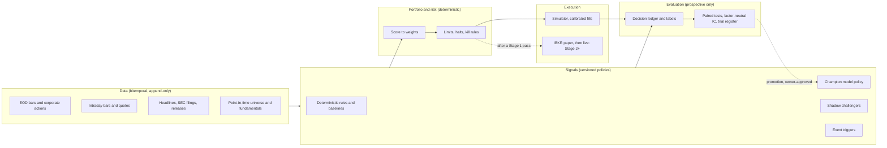

# System blueprint

What this engine is being built into, why that design might make money, and how each plan fits.
[`product.md`](product.md) holds the goal, decisions, and focus order; this page is the picture
behind them. Read it before drafting a plan. Update it when a plan changes the target, not when a
plan merely makes progress.

## The target in one paragraph

An always-on engine that, every night and within minutes of material events, puts a calibrated
expected-return score on a broad set of liquid US stocks and ETFs. Several model policies and
deterministic rules each produce a score, and each is measured on the same candidates. Scores
become portfolios only through deterministic, risk-controlled construction. Portfolios trade
through a fill model calibrated against reality, first in the simulator, then against IBKR paper,
then with small real capital. A policy gains authority only by beating its paired control on
prospective, after-cost evidence under tests that stay honest about how many ideas were tried.

## Where the edge could come from

The research verdicts ([`strategy-research-backlog.md`](strategy-research-backlog.md)
and the external literature below) rule most things out. The design bets on the few that remain:

| Source | Why it might work for this engine | Evidence and prior |
|---|---|---|
| **Breadth of small, text-informed bets** | The fundamental law, IR ≈ IC·√breadth (Grinold 1989), rewards scoring many names a little better, not one name a lot better. LLMs read text cheaply at scale, and credit cost is ignored | News-based LLM signals were real after model cutoffs but decayed from a Sharpe of 6.5 (2021Q4) to 1.2 (2024) before costs (Lopez-Lira & Tang, arXiv:2304.07619). Prior: small positive IC at best |
| **Slow-to-price text in small and mid caps** | Drift persists longer where attention is thin; filings and releases carry acceptance timestamps | Post-earnings drift is gone in large caps since 2006 (Martineau 2022). Prior: weak, concentrated in less-covered names |
| **Filtering a rule's entries (meta-labelling)** | A model that only vetoes or sizes a rule's picks can add value without inventing trades (López de Prado 2018; Joubert 2022) | Plausible; this is P15's hybrid book |
| **Low-turnover allocation** | Judgement applied monthly, where costs do not eat it | P7's AI-only arm; the verdicts favour low turnover |
| **Risk and drawdown control** | Avoiding the −50% years matters more to a small book than adding 1 pp | The regime gate cut drawdown but cost return in risk-on windows (verdicts) |

Not sources of edge here: speed (no colocation, EOD data), options premium selling, parameter
mining, and single-name conviction trades judged on a handful of outcomes.

Agent-trading benchmarks agree with this prior. StockBench (arXiv:2510.02209) and FINSABER
(arXiv:2505.07078) find most LLM agents fail to beat buy-and-hold, usually before costs. The
engine therefore treats "no edge" as the default answer and is built to reach that answer, or its
opposite, quickly and cheaply.

## Architecture

**Invariants.** Every layer keeps them, whatever plan changes it.

1. The model chooses; deterministic code owns the universe, size, risk, fills, accounting, halts.
2. Every fact carries its availability time; nothing reaches a decision before it was available.
3. Every decision is an immutable trace joined later to its outcome; failures are outcomes too.
4. Every policy version is registered before it runs and never edited after; change means a new
   version and a new cohort.
5. Prospective evidence alone promotes. Historical LLM results are diagnostics. Two kinds are
   clean enough to *kill* a policy, though never to promote one: time-locked models on history
   before their cutoff, and frontier models replayed on history after theirs (P16 replay lab,
   with contamination probes and a lockbox).
6. Every comparison is paired, net of trading cost, and counts the trials behind it.

## Layers: now, P15, P16, later

| Layer | Exists (2026-09-25) | P15 adds | P16 proposes | Later |
|---|---|---|---|---|
| Data | EOD store, screens, earnings, headlines (titles), TradingView research data, P14 archive | RSS and 8-K event facts; intraday mover scan | Full 8-K earnings-release text; historical EDGAR corpus; historical news archive (Alpaca/Benzinga or GDELT) | P3 point-in-time vendor data (owner spend) |
| Signals | P8 nightly pick; P9 shadow observers; P7 allocator (inactive) | Scoring every candidate; deterministic baseline; pre-open cancel; event triggers | Challenger lab: blinded, memory, tournament, ensemble, ablations; filing reader | Promoted challengers get book authority |
| Evaluation | Ledger, 1/5/10/20 labels, contamination probes | Paired IC test with looks; book comparison; coded P8 gate | Factor-neutral IC; always-valid sequential tests; deflated Sharpe over the trial register; time-locked text lab; post-cutoff replay lab with lockbox | Stage gates computed from live fills |
| Portfolio | Fixed-fraction sizing, 3 names | ATR sizing, SPY core, limit-on-open, 8 names | Optimizer from scores to weights (Grinold alpha, risk model, turnover cost) | Beta hedge if shorting is approved |
| Execution | Next-open simulator, fill model v4 | Limit-on-open path | Slippage calibration from intraday data; fill model v5 for future cohorts | IBKR paper on personal hardware, then live |
| Ops | Timers, recovery, metrics | P15 status and report | Weekly operator digest | Remote alerts from personal hardware |

## Evaluation science (how "does it work?" gets answered)

- **Unit of evidence:** a scored candidate, not a trade. Hundreds of labels a month make an IC
  test feasible in months. Trades are the monetization check, not the primary test.
- **Paired against a control:** every model score is compared with a deterministic score on the
  same candidates and dates (P15), and every challenger against the champion (P16).
- **Factor-neutral:** a model that simply loads on momentum or short-term reversal is not adding
  judgement. P16 reports IC on returns residualised against known factors.
- **Honest about trials:** a register counts every policy version ever evaluated. Selection among
  challengers uses the deflated Sharpe ratio (Bailey & López de Prado 2014) or t > 3 hurdles
  (Harvey, Liu & Zhu 2016). Continuous monitoring uses always-valid sequential tests (mSPRT;
  Johari et al. 2022) so looking often does not inflate false positives.
- **Contamination:** anything before a model's training cutoff is contaminated. Company-name
  blinding is a control (Glasserman & Lin, arXiv:2309.17322). Time-locked models (ChronoGPT and
  ChronoBERT, arXiv:2502.21206; weights at huggingface.co/manelalab) allow historical text tests.

## Path to money

| Step | Gate | Owner decision needed |
|---|---|---|
| Collect (P15, P16) | Registered tests reach their looks | P16 approval and ceilings |
| Judge | A policy passes its primary test and book comparison, inside the drawdown envelope | None |
| Broker-paper | 1–3 months of IBKR paper fills reconcile to the simulator | Personal host, model provider, IBKR account, execution-layer plan |
| Small live | Live tracks paper within tolerance at each capital step | Loss limits, capital steps |
| Scale | Each new policy repeats the path | Capital |

At S$10,000, a real 3 pp/yr edge is about S$300 a year. The engine becomes worth running for money
only if an edge is proven *and* capital scales, so the design optimises for a fast, trustworthy
verdict first.

## Idea register

Triage of every idea raised so far. "Next" items are in P16; "later" items need a verdict or an
owner decision first.

| Idea | Status | Reason |
|---|---|---|
| Score every candidate; paired IC vs rule | P15 | Breadth and statistical power |
| Comparator books, limit-on-open, pre-open cancel, event triggers | P15 | Comparator and latency |
| Factor-neutral IC, sequential tests, deflated Sharpe | Next (P16) | Separates judgement from factor exposure; honest selection |
| Challenger lab (blinded, memory, tournament, ensemble, ablations) | Next (P16) | Many hypotheses per night on identical inputs, at no marginal constraint |
| Filing and earnings-release reader | Next (P16) | Timestamped text is the LLM's natural input |
| Time-locked historical text lab | Next (P16) | The only contamination-controlled historical LLM test available |
| Post-cutoff replay with mistake notes | Next (P16) | Months of out-of-sample paper trading in days; tests whether agents learn from their own post-mortems |
| Portfolio optimizer from scores | Next (P16, shadow) | Converts IC into returns efficiently (transfer coefficient) |
| Fill calibration from intraday data | Next (P16) | The simulator must be right before Stage 2 |
| Weekly operator digest | Next (P16) | The owner should see state in one page |
| Stage 2 design (portability, IBKR paper, reconciliation, loss limits) | Next (P16, docs only) | No broker code on this host |
| Long-short or beta-hedged books | Later | Needs the shorting decision; would monetize IC far better than long-only |
| Promote a challenger to book authority | Later | Needs a sequential-test pass and owner approval |
| Event-trigger order authority | Later | Needs its own gate after P15 evidence |
| Intraday execution authority | Parked | Needs quote/trade data and queue modelling |
| Model fine-tuning on own labels | Parked | Tiny, overlapping labels; high overfit risk; revisit after a year of data |
| Options, 0DTE, premium selling | Rejected | No after-cost edge (verdicts) |
| Faster reselection of momentum books | Rejected | Loads on short-term reversal (verdicts) |
| Parameter grids on accumulated archives | Rejected | Multiple testing without pre-registration |
