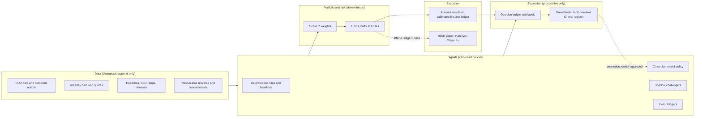

# System blueprint

What this engine is being built into, why that design might make money, and how each plan fits.
[`product.md`](product.md) holds the goal, decisions, and focus order; this page is the picture
behind them. Read it before drafting a plan. Update it when a plan changes the target, not when a
plan merely makes progress.

## The target in one paragraph

An always-on engine that, every night and within minutes of material events, puts a calibrated
expected-return score on a broad set of liquid US stocks and ETFs. Several model policies and
deterministic rules each produce a score, and each is measured on the same candidates. Scores
become portfolios only through deterministic, risk-controlled construction. Portfolios trade
through independently funded engine accounts whose orders, fills, fees, positions, cash, halts
and results have one deterministic owner. The route is first the simulator, then IBKR paper,
then small real capital. A policy gains authority only by beating its paired control on
prospective, after-cost evidence under tests that stay honest about how many ideas were tried.

## Where the edge could come from

The research verdicts ([`strategy-research-backlog.md`](strategy-research-backlog.md)
and the external literature below) rule most things out. The design bets on the few that remain:

| Source | Why it might work for this engine | Evidence and prior |
|---|---|---|
| **Breadth of small, text-informed bets** | The fundamental law, IR ≈ IC·√breadth (Grinold 1989), rewards scoring many names a little better, not one name a lot better. LLMs read text cheaply at scale, and credit cost is ignored | News-based LLM signals were real after model cutoffs but decayed from a Sharpe of 6.5 (2021Q4) to 1.2 (2024) before costs (Lopez-Lira & Tang, arXiv:2304.07619). Prior: small positive IC at best |
| **Slow-to-price text in small and mid caps** | Drift persists longer where attention is thin; filings and releases carry acceptance timestamps | Post-earnings drift is gone in large caps since 2006 (Martineau 2022). Prior: weak, concentrated in less-covered names |
| **Filtering a rule's entries (meta-labelling)** | A model that only vetoes or sizes a rule's picks can add value without inventing trades (López de Prado 2018; Joubert 2022) | Plausible; this is the profitability evidence loop's hybrid book (P15) |
| **Low-turnover allocation** | Judgement applied monthly, where costs do not eat it | The autonomous paper trial's AI-only arm (P7); the verdicts favour low turnover |
| **Risk and drawdown control** | Avoiding the −50% years matters more to a small book than adding 1 pp | The regime gate cut drawdown but cost return in risk-on windows (verdicts) |

Not sources of edge here: speed (no colocation, EOD data), options premium selling, parameter
mining, and single-name conviction trades judged on a handful of outcomes.

Agent-trading benchmarks agree with this prior. StockBench (arXiv:2510.02209) and FINSABER
(arXiv:2505.07078) find most LLM agents fail to beat buy-and-hold, usually before costs. The
engine therefore treats "no edge" as the default answer and is built to reach that answer, or its
opposite, quickly and cheaply.

## Architecture

```mermaid
flowchart LR
  subgraph Data["Data (bitemporal, append-only)"]
    EOD[EOD bars and corporate actions]
    INTRA[Intraday bars and quotes]
    TEXT[Headlines, SEC filings, releases]
    PIT[Point-in-time universe and fundamentals]
  end
  subgraph Signals["Signals (versioned policies)"]
    RULES[Deterministic rules and baselines]
    CHAMP[Champion model policy]
    CHALL[Shadow challengers]
    EVENTS[Event triggers]
  end
  subgraph Eval["Evaluation (prospective only)"]
    LEDGER[Decision ledger and labels]
    TESTS[Paired tests, factor-neutral IC, trial register]
  end
  subgraph Port["Portfolio and risk (deterministic)"]
    CONSTRUCT[Score to weights]
    RISK[Limits, halts, kill rules]
  end
  subgraph Exec["Execution"]
    SIM[Account simulator, calibrated fills and ledger]
    BROKER[IBKR paper, then live: Stage 2+]
  end
  Data --> Signals --> LEDGER --> TESTS
  Signals --> CONSTRUCT --> RISK --> SIM --> LEDGER
  RISK -. after a Stage 1 pass .-> BROKER
  TESTS -. promotion, owner-approved .-> CHAMP
```

**Invariants.** Every layer keeps them, whatever plan changes it.

1. The model chooses; deterministic code owns the universe, size, risk, fills, accounting, halts.
2. Every fact carries its availability time; nothing reaches a decision before it was available.
3. Every decision is an immutable trace joined later to its outcome; failures are outcomes too.
4. Every policy version is registered before it runs and never edited after; change means a new
   version and a new cohort.
5. Prospective evidence alone promotes. Historical LLM results are diagnostics. Two kinds are
   clean enough to *kill* a policy, though never to promote one: time-locked models on history
   before their cutoff, and frontier models replayed on history after theirs (the challenger lab,
   text edge, and evaluation science plan's replay lab (P16),
   with contamination probes and a lockbox).
6. Every comparison is paired, net of trading cost, and counts the trials behind it.
7. Every cost-model change has a recorded break and restarted comparison clock; pre-break
   evidence remains immutable. Private account rows never enter public reports.

## Layers: deployed, built-inert, later

| Layer | Deployed (2026-09-29) | P16 built, inactive | Later |
|---|---|---|---|
| Data | EOD store, screens, earnings, headline titles, TradingView research data, the TradingView historical archive (P14); P15 RSS and 8-K event facts and intraday mover scan | Acceptance-timestamped filing capture and gated historical EDGAR/news corpus paths | Point-in-time data (P3; owner spend) |
| Signals | Daily opportunity agent (P8) nightly pick; multi-cadence agent tools (P9) shadow observers; P15 candidate scoring, deterministic baseline, pre-open cancel, and shadow event triggers; P7 allocator (inactive) | Challenger lab (blinded, memory, tournament, ensemble, ablations) and filing reader | Promoted challengers and separately held strategies gain book authority only through their activation gates |
| Evaluation | Ledger, 1/5/10/20 labels, contamination probes; P15 paired IC test with looks, book comparison, coded P8 gate | Factor-neutral IC, always-valid sequential tests, deflated Sharpe over the N=139 trial census, time-locked text lab, and post-cutoff replay lockbox | Stage gates computed from live fills |
| Portfolio | P8 fixed-fraction sizing, 3 names; P15 ATR sizing, SPY core, 8 names; P22 independently funded account risk, margin/PDT, shorts and halts | Score-to-weight optimizer, recovery, and shadow diagnostics | Strategy-specific beta hedge after its own gate |
| Execution | Next-open and limit-on-open legacy paths; P22 MOO/MOC/deferred intraday fills, effective-dated commissions and one replay ledger | Best-attempt opening measurement and slippage calibration | IBKR paper on personal hardware, then live |
| Ops | Timers, recovery, metrics; P15 status and report | Isolated P16 status adapter and weekly operator digest | Failures investigated on demand by an agent; no push alerting |

## Evaluation science (how "does it work?" gets answered)

- **Unit of evidence:** a scored candidate, not a trade. Hundreds of labels a month make an IC
  test feasible in months. Trades are the monetization check, not the primary test.
- **Paired against a control:** every model score is compared with a deterministic score on the
  same candidates and dates (P15), and every challenger against the champion (P16).
- **Factor-neutral:** a model that simply loads on momentum or short-term reversal is not adding
  judgement. P16 reports IC on returns residualised against known factors.
- **Honest about trials:** a register counts every policy version ever evaluated. Selection among
  challengers uses the deflated Sharpe ratio (Bailey & López de Prado 2014) or t > 3 hurdles
  (Harvey, Liu & Zhu 2016). Continuous monitoring uses always-valid sequential tests (mSPRT;
  Johari et al. 2022) so looking often does not inflate false positives.
- **Contamination:** anything before a model's training cutoff is contaminated. Issuer-name
  blinding is a control (Glasserman & Lin, arXiv:2309.17322). Time-locked models (ChronoGPT and
  ChronoBERT, arXiv:2502.21206; weights at huggingface.co/manelalab) allow historical text tests.

## Research funnel: screen wide, confirm narrow

Many ideas are tried and few earn authority. Each stage differs in cost and in what it can prove.

| Stage | Evidence | Outcome | Can it promote? |
|---|---|---|---|
| **Screen** | A registered historical study: price history, or for an LLM policy only events after its model's training cutoff. Every variant counts in the trial census | Pass (the study's own bar and one-shot holdout), admit (beats the expected best of N noise trials and every control, short of the full bar), or kill | Only to confirmation |
| **Confirm** | The frozen candidate run only on data dated after its freeze, in monthly epochs, with one decision at a registered horizon inside a Bonferroni family of at most eight live candidates | Pass or kill | To a simulator book |
| **Book** | A simulator book here with its paired control (P15-style), then the stages in [`product.md`](product.md) | Stage 1 verdict | To broker-paper, then capital, each with owner approval |

Two principles decide what gets admitted. A signal that ranks stocks is not an edge until a
construction monetizes it after cost at the owner's capital size. And more variants on the same
survivor-biased history mainly raise the trial count, so a new screen needs a new information
source, a new monetization structure, or better data. Confirmation needs no live runner for
event strategies: a frozen pipeline run in batch on months that did not exist at its freeze is
prospective evidence, provided the model identity is unchanged.

## Path to money

| Step | Gate | Owner decision needed |
|---|---|---|
| Collect (P15, P16) | Registered tests reach their looks | None (P16 approved 2026-09-26) |
| Judge | A policy passes its primary test and book comparison, inside the drawdown envelope | None |
| Broker-paper | 1–3 months of IBKR paper fills reconcile to the simulator | Personal host, model provider, IBKR account, execution-layer plan |
| Small live | Live tracks paper within tolerance at each capital step | Loss limits, capital steps |
| Scale | Each new policy repeats the path | Capital |

At S$10,000, a real 3 pp/yr edge is about S$300 a year. The engine becomes worth running for money
only if an edge is proven *and* capital scales, so the design optimises for a fast, trustworthy
verdict first.

## Idea register

Triage of every idea raised so far. P16 items are built but inert; "later" items need a verdict or
an owner decision first.

| Idea | Status | Reason |
|---|---|---|
| Score every candidate; paired IC vs rule | Live (P15) | Breadth and statistical power |
| Comparator books, limit-on-open, pre-open cancel, event triggers | Live (P15) | Comparator and latency |
| Factor-neutral IC, sequential tests, deflated Sharpe | Built (P16, inert) | Separates judgement from factor exposure; honest selection |
| Challenger lab (blinded, memory, tournament, ensemble, ablations) | Built (P16, inert) | Many hypotheses per night on identical inputs, at no marginal constraint |
| Filing and earnings-release reader | Built (P16, inert) | Timestamped text is the LLM's natural input |
| Time-locked historical text lab | Built (P16, gated) | The only contamination-controlled historical LLM test available |
| Post-cutoff replay with mistake notes | Built (P16, gated) | Months of out-of-sample paper trading in days; tests whether agents learn from their own post-mortems |
| Portfolio optimizer from scores | Built (P16, inactive) | Converts IC into returns efficiently (transfer coefficient) |
| Fill calibration from intraday data | Built (P16, measurement only) | The simulator must be right before Stage 2 |
| Weekly operator digest | Built (P16, inactive) | The owner should see state in one page |
| Stage 2 design (portability, IBKR paper, reconciliation, loss limits) | Complete (P16, docs only) | No broker code on this host |
| Long-short or beta-hedged books | Generic short infrastructure active under P22; strategy authority later | Each version still needs a passed registered gate and an independently funded paper account |
| Promote a challenger to book authority | Later | Needs a sequential-test pass and owner approval |
| Live paper book for separately held strategies | P22 generic accounts, fills, costs and money controls; new accounts start inactive | Private alpha selects/tests versions and submits requests; the engine owns isolated balances and execution. Strategy activation remains gated |
| Event-trigger order authority | Later | Needs its own gate after P15 evidence |
| Intraday execution authority | Deferred paper settlement in P22 | Historical minute bars can measure fills only after capture; real-time authority still needs live quote/trade data and queue modelling |
| Model fine-tuning on own labels | Parked | Tiny, overlapping labels; high overfit risk; revisit after a year of data |
| Options, 0DTE, premium selling | Execution refused; capture/design only | No proven after-cost edge and no bid/ask data; P22 captures free contracts and daily bars without granting execution |
| Faster reselection of momentum books | Rejected | Loads on short-term reversal (verdicts) |
| Parameter grids on accumulated archives | Rejected | Multiple testing without pre-registration |

<!-- sources: docs/product.md, docs/plans/README.md, engine/bitemporal_facts.py, server/p15-registration.json, server/p16-registration.json, sim/fills.py -->
